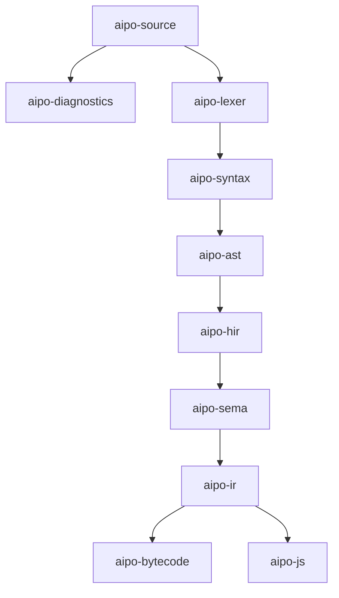

# Aipo Workspace Crates

This directory contains the modular crates implementing the compiler pipeline, intermediate representations, and runtime for the Aipo programming language.

## Architecture Overview

## Crate Directory
| Crate | Responsibility |
|---|---|
| [`aipo-source`](aipo-source/) | UTF-8 source file abstraction, byte offsets, line/col calculations, BOM/CRLF normalization |
| [`aipo-diagnostics`](aipo-diagnostics/) | Canonical diagnostic codes, error reporting, human and JSON Lines emitters |
| [`aipo-lexer`](aipo-lexer/) | Lossless lexical analysis, token classification, string prefixes, Unicode NFC, numeric literal rules |
| [`aipo-ast`](aipo-ast/) | Typed Abstract Syntax Tree data structures with lossless source spans |
| [`aipo-syntax`](aipo-syntax/) | Recursive descent parser, Pratt precedence expression parser, error recovery |
| [`aipo-hir`](aipo-hir/) | High-Level Intermediate Representation and early desugaring passes |
| [`aipo-sema`](aipo-sema/) | Semantic analysis, lexical scopes, mutability paths, and contract checks |
| [`aipo-ir`](aipo-ir/) | Target-neutral Core Intermediate Representation |
| [`aipo-bytecode`](aipo-bytecode/) | Instruction set, binary module format (AIBC v1), verifier, and disassembler |
| [`aipo-vm`](aipo-vm/) | Stack-based bytecode interpreter: value model, frames, closures, the async scheduler |
| [`aipo-runtime`](aipo-runtime/) | Module registry, topological initialization, and the native function registry |
| [`aipo-stdlib`](aipo-stdlib/) | Prelude V1 and the portable standard library modules behind portable contracts |
| [`aipo-host`](aipo-host/) | Host ABI: the AHS host surface, deny-by-default capabilities, host values and generational handles |
| [`aipo-formatter`](aipo-formatter/) | Deterministic, idempotent formatter for the implemented syntax |
| [`aipo-cli`](aipo-cli/) | `aipo run` / `check` / `build` / `fmt` orchestration, JSONL diagnostics, exit codes |
| [`aipo-js`](aipo-js/) | JavaScript ESM emitter, versioned runtime shim, and source maps |
| [`aipo-testkit`](aipo-testkit/) | Rng, AipoSmith generator, differential and metamorphic harnesses |
| [`aipo-bench`](aipo-bench/) | Performance baselines for the frontend, the VM, the JS backend and scaling |
