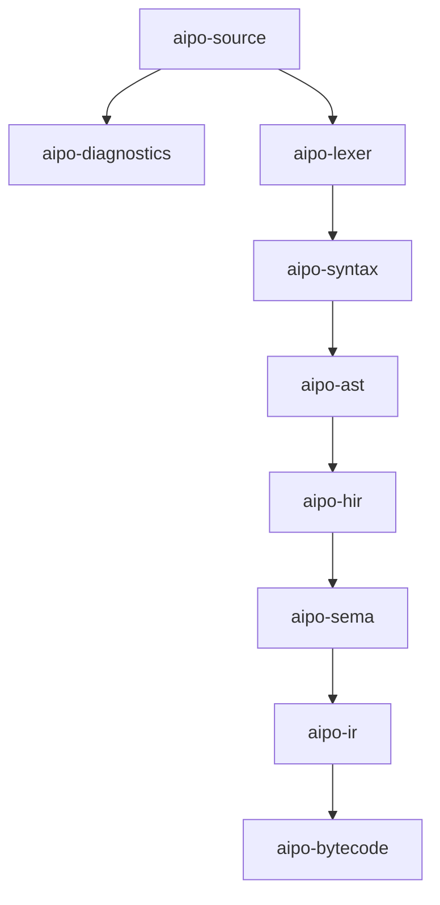

# Aipo Workspace Crates

This directory contains the modular crates implementing the compiler pipeline, intermediate representations, and runtime for the Aipo programming language.

## Architecture Overview

## Crate Directory
| Crate | Responsibility |
|---|---|
| [`aipo-source`](file:///home/raillen/Documentos/Projetos/aipo-lang/crates/aipo-source) | UTF-8 source file abstraction, byte offsets, line/col calculations, BOM/CRLF normalization |
| [`aipo-diagnostics`](file:///home/raillen/Documentos/Projetos/aipo-lang/crates/aipo-diagnostics) | Canonical diagnostic codes, error reporting, human and JSON Lines emitters |
| [`aipo-lexer`](file:///home/raillen/Documentos/Projetos/aipo-lang/crates/aipo-lexer) | Lossless lexical analysis, token classification, string prefixes, Unicode NFC |
| [`aipo-ast`](file:///home/raillen/Documentos/Projetos/aipo-lang/crates/aipo-ast) | Typed Abstract Syntax Tree data structures with lossless source spans |
| [`aipo-syntax`](file:///home/raillen/Documentos/Projetos/aipo-lang/crates/aipo-syntax) | Recursive descent parser, Pratt precedence expression parser, error recovery |
| [`aipo-hir`](file:///home/raillen/Documentos/Projetos/aipo-lang/crates/aipo-hir) | High-Level Intermediate Representation and early desugaring passes |
| [`aipo-sema`](file:///home/raillen/Documentos/Projetos/aipo-lang/crates/aipo-sema) | Semantic analysis, lexical scopes, mutability paths, and contract checks |
| [`aipo-ir`](file:///home/raillen/Documentos/Projetos/aipo-lang/crates/aipo-ir) | Target-neutral Core Intermediate Representation |
| [`aipo-bytecode`](file:///home/raillen/Documentos/Projetos/aipo-lang/crates/aipo-bytecode) | Instruction set, binary module format (AIBC v1), verifier, and disassembler |
