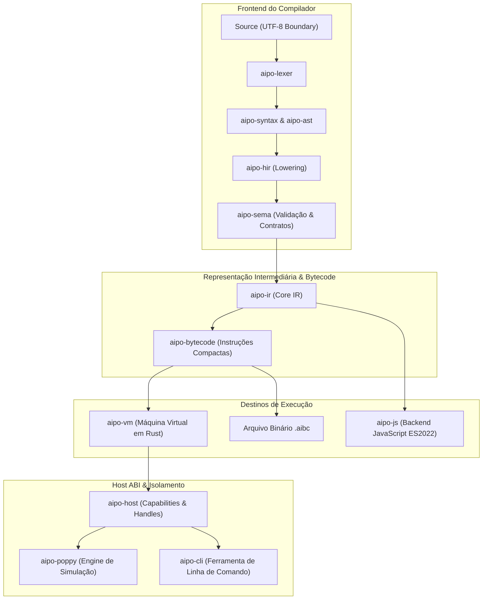

# Macroarquitetura do Sistema

A arquitetura do **Aipo** segue os princípios de **Clean Architecture**, alta coesão e baixo acoplamento, com fronteiras explícitas de domínio entre cada camada do compilador e do runtime.

---

## Diagrama da Arquitetura em Camadas

---

## Invariantes Fundamentais de Arquitetura

1. **Agnosticismo de Frontend e Backend**: A AST e a HIR não possuem conhecimento de como o bytecode é emitido nem de detalhes da VM ou do JavaScript.
2. **Result-based Error Model**: Nenhuma exceção ou pânico em Rust pode vazar como erro de usuário do Aipo. Todos os erros são mapeados para códigos estáveis de diagnóstico.
3. **Imutabilidade Estrutural Segura**: Mutações em estruturas são rastreadas e sujeitas a validação de invariantes, garantindo que o estado interno nunca fique corrompido.
4. **Sem Alocação Oculta no Caminho Feliz**: As operações críticas de despacho e decodificação na VM minimizam clonagens de valores e evitam `Box` desnecessários.
