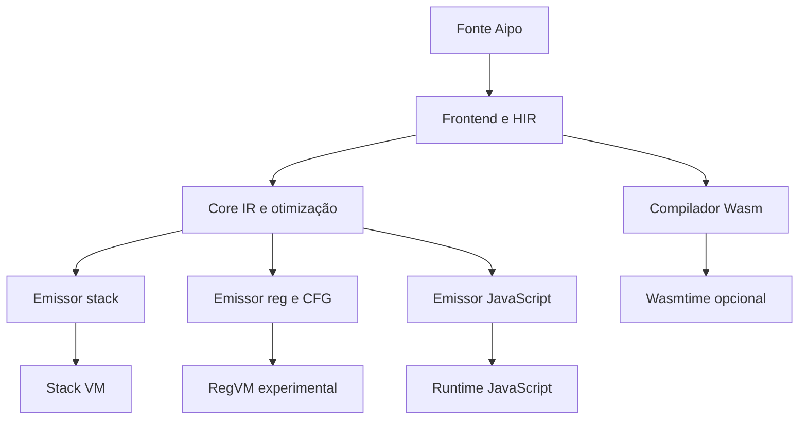
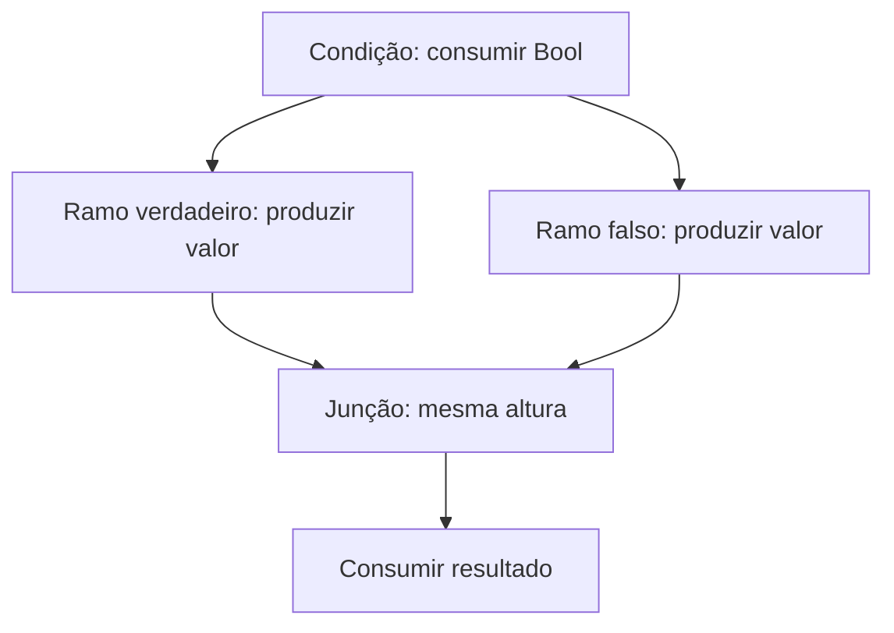

# Guia de uso, auditoria e reimplementação do runtime Aipo

**Data:** 2026-10-09. **Base estudada:** `488905ffb0b83ebbff458939542350d7280ad79b`.
**Base de integração:** `bcbc4c991dee1d9f853c597aaed2790e8981b8b9`, incorporando a atualização de `wasm-encoder` para `0.261.0` já presente na `main`.
**Escopo:** reconstrução das correções de runtime e dos estudos de referência após perda da cópia temporária da revisão.
**Estado:** implementação publicada para revisão; backend de registradores experimental; Goal `P07-G01` em `DRAFT`.

> O usuário autorizou commit, push e PR e solicitou explicitamente não executar testes nesta reconstrução. Testes e fixtures adicionados aqui descrevem o comportamento esperado, mas não foram executados. Resultados da versão local perdida não certificam esta versão. A evidência desta entrega está em [P07-G01](../evidence/P07-G01-runtime-hardening.md).

## 1. Como navegar

| Necessidade | Onde começar |
| --- | --- |
| Rodar programas e escolher backend | Seções 3 e 4 |
| Entender o que mudou e por quê | Seções 5 a 9 |
| Integrar o runtime em Rust | Seção 10 |
| Reimplementar estas correções | Seção 11 |
| Medir performance sem conclusões artificiais | Seção 12 |
| Continuar os estudos e o roadmap | Seções 13 e 14 |
| Revisar riscos, compatibilidade e validação | Seções 15 e 16 |

Leia também o [guia de estudos para LLMs](../studies/llm-study-guide.md), o [mapa de autoridade da linguagem](../language/authority-map.md), a [referência de CLI](../reference/cli.md) e o [corpus de conformance](../conformance/README.md). Este guia explica alterações de implementação; não substitui a especificação da linguagem.

## 2. Arquitetura existente

Aipo mantém um frontend compartilhado. Os backends de stack, registradores e JavaScript recebem Core IR. O compilador Wasm recebe HIR diretamente; não passa pelo `RegEmitter`.



| Área | Arquivos principais | Responsabilidade |
| --- | --- | --- |
| Fonte e frontend | `aipo-source`, `aipo-lexer`, `aipo-syntax`, `aipo-ast`, `aipo-hir`, `aipo-sema` | Texto, tokens, AST, HIR e verificações semânticas |
| IR | `crates/aipo-ir/src/ir.rs`, `builder.rs`, `opt.rs` | Operações neutras, lowering e otimizações |
| Bytecode de registradores | `crates/aipo-bytecode/src/instruction.rs`, `reg_emitter.rs` | Encoding u32, limites e análise do fluxo |
| Execução e valores | `crates/aipo-vm/src/reg_vm.rs`, `value.rs`, `convert.rs`, `vm/` | Runtime, erros, coleções, conversões e contratos |
| CLI | `crates/aipo-cli/src/lib.rs` | Seleção de backend, registro da stdlib, diagnóstico e código de saída |
| JavaScript | `crates/aipo-js/runtime/aipo-runtime.js` | Semântica do shim e execução do código emitido |
| Wasm | `crates/aipo-wasm/src/compiler.rs`, `runner.rs` | Emissão binária e integração opcional com Wasmtime |
| Host e ABI | `aipo-host`, `aipo-runtime`, `aipo-c-abi` | Capabilities, handles, APIs nativas e embedding existentes |

Não foram criadas novas crates ou novas construções de linguagem. A organização segue as fronteiras atuais. As alterações de ABI C, ownership e reentrância que já estavam na base não foram reimplementadas nesta rodada.

## 3. Preparar e usar o projeto

### 3.1 Checkout da revisão

Depois de abrir o PR, use a branch `audit/runtime-hardening-and-studies`:

```bash
git clone https://github.com/poppy-team/aipo-lang.git
cd aipo-lang
git fetch origin audit/runtime-hardening-and-studies
git switch --track origin/audit/runtime-hardening-and-studies
```

Para obter exatamente uma revisão, prefira o SHA do commit mostrado no PR. Uma branch pode receber novos commits; o SHA permite reproduzir a versão lida.

### 3.2 Compilar

O workspace declara `rust-version = "1.85"`. Isso não certifica que todas as features e dependências atuais compilem nessa versão. O lock contém Wasmtime `49.0.2`; use uma toolchain compatível com o grafo escolhido. A reconstrução usa Rust `1.99.0`, sem alterar o MSRV declarado.

Build padrão do CLI:

```bash
cargo build -p aipo-cli --locked
```

Build sem o runner Wasmtime, preservando formatter, JS, regex e Unicode:

```bash
cargo build -p aipo-cli --locked --no-default-features --features formatter,js,regex,unicode
```

Compilador Wasm disponível, sem o runner JIT:

```bash
cargo build -p aipo-cli --locked --no-default-features --features formatter,js,regex,unicode,wasm
```

A feature `wasm` habilita emissão e inspeção; `wasmtime-runner` habilita execução. Desabilitar o JIT reduz o grafo, mas não transforma o projeto em `no_std`. O perfil `nano` já existe no workspace; tamanho e startup precisam de medição em um alvo definido.

### 3.3 Comandos de uso

```bash
aipo check programa.aipo
aipo run programa.aipo --engine=vm
aipo run programa.aipo --engine=reg
aipo build programa.aipo --target js --out dist
aipo build programa.aipo --target wasm --out dist
aipo run programa.aipo --wasm
aipo run dist/app.wasm
aipo fmt programa.aipo --check
```

`--engine=reg` vale para execução no backend experimental. `--target js` e `--target wasm` escolhem outros emissores. Os exemplos pressupõem que as features correspondentes estejam habilitadas.

Os códigos de saída permanecem: `0` para sucesso, `1` para falhas de linguagem/runtime e `2` para erros de uso. A ausência de uma feature pode ter código definido pelo fluxo existente da CLI; consulte o diagnóstico, em vez de inferir sucesso apenas pela ausência de stdout.

## 4. Escolher um backend

| Backend | Uso nesta revisão | Limitação relevante |
| --- | --- | --- |
| Stack VM | Referência para a semântica já implementada | Mantém seus mecanismos próprios de orçamento e host |
| RegVM | Scripts no subconjunto suportado e experimentos de embedding | Não possui paridade completa; programas não representáveis passam a ser rejeitados |
| JavaScript | Emissão JS com o shim do projeto | A semântica depende da versão correspondente do runtime |
| Wasm + Wasmtime | Emissão `.wasm` e execução quando habilitada | Fuel opcional não limita memória, output ou trabalho de callbacks |
| Wasm sem Wasmtime | Emissão e desassembly | Execução retorna erro de engine desabilitada |

O backend de registradores não é promovido a substituto geral da Stack VM. Closures, upvalues, async/await, hooks de construção, invariantes, journal de mutações e contratos de interfaces com operações continuam exigindo trabalho de paridade. Recursos expressos por Core IR não suportado geram `AIPO_COMPILE_REG_UNSUPPORTED`; outras diferenças de runtime, como resolução completa de métodos e serviços de host, continuam pendentes.

## 5. Emissor de registradores: correções e limites

### 5.1 Compilação falha de forma explícita

**Antes:** o braço final do `match` era `_ => {}`. Uma instrução sem lowering era descartada. Um operador binário desconhecido virava comparação de igualdade. `MakeFunction` usava `expect` ao não encontrar uma função.

**Agora:** `compile_function` e `compile_module` retornam `Result<..., String>`. Operações não suportadas, índice de função ausente, metadados de async/upvalues e limites inválidos produzem erro de compilação. A CLI converte a razão técnica em diagnóstico com título EN/PT-BR e ajuda para usar `--engine=vm`.

**Por quê:** produzir bytecode com semântica diferente do programa é mais grave do que informar a limitação do backend. A sintaxe aceita pelo frontend não implica que todos os backends já implementem todas as operações.

### 5.2 Altura da pilha calculada pelo fluxo

O Core IR representa uma pilha de avaliação, enquanto o bytecode usa registradores. Um contador `top` que percorre apenas a ordem textual não descreve ramos que convergem.

Exemplo:

```aipo
var flag = true
io.println(if flag then 10 else 20)
```

Os dois ramos devem produzir um valor no mesmo registrador, e a chamada seguinte deve consumir esse valor. O novo `stack_heights` calcula efeitos de entrada e saída de cada instrução, percorre sucessores com uma fila e exige alturas iguais nas junções. O lowering reinicia `top` com a altura de entrada de cada instrução alcançável.



`PushHandler` acrescenta uma aresta para o handler com espaço para o valor da falha. `Return` e `Fail` terminam o caminho. Instruções inalcançáveis não são emitidas, mas a preflight ainda rejeita categorias de IR não suportadas e destinos inválidos. Não é uma análise completa de tipos, inicialização de registradores ou balanceamento de handlers.

### 5.3 Encoding e operandos

| Operando | Faixa representável | Política |
| --- | --- | --- |
| Opcode | 7 bits | Somente variantes reconhecidas |
| A e C como registradores | `0..=255` | 256 slots físicos |
| B | 9 bits | Seu papel depende do opcode; quando é registrador, deve ser menor que 256 |
| Bx | `0..=131071` | Até 131.072 entradas endereçáveis |
| sBx | `-65536..=65535` | Offset relativo à instrução seguinte |
| Nome em `SetField`/`NewStruct` | `0..=511` | B é índice de constante, não registrador |
| Contagem em `NewList`/`NewDict`/`NewStruct` | `0..=255` | Limite de C; a quantidade de registradores pode impor limite menor |

O emissor reserva temporários após parâmetros e locais; rejeita funções sem espaço suficiente. Uma lista de 256 elementos não pode usar C de 8 bits, mesmo quando os 256 valores cabem nos registradores; a preflight recusa a contagem em vez de truncá-la para zero. Saltos ao fim do Core IR apontam para um retorno implícito real. Offsets fora da faixa são rejeitados antes da conversão final.

Os encoders públicos continuam sendo utilitários de empacotamento que mascaram bits. Quem os usa diretamente deve validar os operandos antes de codificar; um valor truncado não pode ser recuperado depois.

### 5.4 Opcodes adicionados

| Código | Nome | Contrato |
| --- | --- | --- |
| 74 | `IterPrimary` | B contém coleção e C contém o índice completo |
| 75 | `IterKey` | Projeção da chave ou posição |
| 76 | `IterValue` | Projeção do valor |
| 77 | `IterGuard` | Registra identidade/valor e comprimento observável |
| 78 | `IterGuardEnd` | Remove guarda da ativação corrente |
| 79 | `AssertContract` | Tipo e posição ficam em constantes adjacentes Bx/Bx+1 |
| 80 | `AssertContractNullable` | Mesmo contrato, aceitando `none` |

O opcode legado `IterAt` continua decodificável: os dois bits inferiores de C guardam o modo e os demais o registrador do índice. Esse formato comporta apenas 64 registradores de índice. O emissor passa a usar os novos opcodes para preservar os 8 bits de C.

## 6. RegVM: execução e restauração de estado

### 6.1 Uma implementação de aritmética

Os opcodes de aritmética e igualdade delegam a `Value::add`, `sub`, `mul`, `div`, `int_div`, `modulo`, `negate`, `not`, `equal` e `not_equal`, como a semântica compartilhada do runtime.

Isso elimina cópias incompletas que tratavam apenas pares de `Int` ou `Float`, classificavam operandos inválidos como divisão por zero, não verificavam resultados não finitos ou ignoravam promoção numérica. Concatenação, igualdade estrutural e normalização Unicode seguem os helpers existentes e suas features.

O limite de `Int` continua `±(2^53 - 1)`. Metadados/valores construídos diretamente por um host Rust ainda devem respeitar os invariantes públicos; esta mudança não cria um verificador integral para toda entrada arbitrária.

### 6.2 Bytecode malformado

A execução verifica registradores B conforme o papel do opcode, índices de constantes, nomes de globais, fatias de argumentos e destinos de saltos/handlers. Uma global inexistente gera `UndefinedGlobal`; não é substituída por `none`. Uma chave ausente em lookup estrito de `Dict` gera `KeyNotFound`.

Chamadas com fatias que ultrapassam o array de 256 registradores retornam `CorruptedBytecode`. Escrita em `Bytes` exige índice `Int` e valor `Byte`, verificando tudo antes de alterar o buffer. Comprimentos de ranges usam subtração checada e o limite de inteiros seguros.

Essas verificações reduzem classes concretas de panic/corrupção sem garantir que qualquer grafo de valores ou qualquer bytecode hostil seja executável com segurança. Falta um verificador completo de bytecode de registradores.

### 6.3 Chamadas e handlers

`invoke_function` verifica metadados, aridade e profundidade antes de preparar a ativação. A profundidade padrão continua 64. Natives e métodos nativos têm aridade checada antes do callback; `usize::MAX` mantém a convenção de variádicos.

Registradores, constantes e PC do caller são restaurados após retorno ou `VmFault`. Cada `run` isola sua pilha de handlers. Uma falha recuperável sem handler termina a função imediatamente; o caller pode recebê-la e propagar para seu próprio handler. A CLI transforma uma `Failure` no topo em `VmError::UncaughtFailure`, com saída `1`.

Não há janelas de registradores ainda: a chamada continua trocando/salvando um array inteiro de 256 valores. A arena pública permanece reservada, sem integração ao armazenamento dos valores `Rc` atuais.

### 6.4 Orçamento de instruções

`set_instruction_budget(Some(n))` habilita o limite e zera a contagem. Cada instrução de bytecode consome uma unidade antes da execução. Chamadas aninhadas compartilham o orçamento; novas chamadas no mesmo runtime continuam consumindo até reset explícito. `Some(0)` rejeita a primeira instrução. `None` desabilita a contagem.

Exaustão retorna `VmFault::Overflow` com mensagem de orçamento, preservando o catálogo de runtime existente. Não foi inventado um código novo de budget nem uma flag CLI. O limite não cobre tempo gasto por callbacks nativos, alocação, memória total ou saída.

## 7. Iteração, mutações e contratos

### 7.1 Dict segue o canon

| Modo interno | `Dict` | List/String/Bytes/Range no subconjunto Reg |
| --- | --- | --- |
| Primary, `0` | Chave em ordem de inserção | Elemento |
| Key, `1` | Chave em ordem de inserção | Índice ordinal |
| Value, `2` | Valor correspondente | Elemento |

Antes, o modo primário retornava o valor de `Dict` na Stack VM, no shim JS e no RegVM. A correção ajusta os três caminhos para a regra já documentada: `each key in dict` retorna chaves. Não altera a ordem de inserção nem inventa nova sintaxe.

```aipo
var d = {"a": 1, "b": 2}
each key in d {
    io.println(key)
}
each key, value in d {
    io.println(key + String(value))
}
```

Saída esperada: `a`, `b`, `a1`, `b2`, uma por linha. A fixture `33_dict_primary_iteration` registra esse contrato. A expectativa antiga do teste diferencial de JS foi corrigida com base na especificação, não por regeneração automática de snapshots.

### 7.2 Guardas de iteração

RegVM mantém guardas por ativação e preserva as do caller durante chamadas. `IterGuardEnd` não pode retirar uma guarda do caller. Retorno e erro removem apenas guardas da ativação encerrada.

Inserir uma chave nova em um `Dict` diretamente guardado é recusado antes da escrita; substituir o valor de uma chave existente permanece permitido. Comparações de comprimento antes das instruções e ao terminar a execução detectam alterações de tamanho feitas por callbacks.

**Limite importante:** guardar comprimento não é versionar mutações estruturais. Um callback pode remover e inserir mantendo o mesmo tamanho; alterações já feitas por um callback não têm rollback automático. Introduzir versões estruturais em `List`/`Dict` e fazer todos os mutadores consultarem guardas é melhoria pendente.

### 7.3 Contratos suportados

Os novos opcodes mantêm o valor no registrador e verificam tipos fundamentais, `Function`, nomes de structs e parentes de variantes de enum. `T?` aceita `none`. `Failure` continua no canal de falha recuperável, sem ser convertida em violação de contrato.

Tipo e posição textual são colocados em duas constantes consecutivas. A emissão desses pares não usa deduplicação comum, porque Bx+1 precisa permanecer a posição do diagnóstico.

Contratos de interfaces com operações são rejeitados pelo emissor até existir resolução de métodos compatível. Interfaces vazias não resolvidas mantêm o comportamento permissivo da Stack VM. O diagnóstico mostra o nome nominal de uma struct, quando disponível.

## 8. Strings: menos alocações intermediárias

`string_char_at` centraliza a leitura de um escalar Unicode. Stack `GetIndex`, leitura posicional da Stack VM e RegVM compartilham o helper.

Para ASCII, uma verificação `is_ascii()` permite acesso por byte. Para Unicode, índices positivos usam `chars().nth` e negativos `chars().nth_back`. `unsigned_abs` evita negar `i64::MIN`. Índices inválidos retornam `IndexOutOfRange` com o comprimento em escalares.

A alteração elimina o `Vec<char>` temporário na leitura de um caractere. O resultado continua alocando uma `String` e um `Rc`; não é zero allocation. `is_ascii()` também percorre o texto: o caminho ASCII não deve ser anunciado como O(1) total. Para caracteres Unicode no meio, o percurso continua linear. Slicing e outras operações podem manter suas estratégias atuais.

Não há resultado novo de benchmark nesta reconstrução. O [protocolo da seção 12](#12-performance-protocolo-reproduzível) descreve como medir antes de promover a otimização a claim quantitativa.

## 9. Runner Wasm e remoção de código morto

`WasmExecutionOptions { fuel: Option<u64> }` adiciona um orçamento opcional. `execute_wasm` continua disponível e delega às opções padrão, mantendo execução sem limite. `execute_wasm_with_options` configura `Config::consume_fuel` e `Store::set_fuel` antes de instanciar o módulo, cobrindo também uma eventual função `start`.

Entrypoints são procurados em `__top_level__`, `run`, `main`, com assinatura `() -> i64` ou `() -> ()`. Se nenhum existe com assinatura compatível, o runner retorna `MissingExport`; antes devolvia sucesso `0`.

`write_all` e `flush` passam a ter erros propagados. A saída acumulada é entregue mesmo depois de um trap na função `start` ou no entrypoint, quando possível. Se execução e entrega falharem juntas, o erro original de execução tem prioridade. A leitura de strings da memória usa conversões e somas checadas; ponteiros inválidos/UTF-8 inválido continuam ignorados por esse binding, sem novo contrato de trap.

O runner ainda acumula toda a saída em memória e cria engine/módulo por chamada. Fuel não resolve esses custos. A implementação sem feature `wasmtime` conserva o erro explícito de JIT desabilitado.

Foram removidos de `AsyncHelpers` três índices privados nunca lidos e a função privada `program_stmt_span`. Os helpers Wasm exportados de drive/sleep/cancel continuam emitidos. A remoção é de metadados mortos, não da funcionalidade async. Suítes que exigem JIT agora respeitam a feature; testes puros de emissão continuam disponíveis sem JIT. A suíte de equivalência do formatter também é condicionada à sua feature para permitir compilar os alvos de teste do CLI sem dependências opcionais.

## 10. Integração em Rust

### 10.1 Compilar com RegEmitter

```rust
use aipo_bytecode::RegEmitter;

// `ir` é um CoreModule produzido pelo frontend compartilhado.
let module = RegEmitter::new().compile_module(&ir)
    .map_err(|reason| format!("backend reg não suporta o programa: {reason}"))?;
```

O exemplo é um fragmento dentro de uma função que retorna `Result`. Quem usava retorno direto deve tratar `Result` antes de acessar `top_level`, `functions` ou passar o módulo ao runtime.

### 10.2 Orçamento e execução RegVM

```rust
use aipo_vm::RegVm;

let mut vm = RegVm::new();
vm.set_instruction_budget(Some(100_000));
let value = vm.run_module(&module)?;
let consumed = vm.instruction_count();
vm.reset_instruction_count();
```

`RegVm::new()`/`Default` são os pontos de construção recomendados. Os novos campos privados impedem literais externos da struct; isso é uma alteração na API experimental. Instale globais e callbacks necessários: criar `RegVm` sozinho não registra a stdlib. A CLI faz essa ponte com o ambiente existente da Stack VM, mas essa cópia de globais não transforma serviços de host em APIs suportadas pelo RegVM.

Para `Value::Native`, declare aridade exata ou `usize::MAX` para variádicos. O callback retorna `Result<Value, VmFault>`; trabalho bloqueante e operações externas precisam de limites no próprio host.

### 10.3 Execução Wasm com fuel

```rust
use aipo_wasm::{WasmExecutionOptions, execute_wasm_with_options};

let options = WasmExecutionOptions { fuel: Some(1_000_000) };
let mut output = Vec::new();
let return_value = execute_wasm_with_options(&wasm_bytes, &mut output, options)?;
```

A função existe mesmo sem o JIT, mas nesse build retorna erro de engine desabilitada. Configure memória e limites de saída separadamente se o programa vier de uma fonte não controlada. O host deve preservar a mensagem original de falha e decidir como apresentá-la na sua interface.

## 11. Guia de reimplementação

1. **Fixe a base e o contrato.** Leia `ENTRYPOINT`, Goal, authority map e os trechos do canon sobre números, falhas e iteração. Separe comportamento especificado de otimizações ainda propostas.
2. **Enumere papéis dos operandos.** Para cada opcode, marque A/B/C como registrador, contagem, constante ou offset. A checagem de B não pode ser global, porque seu encoding tem 9 bits e vários papéis.
3. **Faça a preflight do IR.** Defina `(consome, produz)`, valide destinos e rejeite operações sem handler. Inclua instruções inalcançáveis na classificação de suporte.
4. **Calcule o CFG.** Inicialize altura zero no início; propague por saltos e fallthrough; acrescente valor de falha na aresta de handler; rejeite underflow, overflow e junções incompatíveis.
5. **Emita a partir da altura de entrada.** Não use a saída textual do ramo anterior para escolher registradores. Mapeie índices IR para bytecode e acrescente retorno real antes de resolver destinos no fim.
6. **Centralize operações de valores.** Reutilize helpers de promoção numérica, limite seguro, finitude, concatenação e igualdade. Evite manter uma segunda semântica nos opcodes Reg.
7. **Isole ativações.** Verifique metadados antes da chamada, salve/restaure registradores/constantes/PC e mantenha handlers locais. Propague `Failure` no retorno, sem executar código restante da função que falhou.
8. **Implemente guardas e contratos.** Preserve guardas do caller, não permita underflow e use pares de constantes para o diagnóstico. Rejeite interfaces que ainda não podem ser avaliadas.
9. **Proteja fronteiras de Wasm.** Instale fuel antes de instanciar; valide entrypoint; cheque ranges de memória e erros do writer; preserve a falha de execução caso haja erro adicional de output.
10. **Sincronize superfícies.** Código estável de diagnóstico, títulos EN/PT-BR, ajuda, fixtures, changelog, contratos de crate, guia de estudos e evidência devem descrever a mesma revisão.
11. **Valide em uma rodada futura.** Execute os gates definidos pelo projeto antes de promover o PR. Nesta entrega, a execução de testes foi dispensada explicitamente pelo usuário; isso não remove o requisito de validação para uma certificação futura.

Ao ampliar um opcode, atualize enum, `from_u8`, preflight, CFG, emissor, handler, documentação e fixture. Um handler sem lowering deixa código-fonte sem acesso; lowering sem handler deixa bytecode sem execução.

## 12. Performance: protocolo reproduzível

O objetivo desta rodada é remover alocação intermediária desnecessária e semântica duplicada. Não existe certificação quantitativa nova.

Para medir strings, use [index_bench.rs](../../crates/aipo-vm/examples/index_bench.rs) e [index_paired.py](../../scripts/perf/index_paired.py). Compile o mesmo harness na base e na candidata em release; arquive hash de código, binários, toolchain, alvo, flags, CPU e SHA do repositório.

O harness usa ASCII de 4.096 caracteres, Unicode de 4.096 escalares e posições início/meio/fim. Faz warm-up antes da medição e emite checksum para evitar otimização que elimine trabalho.

O driver alterna AB/BA, executa pelo menos dois lotes e quatro pares por lote, verifica checksums e preserva amostras individuais. Variações de até ±5% são ruído pelo protocolo do estudo. Não misture binaries construídos com flags diferentes nem resultados de cold start com loop de indexação.

```bash
cargo build -p aipo-vm --release --example index_bench --locked
python3 scripts/perf/index_paired.py --baseline /caminho/base/index_bench --candidate target/release/examples/index_bench --out index-results.json
```

Os comandos são instruções de reprodução; não foram executados nesta reconstrução. O probe `layout_probe` também está disponível para medir `Value`, instrução, frame e arquivo de registradores no alvo escolhido.

Janelas de registradores, shapes/slots, internamento, cache de métodos, stdlib lazy e dispatch especializado precisam de benchmarks próprios. Resultados de outras linguagens não predizem o ganho da Aipo.

## 13. Estudos de referência

O manifest [studies/refs.json](../../studies/refs.json) contém nove SHAs completos. A busca padrão clona em `~/aipo-refs`; `AIPO_REFS_DIR` ou `--dest` muda o destino, sempre fora do repositório Aipo.

```bash
./studies/fetch-refs.sh
./studies/fetch-refs.sh --verify
./studies/fetch-refs.sh --dest /caminho/aipo-refs --verify
```

`--verify` é offline: compara manifest, lock, HEAD, origin e árvore limpa. O fetch recusa clones sujos ou origin divergente e publica o lock apenas depois de completar todos. A branch no manifest é contexto humano; a reprodução usa o SHA, não o HEAD dessa branch.

Leituras e ações estão em [reference-vms](../studies/reference-vms.md), [reference-runtimes](../studies/reference-runtimes.md) e [lessons-for-aipo](../studies/lessons-for-aipo.md). A leitura é dirigida às regiões citadas; não certifica auditoria integral de todos os upstreams. Nenhum runtime de referência foi compilado, integrado ou medido nesta reconstrução.

Correções importantes do guia antigo: o núcleo wasmi tem `no_std`; seu adaptador WASI é separado e depende de `std`. WAMR não é o único candidato nem um vencedor medido. Licença deve ser checada por arquivo e revisão. ADRs citados mas ausentes não foram inventados para preencher lacunas documentais.

## 14. O que ainda pode melhorar

| Prioridade | Melhoria | Por quê | Caminho e aceite futuro |
| --- | --- | --- | --- |
| P0 | Validar esta reconstrução | Compilar não comprova comportamento | Gates default/reduzidos, conformance VM/Reg/JS, casos Wasm de fuel e output |
| P0 | Verificador integral Reg | Checagens locais não provam fluxo/initialização | Papéis de operandos, pool, funções, contratos, jumps, handlers e guards |
| P0 | Versionar mutações estruturais | Comprimento não detecta todas as remoções/inserções | Versões em coleções, guardas em todos os mutadores e regras de callback |
| P1 | Paridade de métodos, closures e upvalues | Muitos scripts ainda exigem Stack VM | Células e frames com ownership definido; corpus diferencial |
| P1 | Async/await e hooks no Reg | Suporte de IR e runtime está incompleto | Preservar Modelo B, scheduler e journal de invariantes |
| P1 | Limites de memória, saída e host | Fuel não limita esses recursos | Política por host e testes de fronteira; ADP-003 continua aberta |
| P1 | Janelas de registradores | Cada chamada ainda troca 256 valores | Base/slots, unwind correto, dois lotes de benchmark de chamadas |
| P1 | Índices de fields e constantes | Buscas lineares/dedup têm custo crescente | Shapes/slots/átomos com medição e preservação de ordem |
| P1 | MSRV por feature | O declarado não está certificado por grafo | Matriz com toolchains e dependências suportadas |
| P2 | Perfil shell/nano real | `no_std` e metas de tamanho não surgem só do perfil | Auditar deps/stdlib/host, build por alvo, tamanho e startup medidos |
| P2 | Cache de engine/módulo Wasm | Criação por chamada pode dominar startup | Ciclo de vida explícito e comparação cold/warm |
| P2 | Streaming de output Wasm | Buffer atual pode crescer sem limite | Writer/limite por execução e contrato de erro claro |
| P2 | Acessibilidade dos diagnósticos | Nem todo erro existente tem ajuda contextual | Catálogo EN/PT-BR, sugestões úteis e apresentação com baixa carga cognitiva |
| P2 | Certificação C/Rust por alvo | Fronteiras e layouts variam por plataforma | Header/exports, ownership, reentrância, ASan/UBSan/Miri onde aplicável |
| P3 | Comparar runtimes alternativos | Leituras não substituem dados | Mesmo workload, checksum, flags, licença e dimensões de memória/tempo |

Não foi concluído todo o roadmap da seção 8 do guia master. Os itens acima delimitam o próximo trabalho sem apresentar estudos como funcionalidades implementadas.

## 15. Compatibilidade e cuidados de revisão

- **API experimental:** `RegEmitter::compile_function`/`compile_module` agora retornam `Result`; consumidores devem migrar.
- **Construção RegVM:** novos campos privados exigem `new`/`Default` fora da crate.
- **Semântica de Dict:** programas que dependiam do bug de iteração primária por valores devem usar o binding `key, value` definido pelo canon.
- **Bytecode Reg:** novos opcodes exigem runtime correspondente. O formato ainda não tem uma certificação independente de compatibilidade entre versões.
- **Wasm:** falta de entrypoint e erro do writer passam a retornar falha, podendo revelar erros que antes eram reportados como sucesso.
- **Perfis:** as guardas de testes respeitam features, mas a matriz comportamental ainda precisa ser executada.
- **Governança:** `prumo.json` mantém seu estado histórico; não foi fabricada transição de fase/Goal. Publicação em draft não implica aprovação Prumo nem conclusão dos gates.

## 16. Evidência e próxima validação

A evidência registra a base, os arquivos, a inspeção estática, as compilações efetivamente observadas e os gates não executados. Os comandos abaixo ficam como roteiro para outra rodada, não como resultados desta entrega:

```bash
cargo fmt --all -- --check
cargo clippy --workspace --all-targets -- -D warnings
cargo test --workspace
cargo doc --workspace --no-deps
prumo validate .
prumo doctor .
node crates/aipo-js/runtime/selftest.mjs
```

Inclua builds/testes sem `wasm`, com `wasm` sem `wasmtime-runner` e com runner completo. Para Wasm, cubra missing entrypoint, fuel zero/finito, loop infinito, erro de escrita e erro de flush. Para Reg, cubra aridades, operandos malformados, restauração do caller, handlers, guards, contratos, índice alto e ramos condicionais.

A entrega deve ser revisada pelo diff do PR e pelos arquivos deste commit. Links locais temporários e números da revisão perdida não são a fonte de verdade desta publicação.
