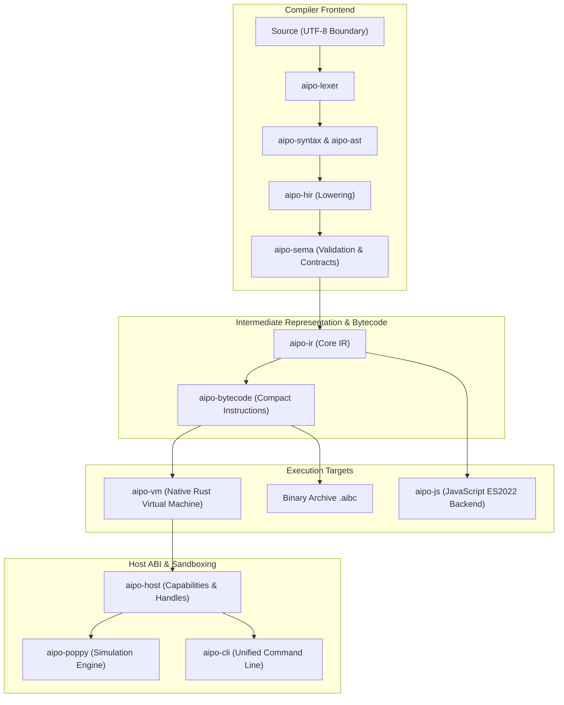

# System Macroarchitecture

The architecture of **Aipo** adheres strictly to **Clean Architecture** principles: high cohesion, low coupling, and explicit domain boundaries between each layer of the compiler and runtime.

---

## Layered Architecture Diagram

---

## Fundamental Architectural Invariants

1. **Frontend & Backend Agnosticism**: AST and HIR maintain zero awareness of bytecode layout, virtual machine mechanics, or JavaScript runtime details.
2. **Result-Based Error Model**: No Rust panics or internal unhandled exceptions ever leak as Aipo user errors. All faults are categorized into stable, human-friendly diagnostic codes.
3. **Safe Structural Invariants**: Struct mutations are journaled and validated against declared invariants, guaranteeing that memory and object state are never corrupted.
4. **Zero Hidden Allocations in the Fast Path**: VM instruction dispatch and value decoding avoid redundant clones, deep copying, and unnecessary `Box` allocations during evaluation.
