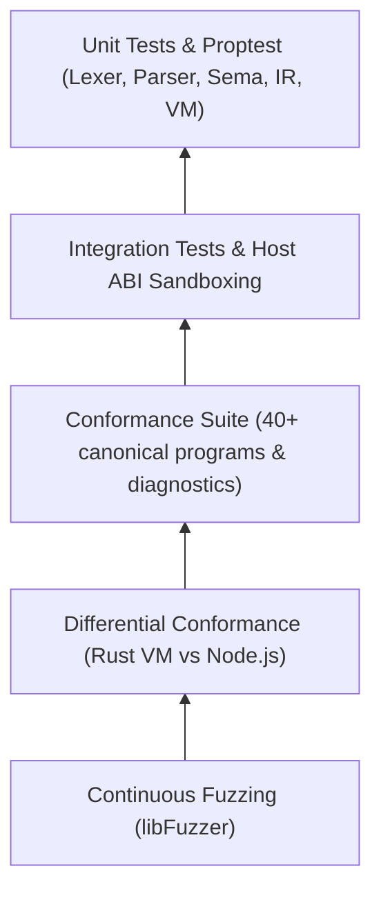

# Code Standards & Testing Strategy

Aipo's engineering integrity is upheld by an exhaustive automated test pyramid and strict compilation standards in Rust 2024.

---

## Mandatory Quality Gates

Every commit and pull request must cleanly satisfy 100% of the following verification gates:

1. **`cargo fmt --check`**: Canonical source code formatting.
2. **`cargo check --workspace --all-targets`**: Zero compilation errors across all workspace targets.
3. **`cargo clippy --workspace --all-targets -- -D warnings`**: Zero warnings allowed under strict linter flags.
4. **`cargo test --workspace`**: 100% passing across over 500 unit and integration tests.
5. **`cargo doc --workspace --no-deps`**: API documentation compiles with zero broken links or warnings.

---

## The Testing Pyramid

### 1. Unit & Property-Based Tests
Verifies pure functions, `Bytes` boundary clamping, UTF-8 character indexing in `Source`, and mathematical invariants with `proptest`.

### 2. Integration & Host ABI Tests
End-to-end scenarios validating VM lifecycle with headless Poppy simulation, generational handle isolation, and capability denials.

### 3. Conformance Tests
Execution of canonical test programs asserting exact standard output and process termination codes.

### 4. Differential Tests (VM ↔ JS)
Concurrent execution of each test program on the native Rust VM and Node.js via emitted JavaScript, asserting identical semantics.

### 5. Continuous Fuzzing
Massive fuzz testing injection on Lexer and Parser ensuring the compiler rejects malformed input gracefully without panicking.
