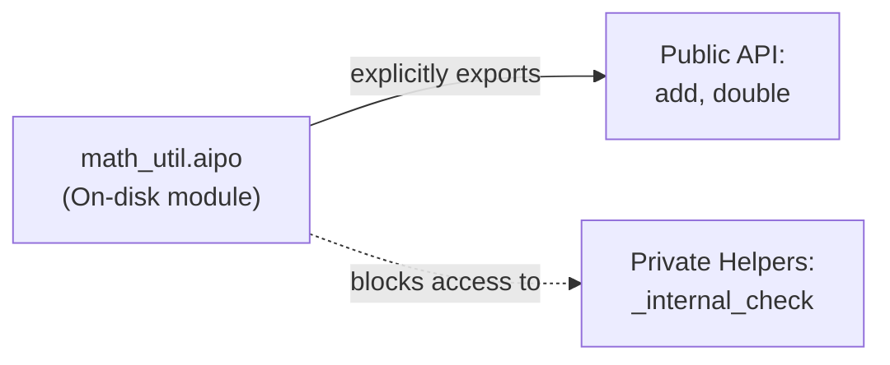
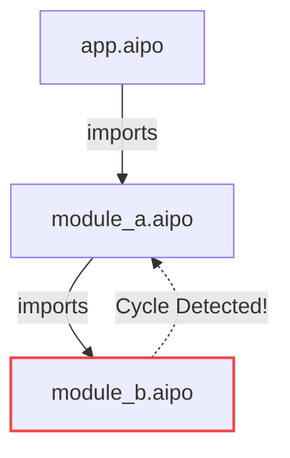
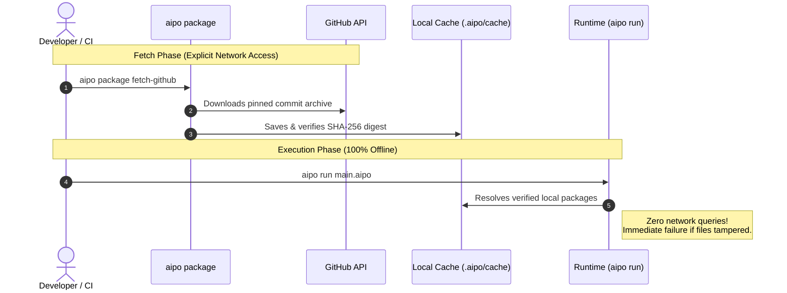

# Packages & Modules

The Aipo codebase architecture relies on a clean, unambiguous separation between two organizational units:
- **Module**: A single `.aipo` source code file.
- **Package**: An autonomous collection of modules governed by an `aipo.toml` manifest.

Unlike legacy package ecosystems prone to lockfile drift, typosquatting attacks, and builds broken by transient network downtime, Aipo's packaging system is **hermetic, deterministic, and 100% offline-first**.

---

## 1. Local Modules (`.aipo`)

In Aipo, **one `.aipo` file corresponds exactly to one module**.



### Private by Default
By default, all functions, structs, and variables declared within a module are **strictly private**. To expose an identifier to consumers, you must explicitly declare it in an `export` statement:

```aipo
# File: math_util.aipo

# 1. Private internal helper function
fn validate_number(n: Int) -> Bool {
    return n >= 0
}

# 2. Public API functions
fn add_positive(a: Int, b: Int) -> Int {
    if not validate_number(a) or not validate_number(b) {
        return fail("numbers must be positive")
    }
    return a + b
}

fn double(n: Int) -> Int {
    return n * 2
}

# Explicitly export only intended public identifiers:
export add_positive, double
```

::: info What happens if I attempt to use a private symbol?
If an importer attempts to reference `validate_number`, the Aipo compiler immediately emits a static compile-time error: `AIPO_SEM_UNKNOWN_NAME`. The private symbol is never injected into the consumer's namespace, ensuring genuine lexical boundary enforcement.
:::

---

## 2. Import Flavors (`import`)

Aipo provides three clean, readable syntaxes for importing modules:

### A. Qualified Import (Recommended Default)
Keeps the module namespace as a clear prefix, ensuring maximum readability:
```aipo
import math_util

let total = math_util.add_positive(10, 20)
print(total)
```

### B. Aliased Import (`as alias`)
Useful for shortening verbose names or resolving naming collisions:
```aipo
import math_util as mu

let result = mu.double(50)
print(result)
```

### C. Selective Direct Import (`import module: ...`)
Imports specific identifiers directly into local scope:
```aipo
import math_util: add_positive, double

let sum = add_positive(15, 30)
let doubled = double(sum)
```

---

## 3. Structural Resolution & Eager Initialization

The Aipo module loader enforces two core architectural guarantees:

1. **Eager Init Once**:
   When a module is first imported, all top-level statements (variable assignments, sanity checks) execute **exactly once**, before the importing module continues. Subsequent imports of the same module throughout the program reuse the initialized bindings without re-executing top-level code.

2. **Acyclic Import Graph**:
   If module `A` imports `B` and module `B` imports `A` (directly or transitively), the Aipo compiler halts immediately with diagnostic `AIPO_MOD_IMPORT_CYCLE`, reporting the exact dependency loop path.



---

## 4. The Hermetic Package System

For larger applications or reusable libraries, files are organized into a package governed by an **`aipo.toml`** manifest.

### Canonical Coordinates: `namespace.name`
Every Aipo package has a two-part formal identity:
- `poppy.game_engine`
- `my_org.auth_service`
- `community.json_extras`

This hierarchical coordinate system eradicates typosquatting and namespace collision attacks inherent to flat registries.

---

## 5. The `aipo.toml` Manifest

The `aipo.toml` file sits at the root of a package:

```toml
[package]
name = "my_app"
namespace = "poppy"
version = "0.1.0"
authors = ["Poppy Team <dev@poppy-lang.org>"]

[dependencies]
# 1. Local path dependency (ideal for monorepos and local development)
utilities = { path = "../libs/utilities" }

# 2. Pinned remote GitHub dependency (STRICTLY REQUIRES commit SHA)
json_extras = { github = "poppy-team/aipo-json-extras", commit = "4b24a71c08000000000000000000000000000000" }
```

::: warning Moving Branches & Tags are Strictly Forbidden
Aipo manifests **reject** floating branches (`main`, `master`) and mutable tags (`v1.x`).
Every remote dependency must declare an **exact 40-character hexadecimal commit SHA**. This guarantees that upstream changes can never compromise your build without explicit human review.
:::

---

## 6. Deterministic Lockfile (`aipo.lock`)

Running `aipo package lock` resolves the complete dependency graph and writes `aipo.lock`.

Every locked entry records four verifiable properties:
```toml
[[package]]
namespace = "poppy"
name = "json_extras"
source = "github:poppy-team/aipo-json-extras"
commit = "4b24a71c08000000000000000000000000000000"
digest = "sha256:e3b0c44298fc1c149afbf4c8996fb92427ae41e4649b934ca495991b7852b855"
```

1. **Coordinates**: Package `namespace` and `name`.
2. **Origin**: GitHub repository URL or local path.
3. **Commit**: Exact, immutable revision.
4. **Cryptographic Digest (SHA-256)**: Mathematical content signature across all files in the package.

If a single byte inside a cached package is modified, the digest check fails and execution is aborted immediately (*fail-closed*).

---

## 7. Local Cache & 100% Offline Execution

Aipo enforces a clean boundary between **fetching dependencies** and **compilation/execution**:



- **`aipo run` and `aipo build` never initiate network requests**: Your builds remain completely unaffected by remote outages, airport Wi-Fi instability, or upstream repo deletions.
- **Content-Addressable Cache**: Retrieved packages are stored under `.aipo/cache`, keyed by their verified content digest.

---

## 8. CLI Command Workflow

The standard package development lifecycle:

### 1. Initialize a New Package
Scaffolds the directory structure and default `aipo.toml`:
```bash
aipo package init --namespace my_team --name my_project
```

### 2. Generate Lockfile
Resolves declared dependencies and generates `aipo.lock`:
```bash
aipo package lock
```

### 3. Fetch Remote Dependencies
Downloads packages pinned in the lockfile into local cache:
```bash
# Public download
aipo package fetch-github

# Authenticated download (for private repositories or higher GitHub API rate limits)
# Token is read from environment variable and NEVER written to disk or logs
aipo package fetch-github --github-token-env GITHUB_TOKEN
```

### 4. Audit Cache Integrity
Scans `.aipo/cache` and recalculates cryptographic hashes to assert zero tampering:
```bash
aipo package cache verify .aipo/cache
```

### 5. Prune Stale Dependencies
Safely removes orphaned package revisions no longer referenced by `aipo.lock`:
```bash
# Dry run simulation (safe):
aipo package cache prune .aipo/cache --lock aipo.lock

# Apply deletion:
aipo package cache prune .aipo/cache --lock aipo.lock --apply
```

---

## 9. Complete Real-World Project Structure

An organized multi-module Aipo project:

### Directory Layout
```text
my_app/
├── aipo.toml
├── aipo.lock
├── .aipo/
│   └── cache/          (local package cache verified with SHA-256)
└── src/
    ├── main.aipo       (entry point)
    └── auth/
        ├── tokens.aipo (submodule)
        └── user.aipo   (submodule)
```

### `src/auth/user.aipo`
```aipo
struct User {
    id
    name
    var active = true
}

fn create_user(id: Int, name: String) -> User {
    return User{ id: id, name: name, active: true }
}

export User, create_user
```

### `src/main.aipo`
```aipo
import auth.user: create_user

let developer = create_user(1, "Raillen")
io.println(f"User registered successfully: {developer.name}")
```

Run your project from terminal:
```bash
aipo run src/main.aipo
```
The compiler resolves the full module graph, asserts package integrity, and executes with native performance!
