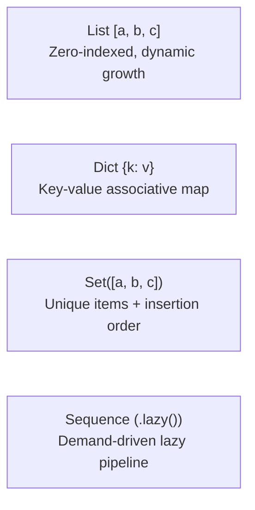

# Standard Library (Stdlib)

The Aipo standard library is built around three non-negotiable principles:
1. **Absolute Determinism**: The same operation produces identical bit-for-bit results on the native Rust VM and the JavaScript runtime.
2. **Security by Default (*Deny-by-Default*)**: Access to host system resources (filesystem, environment variables, system clock) requires explicit capability grants.
3. **Unified Global Environment**: Standard library modules are ambient global built-ins (`math`, `string`, `io`, `task`, `time`, `env`, `fs`, `random`, `json`, `encoding`, `binary`, `path`, `url`, `regex`, `expect`, `testing`, `log`). No `import` is required or permitted to access them; the `import` statement is strictly reserved for local project modules and external packages.

---

## Visual Module Index

| Crate / Module | Primary Purpose | Capability Required? |
| :--- | :--- | :---: |
| [`math`](#1-math-module) | Pure arithmetic, trigonometry, constants, and safe bounds | ❌ No |
| [`string`](#2-string-module) | Text manipulation guaranteed to uphold Unicode NFC normalization | ❌ No |
| [`collections`](#3-collections-list-dict-set-sequence) | Dynamic lists, Hash dicts, Insertion-ordered sets, and Lazy pipelines | ❌ No |
| [`json`](#4-json-module) | Portable serialization and strict parsing with duplicate key rejection | ❌ No |
| [`random`](#5-random-module) | Deterministic 64-bit pseudo-random number generator (SplitMix64) | ❌ No |
| [`time` & `Duration`](#6-time-duration-module) | High-precision timing, pure civil calendar dates, and duration math | 🔒 Yes (`clock.*`) |
| [`binary` & `Bytes`](#7-binary-bytes-module) | Contiguous raw byte buffer reads/writes (LE/BE) and LEB128 varints | ❌ No |
| [`path` & `url`](#8-path-url-modules) | Cross-platform path normalization and URL decomposition | ❌ No |
| [`testing` & `expect`](#9-testing-expect-module) | Integrated assertion engine for pure, self-contained unit tests | ❌ No |
| [`task`](#10-task-module-async-concurrency) | Asynchronous task combinators, groups, races, and timeouts | ❌ No |
| [`fs` & `env`](#11-fs-env-modules-host-resources) | Sandboxed filesystem I/O and isolated environment variable lookups | 🔒 Yes (`fs.*`, `env`) |

---

## 1. `math` Module

The `math` module provides pure floating-point and integer operations without side effects.

### Mathematical Constants
- `math.pi`: \(3.141592653589793\)
- `math.e`: \(2.718281828459045\)
- `math.tau`: \(6.283185307179586\) (\(2 \times \pi\))

### Core Functions

| Function | Signature | Description |
| :--- | :--- | :--- |
| `math.sin(rad)` | `Float -> Float` | Sine in radians |
| `math.cos(rad)` | `Float -> Float` | Cosine in radians |
| `math.tan(rad)` | `Float -> Float` | Tangent in radians |
| `math.sqrt(x)` | `Float -> Float` | Square root (faults if `x < 0`) |
| `math.clamp(val, min, max)` | `(num, num, num) -> num` | Constrains value between `min` and `max` (faults if `min > max`) |
| `math.floor(x)` | `Float -> Int` | Greatest integer less than or equal to `x` |
| `math.ceil(x)` | `Float -> Int` | Smallest integer greater than or equal to `x` |
| `math.round(x)` | `Float -> Int` | Rounds to the nearest integer |
| `math.rad(deg)` | `Float -> Float` | Converts degrees to radians |
| `math.deg(rad)` | `Float -> Float` | Converts radians to degrees |

### Practical Example: Simple Pendulum Simulation

```aipo
struct Pendulum {
    length
    gravity
    angle
    angular_velocity
}

impl Pendulum {
    init(length, gravity, angle, angular_velocity) {
        self.length = length
        self.gravity = gravity
        self.angle = angle
        self.angular_velocity = angular_velocity
    }

    fn update(self, delta_time) {
        # Angular acceleration: (-g / L) * sin(theta)
        let acceleration = (-self.gravity / self.length) * math.sin(self.angle)
        
        let new_vel = self.angular_velocity + acceleration * delta_time
        let new_angle = self.angle + new_vel * delta_time
        
        # Keep angle bounded within [-pi, pi]
        let bounded_angle = math.clamp(new_angle, -math.pi, math.pi)
        
        return Pendulum{
            length: self.length,
            gravity: self.gravity,
            angle: bounded_angle,
            angular_velocity: new_vel,
        }
    }
}

let p = Pendulum{
    length: 2.5,
    gravity: 9.81,
    angle: math.rad(45.0),
    angular_velocity: 0.0,
}

let next_p = p.update(0.016)
io.println(f"New angle: {next_p.angle}")
```

::: tip Cognitive Insight
Aipo completely forbids `NaN` and infinite floats in its value system. Any division by zero or negative square root immediately triggers a recoverable failure with `fail`, preventing silent state corruption.
:::

---

## 2. `string` Module

In Aipo, **every string is strictly validated UTF-8 and automatically normalized to Canonical Form C (NFC)**. This eliminates insidious comparison bugs caused by composed vs decomposed diacritics.

### Dual Invocation: Module Function vs Method
Choose whichever syntax makes your code most readable:
```aipo
let text = "  Aipo Language  "

# Module function style:
let a = string.trim(text)

# Receiver method style (identical semantics with zero overhead):
let b = text.trim().lower()
```

### Core Operations

| Method | Signature | Description |
| :--- | :--- | :--- |
| `.len()` | `() -> Int` | Number of Unicode scalar values |
| `.byte_len()` | `() -> Int` | Number of raw bytes in memory |
| `.trim()` | `() -> String` | Strips whitespace from both ends |
| `.split(sep)` | `String -> List` | Splits string into a list of chunks |
| `.join(list)` | `List -> String` | Joins a list of items using separator |
| `.contains(sub)` | `String -> Bool` | Checks if substring is present |
| `.starts_with(pre)` | `String -> Bool` | Checks prefix |
| `.ends_with(suf)` | `String -> Bool` | Checks suffix |
| `.replace(old, new)` | `(String, String) -> String` | Replaces occurrences of substring |
| `.upper()` / `.lower()` | `() -> String` | Unicode-aware uppercase or lowercase |

### Practical Example: Data Sanitization

```aipo
fn sanitize_email(raw_email) {
    let clean = raw_email.trim().lower()
    
    if not clean.contains("@") {
        return fail("invalid email: missing at-sign")
    }
    
    let parts = clean.split("@")
    if parts.len() != 2 {
        return fail("invalid email: malformed format")
    }
    
    let username = parts[0]
    let domain = parts[1]
    
    if username.len() == 0 or not domain.contains(".") {
        return fail("invalid email: empty username or domain")
    }
    
    return username + "@" + domain
}

let raw_input = "  Dev.Aipo@Poppy-Lang.ORG  "
let final_email = sanitize_email(raw_input)
io.println(f"Sanitized email: {final_email}")
# Prints: "Sanitized email: dev.aipo@poppy-lang.org"
```

---

## 3. Collections: `List`, `Dict`, `Set`, `Sequence`

Aipo offers four core data structures designed for high efficiency and predictable ergonomics:



### 1. `List`
Dynamic zero-indexed collection:
```aipo
let numbers = [10, 20, 30]
numbers.add(40)

io.println(numbers[0])  # 10
io.println(numbers[-1]) # 40 (negative indices count from end)
```

### 2. `Dict`
Associative hash map defined with `{}` syntax:
```aipo
let config = {
    "port": 8080,
    "host": "localhost",
    "debug": true,
}

io.println(config["port"]) # 8080
config["port"] = 9000
io.println(config["port"]) # 9000
```

### 3. `Set` (Insertion-Ordered Unique Sets)
Unlike traditional sets in other languages, Aipo sets **strictly preserve original insertion order**:
```aipo
let tags = Set()
tags.add("rust")
tags.add("aipo")
tags.add("rust") # Duplicate silently ignored

io.println(tags.len()) # 2
io.println(tags.has("aipo")) # true
io.println(tags.to_list()) # ["rust", "aipo"] - insertion order guaranteed!
```

### 4. `Sequence` (Lazy Pipelines)
Chaining transformations on standard lists allocates intermediate lists in memory. The `Sequence` type, created via `.lazy()`, evaluates elements **on demand** with constant memory usage:

```aipo
let items = [1, 2, 3, 4, 5, 6, 7, 8, 9, 10]

# This pipeline evaluates on demand with zero intermediate allocations:
let seq = items.lazy()
let evens = seq.filter(x => x % 2 == 0)
let scaled = evens.map(x => x * 10)
let taken = scaled.take(3)
let result = taken.collect()

io.println(result) # [20, 40, 60]
```

Available `Sequence` methods:
- **Intermediate Pipeline Stages (return a new `Sequence`)**: `.map(fn)`, `.filter(fn)`, `.flat_map(fn)`, `.take(n)`, `.skip(n)`, `.distinct()`, `.zip(other)`, `.chain(other)`, `.chunk(size)`, `.window(size)`, `.enumerate()`.
- **Terminal Consumers (drive evaluation and return final value)**: `.collect()`, `.find(fn)`, `.any(fn)`, `.all(fn)`, `.count()`, `.reduce(initial, fn)`.

---

## 4. `json` Module

The `json` module provides deterministic serialization and deserialization with strict safety guarantees.

### Core Signatures
- `json.parse(text)`: Parses JSON text into native Aipo values. **Strictly rejects duplicate object keys** with an immediate failure, eliminating subtle security vulnerabilities in API parsers.
- `json.stringify(value, pretty = false)`: Serializes Aipo values into canonical JSON text. Detects circular graphs and fails gracefully instead of blowing the stack.

### Practical Example: Reading, Validating, and Serializing

```aipo
let raw_payload = "{\"service\": \"auth\", \"attempts\": 3, \"active\": true}"

# Safe parsing inside an attempt block
var payload = {}
attempt {
    payload = json.parse(raw_payload)
} failed err {
    payload = {"error": "Malformed JSON", "detail": err.message}
}

let service_name = payload["service"]
io.println(f"Requested service: {service_name}")

# Adding metadata and emitting formatted output (pretty = true)
payload["updated_at"] = 1727330000
let output_json = json.stringify(payload, true)
io.println(output_json)
```

---

## 5. `random` Module

The `random` module is built on **SplitMix64**, a 64-bit high-performance pseudo-random number generator offering **exact mathematical reproducibility** across the Rust VM and JavaScript runtime.

### Global Generator vs Independent Seeded Generator
You can use the global PRNG or instantiate isolated generators via `random.create(seed)` for simulations and repeatable testing:

```aipo
# 1. Quick global generation
let d6 = random.int(1, 6)
let probability = random.float() # [0.0, 1.0)
let coin = random.bool()

# 2. Seeded generator for 100% reproducible tests
let game_rng = random.create(42)

let chosen_enemy = game_rng.choice(["Goblin", "Orc", "Dragon"])
let rolled_stats = game_rng.shuffle([10, 14, 18, 8, 12])

io.println(f"Enemy: {chosen_enemy}")
io.print("Shuffled stats: ")
io.println(rolled_stats)
```

::: tip Why This Matters
In automated test suites and multiplayer games, a PRNG that behaves identically across all architectures and operating systems eliminates flaky tests and impossible-to-reproduce heisenbugs.
:::

---

## 6. `time` & `Duration` Module

Time measurement in Aipo cleanly decouples two concepts:
1. **Physical Host Clock**: Real machine readings (`time.now()`, `time.monotonic()`), treated as sensitive host capabilities protected by **Capability** security.
2. **Pure Calendar Dates & Durations**: Pure civil date values (`time.date()`, `time.time_of_day()`, `time.parse_iso()`) and durations (`Duration`) that are independent of host system access.

### Host Clock Readings (Protected by Capability)
```aipo
# Requires the host to grant capability 'clock.wall'
let now_duration = time.now()

# Requires capability 'clock.monotonic' (ideal for benchmarks)
let start = time.monotonic()
# ... heavy computation ...
let finish = time.monotonic()
let elapsed = finish - start
io.println(f"Elapsed: {elapsed.total_seconds()}s")
```

### Pure Civil Dates & Durations
```aipo
# Pure civil date construction (Year, Month, Day)
let release_date = time.date(2026, 9, 26)
io.println(release_date.to_iso()) # "2026-09-26"
io.println(f"Year: {release_date.year}, Month: {release_date.month}, Day: {release_date.day}")

# Creating and calculating Durations
let d1 = Duration(120.5) # 120.5 seconds
let d2 = Duration(30.0)
let total = d1 + d2

io.println(f"Total in seconds: {total.total_seconds()}")
io.println(f"Total in milliseconds: {total.total_milliseconds()}")
```

---

## 7. `binary` & `Bytes` Module

The `Bytes` type and `binary` module provide contiguous byte buffer manipulation with explicit endianness controls (Little-Endian / Big-Endian) and LEB128 varint compression.

### Practical Example: Binary Network Packet Serialization

Constructing a fixed binary network packet header:
- Byte 0: Message opcode (`u8`)
- Bytes 1-2: Player ID (`u16 Little-Endian`)
- Bytes 3-6: X coordinate (`f32 Little-Endian`)
- Bytes 7-10: Y coordinate (`f32 Little-Endian`)

```aipo
# Allocate a contiguous 11-byte buffer
let buffer = Bytes(11)

# Write fields into the packet
binary.write_u8(buffer, 0, 1)          # MsgType = 1 (Position)
binary.write_u16_le(buffer, 1, 1042)   # Player ID = 1042
binary.write_f32_le(buffer, 3, 128.5)  # X = 128.5
binary.write_f32_le(buffer, 7, -64.25) # Y = -64.25

io.println(f"Buffer size: {buffer.len()} bytes")

# Corresponding read on receiver
let msg_type = binary.read_u8(buffer, 0)
let player_id = binary.read_u16_le(buffer, 1)
let pos_x = binary.read_f32_le(buffer, 3)
let pos_y = binary.read_f32_le(buffer, 7)

io.println(f"Packet: type={msg_type}, player={player_id}, x={pos_x}, y={pos_y}")
```

Additionally, strings can be encoded directly into `Bytes` and decoded back:
```aipo
let greeting = "Hello Aipo"
let raw_bytes = greeting.encode()
let decoded = raw_bytes.decode()
io.println(decoded) # "Hello Aipo"
```

---

## 8. `path` & `url` Modules

To prevent cross-platform bugs between Windows backslashes (`\`) and Unix slashes (`/`), `path` **normalizes all separators to forward slashes (`/`)** and resolves paths safely.

### Practical Example with `path` and `url`

```aipo
# 1. Cross-platform path normalization
let raw_path = "src/models/../controllers/auth.aipo"
let clean = path.normalize(raw_path)
io.println(clean) # "src/controllers/auth.aipo"

let parent_dir = path.dirname(clean)
let file_name = path.basename(clean)
let extension = path.ext(clean)

io.println(f"Parent directory: {parent_dir}") # "src/controllers"
io.println(f"Base name: {file_name}")        # "auth.aipo"
io.println(f"Extension: {extension}")        # ".aipo"

# 2. WHATWG URL parsing
let address = "https://aipolang.vercel.app/manual/stdlib?lang=en&theme=dark#top"
let parsed = url.parse(address)

let proto = parsed["protocol"]
let host = parsed["host"]
let pathname = parsed["pathname"]
let query = parsed["search"]

io.println(f"Protocol: {proto}") # "https:"
io.println(f"Host: {host}")       # "aipolang.vercel.app"
io.println(f"Pathname: {pathname}") # "/manual/stdlib"
io.println(f"Search: {query}")   # "?lang=en&theme=dark"
```

---

## 9. `testing` & `expect` Module

Aipo provides an integrated, pure assertion engine requiring zero third-party dependencies:

```aipo
fn divide(dividend, divisor) {
    if divisor == 0 {
        return fail("division by zero")
    }
    return dividend / divisor
}

# Success assertions
expect.equal(divide(10, 2), 5.0)
expect.true(divide(10, 2) > 0.0)

# Expected failure verification using attempt/failed
var error_message = ""
attempt {
    divide(10, 0)
} failed err {
    error_message = err.message
}

expect.equal(error_message, "division by zero")

io.println("All tests passed successfully!")
```

Canonical assertions:
- `expect.equal(actual, expected)`
- `expect.not_equal(actual, expected)`
- `expect.true(value)`
- `expect.false(value)`
- `expect.none(value)`
- `expect.some(value)`
- `expect.failure(value)`
- `expect.contains(collection, element)`
- `expect.approx(actual, expected, tolerance = 0.0001)`

---

## 10. `task` Module (Async Concurrency)

The `task` module coordinates cooperative concurrency running on a **deterministic scheduler driven by virtual clock ticks**.

### Async Combinators

| Combinator | Signature | Description |
| :--- | :--- | :--- |
| `task.spawn(fn, [args])` | `(Callable, List) -> Task` | Spawns a task and queues it in the cooperative scheduler |
| `task.sleep(dur)` | `Duration -> None` | Suspends execution of current task for virtual clock ticks |
| `task.all(tasks)` | `List<Task> -> List` | Awaits all tasks and returns list of completed values |
| `task.race(tasks)` | `List<Task> -> Value` | Returns the result of the first task to complete |
| `task.timeout(task, dur)` | `(Task, Duration) -> Value` | Runs task with deadline; faults with "timeout" if exceeded |
| `task.cancel(task)` | `Task -> None` | Cooperatively cancels a pending task |
| `task.group()` | `() -> TaskGroup` | Creates a structured task group |

### Practical Example: Concurrent Fetch and Racing

```aipo
async fn fetch_data(origin) {
    task.sleep(1)
    return f"data-from-{origin}"
}

let t1 = fetch_data("server-1")
let t2 = fetch_data("server-2")

# All combinator: waits for both tasks and returns complete results list
let all_results = task.all([t1, t2])
io.println(all_results) # [data-from-server-1, data-from-server-2]

# Race combinator: first to settle wins
let t3 = fetch_data("north")
let t4 = fetch_data("south")
let winner = task.race([t3, t4])
io.println(winner)
```

---

## 11. `fs` & `env` Modules (Host Resources)

Unlike runtimes where imported scripts can silently scan your filesystem or exfiltrate private credentials, **Aipo blocks all host access by default**.

```aipo
# If the host environment has not granted capability "env.read":
# Execution faults with: AIPO_RT_CAPABILITY_DENIED (capability: "env.read")
var current_user = "guest"
attempt {
    current_user = env.get("USER")
} failed err {
    current_user = "guest" # Safe, explicit fallback
}

io.println(f"Running as: {current_user}")
```

::: warning Security Guarantee
When a capability is denied, the function **does not pretend the resource does not exist** and **never returns silent empty defaults**. It generates a structured fault with code `AIPO_RT_CAPABILITY_DENIED`, enabling transparent auditing and resilient recovery via `attempt ... failed`.
:::
