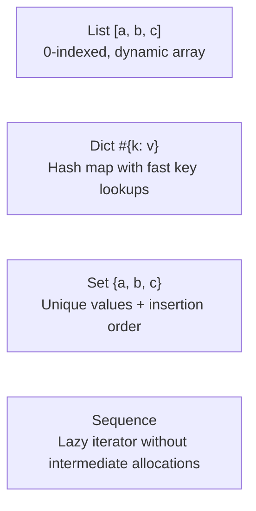

# Standard Library (Stdlib)

The Aipo standard library is built around three non-negotiable principles:
1. **Absolute Determinism**: The same operation produces identical bit-for-bit results on the native Rust VM and the JavaScript runtime.
2. **Security by Default (*Deny-by-Default*)**: Access to host system resources (filesystem, environment variables, system clock) requires explicit capability grants.
3. **Ergonomic Dual Invocation**: Functions across canonical modules can be invoked either as module functions (`string.len(txt)`) or as receiver methods on the value (`txt.len()`).

---

## Visual Module Index

| Crate / Module | Primary Purpose | Capability Required? |
| :--- | :--- | :---: |
| [`math`](#1-math-module) | Pure arithmetic, trigonometry, constants, and safe bounds | ❌ No |
| [`string`](#2-string-module) | Text manipulation guaranteed to uphold Unicode NFC normalization | ❌ No |
| [`collections`](#3-collections-list-dict-set-sequence) | Dynamic lists, Hash dicts, Insertion-ordered sets, and Lazy pipelines | ❌ No |
| [`json`](#4-json-module) | Portable serialization and strict parsing with duplicate key rejection | ❌ No |
| [`random`](#5-random-module) | Deterministic 64-bit pseudo-random number generator (SplitMix64) | ❌ No |
| [`time` & `Duration`](#6-time-duration-module) | High-precision timing, pure civil calendar dates, and duration math | 🔒 Yes (`clock.*`) |
| [`binary` & `Bytes`](#7-binary-bytes-module) | Contiguous raw byte buffer reads/writes (LE/BE) and LEB128 varints | ❌ No |
| [`path` & `url`](#8-path-url-modules) | Cross-platform path normalization and URL decomposition | ❌ No |
| [`testing`](#9-testing-expect-module) | Integrated assertion engine for pure, self-contained unit tests | ❌ No |
| [`task`](#10-task-module-async-concurrency) | Asynchronous task combinators, groups, races, and timeouts | ❌ No |
| [`fs` & `env`](#11-fs-env-modules-host-resources) | Sandboxed filesystem I/O and isolated environment variable lookups | 🔒 Yes (`fs.*`, `env`) |

---

## 1. `math` Module

The `math` module provides pure floating-point and integer operations without side effects.

### Mathematical Constants
- `math.pi`: \(3.141592653589793\)
- `math.e`: \(2.718281828459045\)
- `math.tau`: \(6.283185307179586\) (\(2 \times \pi\))

### Core Functions

| Function | Signature | Description |
| :--- | :--- | :--- |
| `math.sin(rad)` | `Float -> Float` | Sine in radians |
| `math.cos(rad)` | `Float -> Float` | Cosine in radians |
| `math.tan(rad)` | `Float -> Float` | Tangent in radians |
| `math.sqrt(x)` | `Float -> Float` | Square root (faults if `x < 0`) |
| `math.clamp(val, min, max)` | `(num, num, num) -> num` | Constrains value between `min` and `max` (faults if `min > max`) |
| `math.floor(x)` | `Float -> Int` | Greatest integer less than or equal to `x` |
| `math.ceil(x)` | `Float -> Int` | Smallest integer greater than or equal to `x` |
| `math.round(x)` | `Float -> Int` | Rounds to the nearest integer |
| `math.rad(deg)` | `Float -> Float` | Converts degrees to radians |
| `math.deg(rad)` | `Float -> Float` | Converts radians to degrees |

### Practical Example: Simple Pendulum Simulation

```aipo
import math

struct Pendulum {
    length: Float,
    gravity: Float,
    angle: Float,
    angular_velocity: Float
}

impl Pendulum {
    fn update(self, delta_time: Float) -> Pendulum {
        // Angular acceleration: (-g / L) * sin(theta)
        let accel = (-self.gravity / self.length) * math.sin(self.angle)
        
        let new_vel = self.angular_velocity + accel * delta_time
        let new_angle = self.angle + new_vel * delta_time
        
        // Clamp angle safely within rendering bounds
        let normalized_angle = math.clamp(new_angle, -math.pi, math.pi)
        
        return Pendulum {
            length: self.length,
            gravity: self.gravity,
            angle: normalized_angle,
            angular_velocity: new_vel
        }
    }
}

let p = Pendulum {
    length: 2.5,
    gravity: 9.81,
    angle: math.rad(45.0),
    angular_velocity: 0.0
}

let p_next = p.update(0.016)
print("New angle: " + String(p_next.angle))
```

::: tip Cognitive Anchor
Aipo strictly prohibits `NaN` and infinity values in its runtime value model. Division by zero or square roots of negative numbers immediately trigger recoverable `fail` values, preventing silent data corruption from propagating through your program.
:::

---

## 2. `string` Module

In Aipo, **every string literal and computed string is validated UTF-8 and automatically normalized to Unicode Normalization Form C (NFC)**. This eliminates insidious bugs caused by visually identical composed diacritics.

### Dual Invocation: Function vs Method
Choose whichever syntax best fits your mental flow:
```aipo
import string

let text = "  Aipo Language  "

// Module-function style:
let a = string.trim(text)

// Receiver-method style (identical implementation and performance):
let b = text.trim().lower()
```

### Essential Operations

| Method | Signature | Description |
| :--- | :--- | :--- |
| `.len()` | `() -> Int` | Number of Unicode codepoints (characters) |
| `.byte_len()` | `() -> Int` | Number of raw UTF-8 bytes in memory |
| `.trim()` | `() -> String` | Strips leading and trailing whitespace |
| `.split(sep)` | `String -> List` | Splits text into list of substrings |
| `.join(list)` | `List -> String` | Joins a list of items using this separator |
| `.contains(sub)` | `String -> Bool` | Checks if substring exists |
| `.starts_with(pre)` | `String -> Bool` | Tests starting prefix |
| `.ends_with(suf)` | `String -> Bool` | Tests ending suffix |
| `.replace(old, new)` | `(String, String) -> String` | Replaces occurrences of a substring |
| `.upper()` / `.lower()` | `() -> String` | Unicode-aware uppercase/lowercase conversion |

### Practical Example: Input Sanitization Pipeline

```aipo
import string

fn sanitize_email(raw_email: String) -> String {
    let clean = raw_email.trim().lower()
    
    if not clean.contains("@") then
        fail "invalid email: missing @"
    end
    
    let parts = clean.split("@")
    if parts.len() != 2 then
        fail "invalid email: incorrect structure"
    end
    
    let user = parts[0]
    let domain = parts[1]
    
    if user.len() == 0 or not domain.contains(".") then
        fail "invalid email: user or domain cannot be empty"
    end
    
    return user + "@" + domain
}

let input_email = "  Dev.Aipo@Poppy-Lang.ORG  "
let final_email = sanitize_email(input_email)
print("Sanitized email: " + final_email)
// Prints: "Sanitized email: dev.aipo@poppy-lang.org"
```

---

## 3. Collections: `List`, `Dict`, `Set`, `Sequence`

Aipo provides four core data structures designed for readability and runtime predictability:



### 1. `List`
Dynamic array indexed by integer offsets:
```aipo
let numbers = [10, 20, 30]
numbers.push(40)
print(numbers[0])   // 10
print(numbers[-1])  // 40 (negative indexing counts from the end)
```

### 2. `Dict`
Key-value associative map created using the `#{}` syntax:
```aipo
let config = #{
    "port": 8080,
    "host": "localhost",
    "debug": true
}

print(config["port"]) // 8080
config["port"] = 9000
```

### 3. `Set` (Insertion-Ordered Unique Values)
Unlike standard sets in Python or JavaScript, Aipo's `Set` **strictly preserves the original insertion order of elements**:
```aipo
let tags = Set()
tags.add("rust")
tags.add("aipo")
tags.add("rust") // Duplicate entry is silently ignored

print(tags.len()) // 2
print(tags.to_list()) // ["rust", "aipo"] - deterministic order guaranteed!
```

### 4. `Sequence` (Lazy Evaluation Pipelines)
Chaining `.map()` and `.filter()` over large lists produces wasteful intermediate heap allocations. Aipo's `Sequence` evaluates items **lazily on demand**, maintaining a flat \(O(1)\) memory footprint:

```aipo
let data = [1, 2, 3, 4, 5, 6, 7, 8, 9, 10]

// This pipeline allocates zero intermediate arrays:
let result = Sequence(data)
    .filter(fn(x) => x % 2 == 0)
    .map(fn(x) => x * 10)
    .take(3)
    .to_list()

print(result) // [20, 40, 60]
```

---

## 4. `json` Module

The `json` module provides deterministic serialization and deserialization with strict safety guarantees.

### Key Signatures
- `json.parse(text: String) -> Value`: Parses JSON text into Aipo values. **Strictly rejects duplicate object keys** with a recoverable failure, preventing security discrepancies across microservices.
- `json.stringify(value: Value, pretty: Bool = false) -> String`: Serializes values into canonical JSON. Detects object reference cycles and fails gracefully without recursion crashes.

### Practical Example: Parsing, Validating, and Serializing

```aipo
import json

let incoming_payload = "{\"service\": \"auth\", \"retries\": 3, \"active\": true}"

// Safely parse within an attempt block
let payload = attempt
    json.parse(incoming_payload)
recover err
    #{ "error": "Malformed JSON payload", "detail": err }
end

print("Requested service: " + payload["service"])

// Enrich dictionary and format pretty-printed output
payload["timestamp"] = 1727330000
let response_json = json.stringify(payload, true)
print(response_json)
```

---

## 5. `random` Module

The `random` module is powered by **SplitMix64**, a high-performance 64-bit pseudo-random number generator offering **100% mathematical reproducibility** across native and JavaScript targets.

### Global Generator vs Seeded Instances
Use the global default generator for convenience, or instantiate isolated `Rng` structs for reproducible simulations and unit tests:

```aipo
import random

// 1. Quick global generation
let d6 = random.int(1, 6)
let chance = random.float() // [0.0, 1.0)
let coin_flip = random.bool()

// 2. Seeded generator for 100% reproducible tests
let game_rng = random.create(42)

let chosen_monster = game_rng.choice(["Goblin", "Orc", "Dragon"])
let rolled_stats = game_rng.shuffle([10, 14, 18, 8, 12])

print("Encountered: " + chosen_monster)
print("Shuffled stats: " + String(rolled_stats))
```

::: tip Why Determinism Matters
In game development, procedural world generation, and automated testing, having a random generator that behaves identically across Linux, Windows, macOS, and web browsers eliminates phantom bugs (*heisenbugs*).
:::

---

## 6. `time` & `Duration` Module

Time measurement in Aipo is divided into two decoupled domains:
1. **Physical Host Clock**: System wall-clock and monotonic timers (`time.now()`, `time.monotonic()`), treated as sensitive external capabilities guarded by the **Host ABI**.
2. **Pure Calendar Dates & Durations**: Pure calendar representations (`Date`, `DateTime`) and high-precision intervals (`Duration`) independent of host timezone quirks.

### Host Clock (Capability-Gated)
```aipo
import time

// Requires host application to grant 'clock.wall' capability
let now_seconds = time.now()

// Requires 'clock.monotonic' capability (ideal for high-precision benchmarking)
let start = time.monotonic()
// ... execute compute-heavy logic ...
let finish = time.monotonic()
let elapsed = finish - start
print("Elapsed time: " + String(elapsed) + "s")
```

### Pure Civil Dates & Durations
```aipo
import time

// Construct pure civil calendar date (Year, Month, Day)
let release_date = time.date(2026, 9, 26)

print("Is leap year? " + String(release_date.is_leap()))
print("Days in month: " + String(release_date.days_in_month()))
print("ISO-8601: " + release_date.to_iso()) // "2026-09-26"

// Duration arithmetic
let span = Duration(120.5) // 120.5 seconds
print("In minutes: " + String(span.minutes()))
```

---

## 7. `binary` & `Bytes` Module

The `Bytes` value type and `binary` module facilitate low-level contiguous memory buffer manipulation with explicit endianness (Little-Endian / Big-Endian) and LEB128 compression.

### Practical Example: Binary Network Packet Serialization

Consider constructing a game state packet with a binary layout:
- Byte 0: Packet type ID (`u8`)
- Bytes 1-2: Player ID (`u16 Little-Endian`)
- Bytes 3-6: Position X (`f32 Little-Endian`)
- Bytes 7-10: Position Y (`f32 Little-Endian`)

```aipo
import binary

// Allocate contiguous byte buffer
let packet = Bytes(11)

// Write fields with explicit endianness
binary.write_u8(packet, 0, 0x01)         // PacketType = 1 (Movement)
binary.write_u16_le(packet, 1, 1042)      // Player ID = 1042
binary.write_f32_le(packet, 3, 128.5)     // Pos X = 128.5
binary.write_f32_le(packet, 7, -64.25)    // Pos Y = -64.25

print("Packet size: " + String(packet.len()) + " bytes")

// Symmetrical reading on the receiving side
let msg_type = binary.read_u8(packet, 0)
let player_id = binary.read_u16_le(packet, 1)
let x = binary.read_f32_le(packet, 3)
let y = binary.read_f32_le(packet, 7)

print("Received packet: Player #" + String(player_id) + " at (" + String(x) + ", " + String(y) + ")")
```

---

## 8. `path` & `url` Modules

To prevent bugs when running scripts across Windows (`C:\path\file`) and POSIX systems (`/path/file`), the `path` module **normalizes all separators to forward slashes (`/`)** and resolves relative parent segments logically.

### Practical Example with `path` and `url`

```aipo
import path
import url

// 1. Cross-platform path normalization
let messy_path = "src\\models\\..\\controllers\\auth.aipo"
let clean_path = path.normalize(messy_path)
print(clean_path) // "src/controllers/auth.aipo"

print("Parent directory: " + path.dirname(clean_path)) // "src/controllers"
print("File basename: " + path.basename(clean_path))   // "auth.aipo"
print("File extension: " + path.extension(clean_path)) // "aipo"

// 2. URL parsing and query extraction
let endpoint = "https://aipolang.vercel.app/manual/stdlib?lang=en&theme=dark#top"
let parsed = url.parse(endpoint)

print("Protocol: " + parsed["protocol"]) // "https"
print("Host: " + parsed["host"])         // "aipolang.vercel.app"
print("Path: " + parsed["path"])         // "/manual/stdlib"
print("Query: " + parsed["query"])       // "lang=en&theme=dark"
```

---

## 9. `testing` (`expect`) Module

Aipo includes a native testing engine eliminating the need for third-party test frameworks:

```aipo
import testing: expect

fn divide(dividend: Int, divisor: Int) -> Int {
    if divisor == 0 then
        fail "division by zero"
    end
    return dividend / divisor
}

// Positive assertion cases
expect(divide(10, 2)).to_equal(5)
expect(divide(10, 3)).to_equal(3)

// Expected failure assertion
expect(fn() => divide(10, 0)).to_fail_with("division by zero")

print("All tests passed successfully!")
```

---

## 10. `task` Module (Async Concurrency)

The `task` module drives cooperative asynchronous concurrency on top of a **deterministic virtual-time task scheduler**.

### Async Combinators

| Combinator | Signature | Description |
| :--- | :--- | :--- |
| `task.spawn(fn)` | `async fn -> Task` | Spawns task into cooperative scheduler queue |
| `task.sleep(dur)` | `Duration -> Task` | Suspends active task for virtual duration |
| `task.all(tasks)` | `List<Task> -> Task` | Awaits all tasks to resolve successfully |
| `task.race(tasks)` | `List<Task> -> Task` | Resolves to the value of the first task to complete |
| `task.timeout(task, dur)` | `(Task, Duration) -> Task` | Aborts task with failure if duration expires |
| `task.cancel(task)` | `Task -> None` | Cooperatively cancels a pending task |

### Practical Example: Concurrent Services Race with Timeout

```aipo
import task

async fn query_endpoint(endpoint_name: String, latency_seconds: Float) -> String {
    task.sleep(Duration(latency_seconds))
    return "Response from " + endpoint_name
}

async fn fetch_fastest_data() -> String {
    let t1 = task.spawn(fn() => query_endpoint("North-America", 0.15))
    let t2 = task.spawn(fn() => query_endpoint("South-America", 0.05))
    let t3 = task.spawn(fn() => query_endpoint("Europe", 0.20))
    
    // Race tasks: fastest response wins
    let race_task = task.race([t1, t2, t3])
    
    // Enforce 0.5s maximum timeout ceiling
    let result = await do
        task.timeout(race_task, Duration(0.5))
    end
    
    return result
}
```

---

## 11. `fs` & `env` Modules (Host Resources)

Unlike Python or Node.js where any third-party script can silently read sensitive environment variables or traverse your filesystem, **Aipo blocks all host interaction by default**.

```aipo
import fs
import env

// If the host application has not explicitly granted "env.read":
// Execution is halted with: AIPO_RT_CAPABILITY_DENIED (capability: "env.read")
let current_user = attempt
    env.get("USER")
recover err
    "guest" // Safe, transparent recovery fallback
end

print("Running as: " + current_user)
```

::: warning Security Charter
When a capability is withheld by the host, the function **does not pretend the resource is missing** and **does not return deceptive empty values**. It raises a structured, auditable fault with canonical code `AIPO_RT_CAPABILITY_DENIED`.
:::
