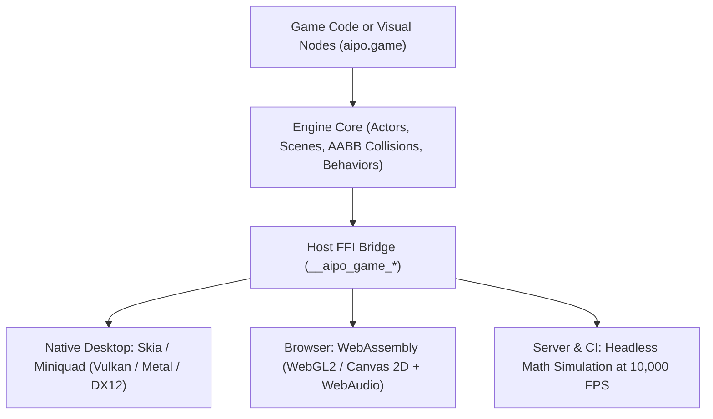
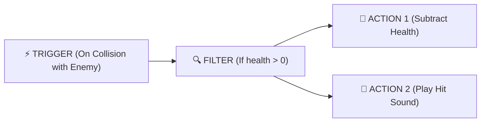

# aipo.game — 2D Micro Game Engine

`aipo.game` is the official 2D game engine of the Aipo programming language for expressive, rapid game development. It draws inspiration from the productivity paradigms of **Construct 3**, **ct.js**, and **GameMaker Studio**, powered by the raw speed and determinism of Aipo's native runtime.

---

## 1. Overview & Philosophy

Game development should not be weighed down by excessive boilerplate or heavyweight workflows. `aipo.game` is anchored on four core pillars:

1. **Explicit Actors & Scenes:** Every entity (`Actor`) encapsulates its lifecycle (`on_create`, `on_update`, `on_collision`, `on_destroy`), rendering, and physics.
2. **One-Line Pluggable Behaviors:** Turnkey capabilities like platformer physics, top-down movement, and bullet trajectories are attached with a single declaration.
3. **Deterministic Simulation:** Aipo's strict type system and controlled side effects ensure 100% reproducible gameplay steps, enabling **Rollback Netcode** for multiplayer and featherweight replay files.
4. **Anti-Spaghetti Visual Nodes:** Visual scripting follows an organized **"Trigger $\to$ Filter $\to$ Action"** model that compiles bidirectionally to clean `.aipo` code.



---

## 2. Installation

Add to your project's `aipo.toml`:

```toml
[dependencies]
"aipo.game" = { path = "packages/aipo-game" }
```

---

## 3. Quick Example: Space Game in 50 Lines

```aipo
import aipo.game as g

// 1. Player Actor
let Ship = g.actor("Ship", {
    sprite: "ship.png",
    behaviors: [
        g.behaviors.TopDown(speed: 250.0),
        g.behaviors.KeepInScreen()
    ],

    on_create: actor => {
        actor.health = 100
        actor.cooldown = 0.0
    },

    on_update: (actor, dt) => {
        actor.cooldown -= dt
        
        // Fire laser on Spacebar press
        if g.input.key_down("Space") and actor.cooldown <= 0.0 {
            g.spawn(Laser, x: actor.x, y: actor.y - 18)
            g.audio.play("laser.wav")
            actor.cooldown = 0.15
        }
    },

    on_collision: (actor, other) => {
        if other.is_a(Asteroid) {
            actor.health -= 20
            other.destroy()
            g.audio.play("explosion.wav")
        }
    }
})

// 2. Projectile Actor
let Laser = g.actor("Laser", {
    sprite: "laser.png",
    behaviors: [
        g.behaviors.Bullet(speed: 600.0, angle: -90.0),
        g.behaviors.DestroyOutsideScreen()
    ]
})

// 3. Enemy Actor
let Asteroid = g.actor("Asteroid", {
    sprite: "asteroid.png",
    behaviors: [
        g.behaviors.Bullet(speed: 140.0, angle: 90.0),
        g.behaviors.DestroyOutsideScreen()
    ]
})

// 4. Main Game Scene
let SpaceScene = g.scene("Level1", {
    width: 800,
    height: 600,
    background: "#0d0e15",

    on_load: scene => {
        g.spawn(Ship, x: 400, y: 520)

        // Spawn asteroids every 0.8s
        scene.timer(interval: 0.8, repeat: true, _ => {
            let posX = g.random.range(40, 760)
            g.spawn(Asteroid, x: posX, y: -20)
        })
    }
})

// 5. Entrypoint
fn main() {
    g.start({
        title: "Space Defender — Aipo Game",
        width: 800,
        height: 600,
        initial_scene: SpaceScene
    })
}
```

---

## 4. Behaviors Catalog

| Behavior | Key Properties | Description |
|---|---|---|
| `g.behaviors.TopDown()` | `speed: 200.0`, `diagonal: true` | 8-directional movement with WASD, arrow keys, and gamepad support. |
| `g.behaviors.Platformer()` | `speed: 200.0`, `jump_force: 400.0`, `gravity: 980.0` | Classic platforming physics with jump, gravity, and ground contact checks. |
| `g.behaviors.Bullet()` | `speed: 400.0`, `angle: 0.0` | Moves the entity in a straight line at fixed speed and angle. |
| `g.behaviors.Solid()` | *(none)* | Marks the actor as an impassable obstacle for moving entities. |
| `g.behaviors.WrapScreen()` | `margin: 16.0` | Reappears on the opposite side of the screen when crossing borders. |
| `g.behaviors.KeepInScreen()` | `margin: 0.0` | Prevents the actor from leaving visible window boundaries. |
| `g.behaviors.DestroyOutsideScreen()` | `margin: 50.0` | Automatically frees the actor when out of viewport range. |

---

## 5. Input and Audio Subsystems

### Keyboard & Mouse
```aipo
// Continuous or single-press checks
if g.input.key_down("Space") { ... }
if g.input.key_pressed("Enter") { ... }

// Normalized directional axes (-1.0 to +1.0)
let ax = g.input.axis_x() // A/D or Left/Right
let ay = g.input.axis_y() // W/S or Up/Down

// Pointer coordinates
let mx = g.input.mouse_x()
let my = g.input.mouse_y()
let clicked = g.input.mouse_down("left")
```

### Sound Effects & Music
```aipo
// External audio file playback
g.audio.play("laser.wav")
g.audio.play_sound("laser.wav", volume: 0.8, pitch: 1.2)
g.audio.play_music("bgm_stage1.ogg", volume: 0.5, loop: true)

// Procedural Chiptune SFX (SFXR style) — Zero external audio files required!
g.audio.sfx("coin")       // Coin / Pickup chime
g.audio.sfx("jump")       // Rising pitch jump sound
g.audio.sfx("laser")      // Blaster laser sound
g.audio.sfx("explosion")  // White noise explosion rumble
g.audio.sfx("powerup")    // Ascending arpeggio powerup
```

---

## 6. Tweening & "Game Juice" Animations

The tweening module (`aipo.game.tween`) infuses games with springy, elastic animations using customizable easing curves:

```aipo
// Squash & Stretch on landing or jumping
g.animate(player, prop: "scale_x", to_val: 1.3, duration: 0.1, ease_fn: g.ease_out)
g.animate(player, prop: "scale_y", to_val: 0.7, duration: 0.1, ease_fn: g.ease_out, on_complete: _ => {
    // Return to normal dimensions with a bouncy settle
    g.animate(player, prop: "scale_x", to_val: 1.0, duration: 0.2, ease_fn: g.bounce_out)
    g.animate(player, prop: "scale_y", to_val: 1.0, duration: 0.2, ease_fn: g.bounce_out)
})
```

---

## 7. Anti-Spaghetti Visual Scripting Nodes

The `aipo.game.nodes` module defines the data structures and compiler for graphical editing tools.

Instead of unorganized graphs with tangled cables, visual logic is organized into structured **Trigger $\to$ Filter $\to$ Action** sequences:



### Visual / Code Bidirectionality
Any visual rule transpires directly into readable Aipo code:

```aipo
import aipo.game.nodes as n

let collision_rule = n.rule(
    "EnemyHit",
    trigger: n.trigger("on_collision", { "with": "Enemy" }),
    filters: [ n.filter("actor.vy", ">", "0") ],
    actions: [
        n.action("destroy", { "target": "other" }),
        n.action("play_sound", { "file": "hit.wav")
    ]
)

// The node compiler outputs clean, formatted Aipo source:
let source_code = n.transpile_to_aipo_code(collision_rule)
```
