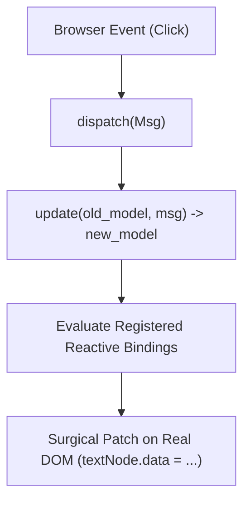

# aipo.html — Declarative Web Framework

`aipo.html` is the official package of the Aipo programming language for building modern web applications, Single Page Applications (SPAs), and browser user interfaces.

It combines:
1. **Clean Declarative Tag Syntax:** no `children: [...]` and no closing tags.
2. **Fine-Grained Model-View-Update (MVU) Reactivity:** surgical DOM updates with zero full-tree diffing overhead.
3. **Typed CSS-in-Aipo:** composable styles with class hashing and automatic `<head>` injection.
4. **JavaScript Runtime Bridge (`aipo-dom.js`):** seamless integration with the `aipo-js` emitter and WebAssembly compilation.

---

## 1. Getting Started

In your `aipo.toml`:

```toml
[dependencies]
"aipo.html" = { path = "packages/aipo-html" }
```

Import the package and mount the application into a target DOM selector (e.g., `<div id="app"></div>`):

```aipo
import aipo.html as h

struct Model {
    count: Int
}

enum Msg {
    Increment,
    Decrement,
    Reset
}

fn update(m: Model, msg: Msg) -> Model {
    match msg {
        Msg::Increment => Model{ count: m.count + 1 },
        Msg::Decrement => Model{ count: m.count - 1 },
        Msg::Reset => Model{ count: 0 }
    }
}

fn view(m: Model, dispatch: Fn) {
    h.div(class: "p-8 max-w-sm mx-auto bg-white rounded-xl shadow-lg border") {
        h.h1(f"Counter: {m.count}", class: "text-2xl font-bold text-gray-800")
        
        h.div(class: "flex gap-2 mt-4") {
            h.button("+1", class: "bg-indigo-600 text-white px-4 py-2 rounded font-medium", on_click: _ => dispatch(Msg::Increment))
            h.button("-1", class: "bg-gray-200 text-gray-800 px-4 py-2 rounded font-medium", on_click: _ => dispatch(Msg::Decrement))
            h.button("Reset", class: "bg-red-500 text-white px-4 py-2 rounded font-medium", on_click: _ => dispatch(Msg::Reset))
        }
    }
}

h.mount("#app", init = Model{ count: 0 }, update, view)
```

---

## 2. Declarative Tag Syntax

`aipo.html` leverages Aipo's native *trailing block* syntax. Tags behave intuitively:

### Leaf Tags & Direct Text
When an element contains only text, the string is passed as the first parameter:

```aipo
h.h1("Main Title")
h.p("Paragraph explanation.", class: "lead text-gray-600")
h.span("Highlighted", class: "badge font-semibold")
```

### Container Tags with Children
Attributes live inside parentheses, and children live inside a natural block `{ ... }`:

```aipo
h.div(class: "card shadow-sm") {
    h.h3("Card Header")
    h.p("Card inner body content.")
    h.button("Action")
}
```

### Void Elements
Elements without children (such as `input`, `img`, `hr`):

```aipo
h.img(src: "photo.png", alt: "Avatar", class: "rounded-full h-12 w-12")
h.input(type: "text", placeholder: "Type here...", class: "border p-2 rounded")
h.hr(class: "my-4")
```

---

## 3. Fine-Grained MVU Reactivity

Unlike conventional frameworks that re-compute the entire virtual tree and burn CPU cycles comparing identical virtual nodes (traditional Virtual DOM diffing), `aipo.html` implements **Fine-Grained MVU**:



1. **Single Initial Mount:** `view(m, dispatch)` constructs the real DOM upon initialization and registers fine-grained bindings on leaf nodes and dynamic attributes.
2. **Surgical Update:** When a message modifies the immutable model, the runtime checks modified values and updates **only the affected text node or attribute directly in the browser**.

---

## 4. Styling: Utility Classes & Typed CSS-in-Aipo

### Utility Classes (Tailwind / Bootstrap)
Pass classes directly via the `class` property:

```aipo
h.div(class: "flex items-center justify-between p-4 bg-slate-900 text-white rounded-lg") {
    h.span("Active Dashboard")
}
```

### Typed CSS-in-Aipo (`h.css`)
Declare scoped, type-safe styles:

```aipo
let card_style = h.css {
    display: "flex",
    direction: "column",
    padding: 20,
    background: "#ffffff",
    border_radius: 12,
    border: "1px solid #e2e8f0",
    hover: {
        border_color: "#6366f1",
        shadow: "0 8px 16px rgba(99, 102, 241, 0.1)"
    }
}

# Injects the unique hash rule into the document head and attaches the class
h.div(style: card_style) {
    h.p("Card with isolated, type-safe styling!")
}
```
