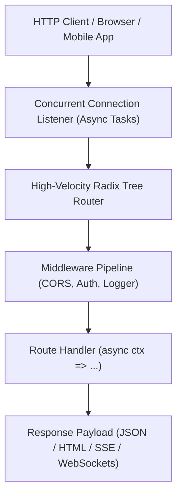

# aipo.http — Web Backend Framework & APIs

`aipo.http` is the official backend framework of the Aipo programming language for building HTTP servers, microservices, and APIs with native WebSocket support. It is engineered to leverage Aipo's structured async concurrency and the raw performance of the native Wasm JIT compiler.

Drawing inspiration from the speed and elegance of **Hono** and **FastAPI**, `aipo.http` strips away traditional boilerplate, embracing a declarative, secure-by-default architecture.

---

## 1. Overview & Core Philosophy

Unlike legacy frameworks burdened by transpilers, decorators, or complex mutable middleware chains, `aipo.http` takes full advantage of Aipo's first-class capabilities:

1. **Radix Tree Routing:** Blazing-fast dispatch for parameterized routes (`/users/:id`).
2. **Clean Context (`ctx`):** Ergonomic access to parameters, headers, query strings, and JSON payloads with immutable, chainable helpers.
3. **Schema & Contract Integration:** First-class compatibility with Aipo contracts for automated payload validation and standardized HTTP 422 error responses.
4. **Native WebSockets:** High-throughput bidirectional real-time communication with zero external dependencies.
5. **Fullstack Unification with `aipo.html`:** The same Aipo codebase renders on the server (SSR) and powers client-side reactivity (Fine-Grained MVU).



---

## 2. Quickstart: REST API with Validation

```aipo
import aipo.http as web

let app = web.create()

# Logging Middleware
app.use(async (ctx, next) => {
    let start = time.now()
    await next()
    let elapsed = time.elapsed_ms(start)
    io.println(f"[{ctx.method}] {ctx.path} — {ctx.status} ({elapsed}ms)")
})

# Simple Route
app.get("/", ctx => {
    return ctx.json({ "message": "Aipo HTTP service online!" })
})

# Parameterized Route
app.get("/users/:id", async ctx => {
    let user_id = ctx.param("id")
    let user = await fetch_user_from_db(user_id)
    
    if user == none {
        return ctx.status(404).json({ "error": "User not found" })
    }
    
    return ctx.json(user)
})

# POST Route with JSON Parsing
app.post("/users", async ctx => {
    let body = await ctx.req.json()
    
    # Input validation
    if not body.contains("name") or not body.contains("email") {
        return ctx.status(400).json({ "error": "Fields 'name' and 'email' are required" })
    }
    
    let new_user = await create_user(body.name, body.email)
    return ctx.status(201).json(new_user)
})

# Start server on port 3000
app.listen(port: 3000, host: "0.0.0.0", _ => {
    io.println("🚀 Server running on http://localhost:3000")
})
```

---

## 3. Real-Time WebSockets

Native WebSocket support is baked directly into the core of `aipo.http`, enabling real-time chat, multiplayer rooms, and streaming data feeds in just a few lines of code:

```aipo
app.ws("/ws/room/:room_id", {
    on_connect: (socket, ctx) => {
        let room = ctx.param("room_id")
        socket.join(room)
        socket.broadcast_to(room, "A new participant joined the room!")
    },

    on_message: (socket, message) => {
        # Broadcast message to everyone in the room
        socket.broadcast_to(socket.current_room, message)
    },

    on_disconnect: (socket, reason) => {
        io.println(f"Disconnected: {reason}")
    }
})
```

---

## 4. Fullstack SSR with `aipo.html`

`aipo.http` renders components authored with [`aipo.html`](/en/packages/aipo-html) on the server natively, serving instant static HTML paired with seamless client hydration:

```aipo
import aipo.http as web
import aipo.html as h

app.get("/page", ctx => {
    return ctx.html(
        h.div(class: "container mx-auto p-4") {
            h.h1("Rendered on the Server with Aipo!", class: "text-2xl font-bold")
            h.p("Zero Node.js, Webpack, or Babel dependencies.")
        }
    )
})
```
