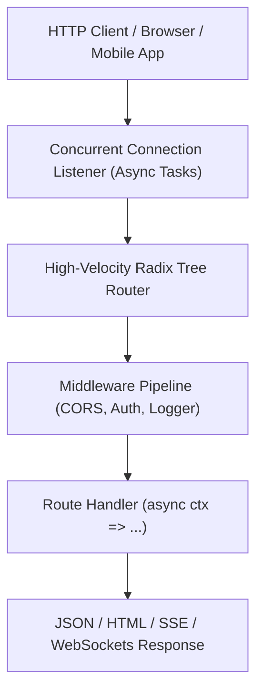

# aipo.http — Web Backend Framework & APIs

`aipo.http` is the official backend framework of the Aipo programming language for building HTTP servers, microservices, and APIs with native WebSocket support. It is engineered to leverage Aipo's structured async concurrency and the raw performance of the native Wasm JIT compiler.

Inspired by the speed and developer experience of **Hono** and **FastAPI**, `aipo.http` eliminates traditional boilerplate, providing a declarative, safe-by-default architecture.

---

## 1. Overview & Philosophy

Unlike legacy web frameworks that rely on transpilers, runtime decorators, or complex mutable middlewares, `aipo.http` leverages Aipo's first-class language capabilities:

1. **Radix Tree Routing:** Blazing fast parameterized route matching (`/users/:id`).
2. **Clean Request Context (`ctx`):** Streamlined access to path parameters, headers, query strings, and JSON payloads with immutable, chainable methods.
3. **Schema & Contract Integration:** First-class compatibility with Aipo contracts for automated payload validation and standardized HTTP 422 error responses.
4. **Native WebSockets:** Built-in bidirectional real-time connections without external dependencies.
5. **Fullstack with `aipo.html`:** The exact same language codebase runs on the server (SSR HTML delivery) and on the client (Fine-Grained MVU reactivity).



---

## 2. Quick Example: REST API with Validation

```aipo
import aipo.http as web

let app = web.create()

// Logging Middleware
app.use(async (ctx, next) => {
    let start = time.now()
    await next()
    let duration = time.elapsed_ms(start)
    print(f"[{ctx.method}] {ctx.path} — {ctx.status} ({duration}ms)")
})

// Simple Route
app.get("/", ctx => {
    return ctx.json({ "message": "Aipo HTTP Server running!" })
})

// Parameterized Route
app.get("/users/:id", async ctx => {
    let user_id = ctx.param("id")
    let user = await fetch_user_from_db(user_id)
    
    if user == null {
        return ctx.status(404).json({ "error": "User not found" })
    }
    
    return ctx.json(user)
})

// POST Route with JSON Parsing
app.post("/users", async ctx => {
    let body = await ctx.req.json()
    
    if !body.contains("name") or !body.contains("email") {
        return ctx.status(400).json({ "error": "'name' and 'email' fields are required" })
    }
    
    let new_user = await create_user(body.name, body.email)
    return ctx.status(201).json(new_user)
})

// Start server on port 3000
app.listen(port: 3000, host: "0.0.0.0", _ => {
    print("🚀 Server running on http://localhost:3000")
})
```

---

## 3. Real-Time WebSockets

WebSocket support is built directly into the core of `aipo.http`, enabling real-time chat rooms, multiplayer game lobbies, and metric streaming in just a few lines:

```aipo
app.ws("/ws/room/:room_id", {
    on_connect: (socket, ctx) => {
        let room = ctx.param("room_id")
        socket.join(room)
        socket.broadcast_to(room, "A new user joined the room!")
    },

    on_message: (socket, message) => {
        socket.broadcast_to(socket.current_room, message)
    },

    on_disconnect: (socket, reason) => {
        print(f"Disconnected: {reason}")
    }
})
```

---

## 4. Fullstack SSR with `aipo.html`

`aipo.http` natively renders components authored with [`aipo.html`](/en/packages/aipo-html) on the server, serving lightning-fast static HTML with zero build step overhead:

```aipo
import aipo.http as web
import aipo.html as h

app.get("/landing", ctx => {
    return ctx.html(
        h.div(class: "container mx-auto p-4") {
            h.h1("Server-Side Rendered with Aipo!", class: "text-2xl font-bold")
            h.p("Zero Node.js, Webpack, or Babel dependencies.")
        }
    )
})
```
