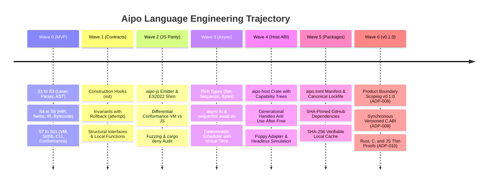

# Development Trajectory

This section documents the complete engineering journey, architecture evolution, and milestones of the **Aipo** programming language, from the initial tokenization concepts to the consolidation of release v0.1.0.

Every wave and vertical slice was built under the **Lean Progressive Context (LPC)** methodology and governed by the **Prumo CLI**, with strict acceptance criteria, exhaustive automated test coverage, and zero unverified assumptions.

---

## Implementation Waves Timeline

---

## Implementation Waves Summary

Completed
<h4>Wave 0 — Language MVP</h4>

Implementation of 11 fundamental vertical slices: UTF-8 Lexer, resilient Parser, HIR, semantic analysis, Core IR, Bytecode, stack/register VM, minimal Stdlib, Code Formatter, unified CLI, and initial conformance suite.

<a href="/en/trajectory/wave-0-mvp">Read Wave 0 documentation →</a>

Completed
<h4>Wave 1 — Contracts & Conformance</h4>

Language MVP hardening with <code>init()</code> hooks, <code>invariant()</code> integrity enforcement on stable mutation boundaries with automated rollback via transactional journal, and structural interface conformance.

<a href="/en/trajectory/wave-1-contracts">Read Wave 1 documentation →</a>

Completed
<h4>Wave 2 — JS Parity & Quality</h4>

Modern JavaScript (ES2022) code generation via <code>aipo-js</code> with modular runtime shim, differential VM↔JS conformance testing, property-based testing, continuous fuzzing, and strict dependency audits with <code>cargo deny</code>.

<a href="/en/trajectory/wave-2-js-parity">Read Wave 2 documentation →</a>

Completed
<h4>Wave 3 — Rich Types & Async</h4>

Introduction of insertion-ordered <code>Set</code>, lazy <code>Sequence</code>, binary <code>Bytes</code> packaging, native <code>async fn</code> and <code>await do</code> syntax, async combinators, and a cooperative scheduler with virtual time.

<a href="/en/trajectory/wave-3-async">Read Wave 3 documentation →</a>

Completed
<h4>Wave 4 — Host ABI & Poppy Engine</h4>

Secure Host ABI design (<code>aipo-host</code>) featuring deny-by-default capabilities, generational handles resistant to use-after-free, scope escape barriers, and headless integration with the Poppy simulation engine.

<a href="/en/trajectory/wave-4-host-poppy">Read Wave 4 documentation →</a>

Completed
<h4>Wave 5 — Hermetic Packages</h4>

Hermetic package distribution and dependency resolution: <code>namespace.package</code> coordinates, commit SHA-pinned GitHub dependencies with hash verification, atomic local cache, and 100% offline replay.

<a href="/en/trajectory/wave-5-packages">Read Wave 5 documentation →</a>

In Progress
<h4>Wave 6 — Release v0.1.0</h4>

Formal product boundary definition (ADP-008): dedicated focus on the standalone language and toolchain, minimal test runner, versioned synchronous C ABI (ADP-009), and thin interop proofs in Rust, C, and JavaScript (ADP-010).

<a href="/en/trajectory/wave-6-release-v010">Read Wave 6 documentation →</a>

