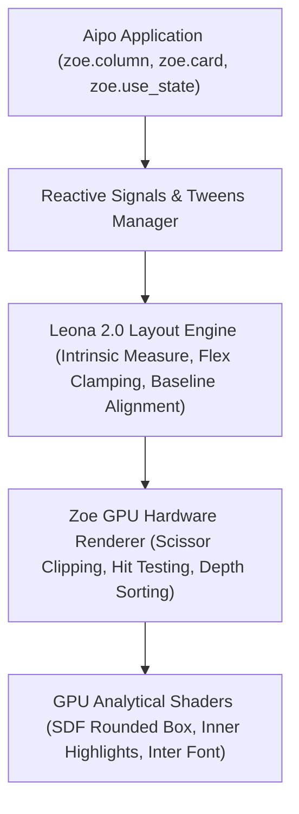

# Zoe UI Framework (`aipo.zoe`)

> **The High-Performance Declarative GUI Framework for Aipo.**  
> Combining modern reactive state ergonomics with native GPU analytical shaders (SDF), subpixel typography, and the **Leona** layout engine.

---

## 🌟 What is Zoe UI?

**Zoe UI** is the canonical GUI library and framework for the Aipo programming language, designed for building professional graphical applications, developer tools (IDEs, game engine editors, diagnostic dashboards), and tactile user interfaces.

Unlike traditional GUI frameworks that wrap heavy native libraries (C++, Electron, Qt), Zoe UI is written **100% in pure Aipo code**:
- The component tree (`ElementNode`), bounding box layout calculation, and reactive event dispatching all run directly within Aipo's runtime.
- The low-level backend (`aipo-game-host`) accelerates presentation using **GPU analytical fragment shaders (SDF)**, delivering steady 60+ FPS, continuous anti-aliased corners, 1px top inner highlights, and crisp subpixel typography.



---

## 🎯 Architectural Pillars

| Pillar | Description |
| :--- | :--- |
| **Pillar 1: Analytical UI Shaders (GPU)** | Primitive rendering via *Signed Distance Fields* (SDF). Smoothstep continuous anti-aliasing, physically modeled 1px top chamfer highlight, and 2-layer gaussian elevation. |
| **Pillar 2: Subpixel Vector Typography** | Vector typography powered by `fontdue` with embedded Inter TTF. Real font metrics (`ascent`, `descent`, `line_height`) at layout resolution time. |
| **Pillar 3: Leona 2.0 Layout Engine** | 3-pass layout system: Intrinsic Content Measurement, Strict Flex Clamping (no overflow), and Font Baseline Alignment. |
| **Pillar 4: Component Authoring Protocol** | Standardized component composition contract. Easy extensibility for complex widgets such as code editors, Bézier node graphs, and docking splits. |

---

## 🚀 Quickstart in 60 Seconds

Add the dependency to your `aipo.toml`:

```toml
[dependencies]
"aipo.zoe" = { path = "packages/aipo-zoe" }
```

Create your `main.aipo` file:

```aipo
import aipo.zoe as zoe

fn view() {
    let count = zoe.use_state(0)

    return zoe.center({ "background": zoe.color.base, "gap": 16.0 }, [
        zoe.label(f"Counter: {count.get()}", {
            "font_size": 24.0,
            "color": zoe.color.text,
            "font_weight": "bold"
        }),
        zoe.row({ "gap": 12.0 }, [
            zoe.button("+1 Increment", _ => zoe.set_state(count, count.get() + 1), {
                "variant": "primary"
            }),
            zoe.button("Reset", _ => zoe.set_state(count, 0), {
                "variant": "secondary"
            })
        ])
    ])
}

fn setup() {
    zoe.mount(view)
}

fn update(dt) {
    zoe.step(dt)
}

fn draw() {
    zoe.draw_ui()
}
```

Run the application:

```bash
aipo run main.aipo
```

---

## 🧭 Documentation Navigation

- **[Getting Started](/en/zoe/guide/getting-started)** — Application lifecycle, entrypoint, and conventions.
- **[Layout with Leona 2.0](/en/zoe/guide/layout-leona)** — Understanding flexbox, min/max constraints, content hugging, and baseline alignment.
- **[Reactivity & Signals](/en/zoe/guide/reactivity)** — Working with `use_state`, `use_memo`, `use_effect`, and tween animations.
- **[Creating Custom Components](/en/zoe/guide/custom-components)** — The canonical protocol for building new widgets.
- **[Component Catalog](/en/zoe/components/buttons)** — Documentation for buttons, inputs, layout, navigation, and advanced widgets.
- **[Interactive Playground](/en/zoe/playground)** — Test Zoe code and see interactive previews.
