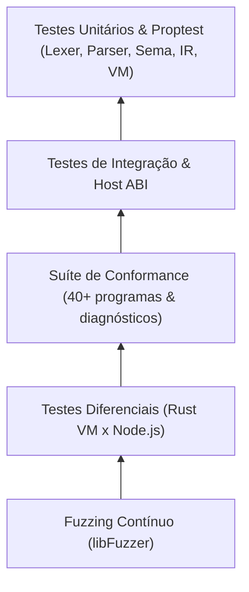

# Padrões de Código & Estratégia de Testes

A integridade do Aipo é sustentada por uma pirâmide abrangente de testes automatizados e regras estritas de compilação em Rust 2024.

---

## Portões de Qualidade Obrigatórios (Quality Gates)

Todo commit e pull request deve passar com sucesso por 100% dos seguintes portões de verificação:

1. **`cargo fmt --check`**: Verificação rigorosa de formatação do código-fonte.
2. **`cargo check --workspace --all-targets`**: Análise de compilação sem erros.
3. **`cargo clippy --workspace --all-targets -- -D warnings`**: Zero advertências permitidas em linters estáticos.
4. **`cargo test --workspace`**: Execução integral de mais de 500 testes unitários e de integração.
5. **`cargo doc --workspace --no-deps`**: Verificação de documentação de APIs sem links quebrados.

---

## A Pirâmide de Testes

### 1. Testes Unitários & de Propriedade
Verificação de funções puras, manipulação de limites em `Bytes`, cálculo de offsets em `Source` e propriedades matemáticas com `proptest`.

### 2. Testes de Integração & Host ABI
Cenários ponta a ponta avaliando o comportamento da VM com simulação Poppy, gerenciamento de memória em handles e negação de capacidades.

### 3. Testes de Conformance
Execução de programas canônicos com checagem estrita de saída de texto e código de término.

### 4. Testes Diferenciais (VM ↔ JS)
Execução paralela de cada programa no runtime em Rust e no Node.js, garantindo compatibilidade semântica absoluta.

### 5. Fuzzing Contínuo
Injeção massiva de entradas aleatórias e malformadas no Lexer e no Parser para comprovar que o compilador nunca sofre pânicos ou estouros de buffer.
