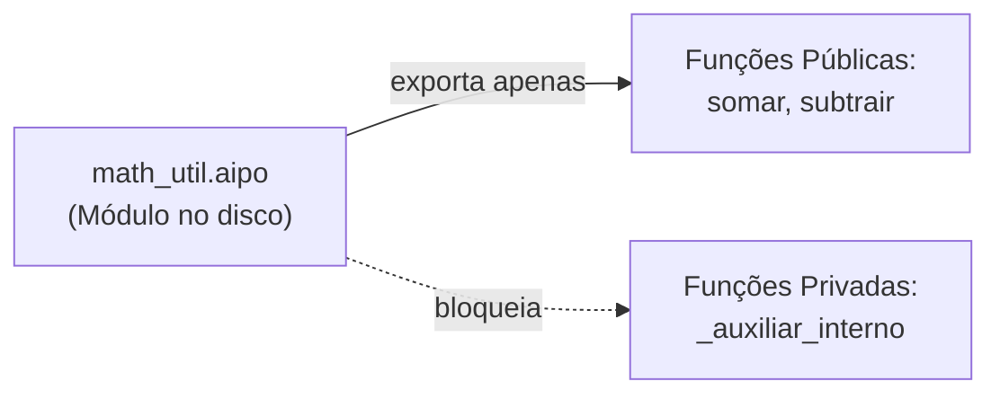
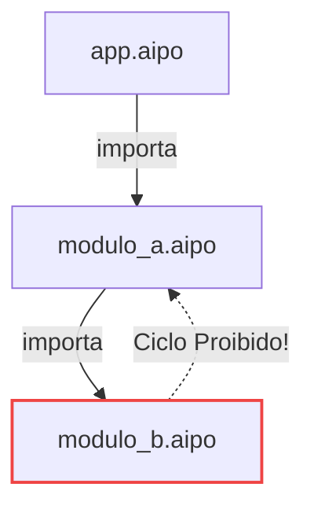
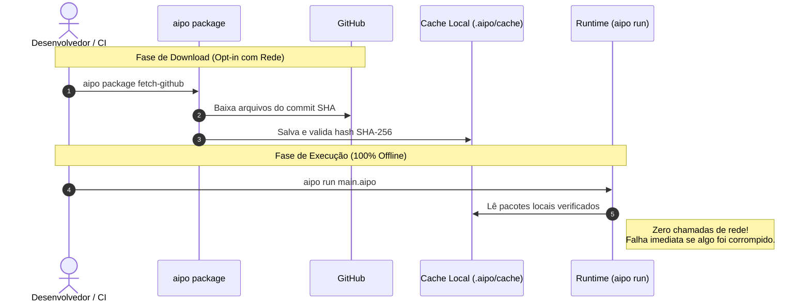

# Pacotes & Módulos

O ecossistema de código do Aipo é sustentado por uma separação clara entre duas unidades de organização:
- **Módulo**: Um único arquivo de código-fonte `.aipo`.
- **Pacote**: Uma coleção autônoma de módulos governada por um manifesto `aipo.toml`.

Diferente de gerenciadores tradicionais de dependências que sofrem com derivação de lockfile, ataques de sequestro e builds quebrados por falhas de rede, o sistema de empacotamento do Aipo é **hermético, determinístico e 100% offline-first**.

---

## 1. Módulos Locais (`.aipo`)

No Aipo, **um arquivo `.aipo` equivale exatamente a um módulo**.



### Privacidade por Padrão (*Private by Default*)
Por padrão, todas as funções, estruturas e variáveis declaradas em um arquivo são **estritamente privadas**. Para tornar um símbolo acessível a outros módulos, você deve listá-lo explicitamente na declaração `export`:

```aipo
// Arquivo: math_util.aipo

// 1. Função privada de apoio interno
fn validar_numero(n: Int) -> Bool {
    return n >= 0
}

// 2. Funções públicas
fn somar_positivo(a: Int, b: Int) -> Int {
    if not validar_numero(a) or not validar_numero(b) then
        fail "números devem ser positivos"
    end
    return a + b
}

fn duplicar(n: Int) -> Int {
    return n * 2
}

// Exporta explicitamente apenas os símbolos que a API pública oferece:
export somar_positivo, duplicar
```

::: info O que acontece se eu tentar usar algo privado?
Se um módulo importador tentar acessar `validar_numero`, o compilador Aipo emite um diagnóstico estático `AIPO_SEM_UNKNOWN_NAME`. O símbolo privado nem sequer é registrado no escopo do importador, garantindo proteção semântica real.
:::

---

## 2. Formas de Importação (`import`)

O Aipo oferece três maneiras diretas e legíveis de importar módulos:

### A. Importação Qualificada (Padrão Recomendado)
Mantém o nome do módulo como prefixo, facilitando a leitura de quem lê o código sem ambiguidades:
```aipo
import math_util

let total = math_util.somar_positivo(10, 20)
print(total)
```

### B. Importação com Apelido (`as alias`)
Útil para encurtar nomes longos ou evitar conflitos de nomes idênticos:
```aipo
import math_util as mu

let dobro = mu.duplicar(50)
print(dobro)
```

### C. Importação Seletiva Direta (`import modulo: ...`)
Traz os identificadores especificados diretamente para o escopo local:
```aipo
import math_util: somar_positivo, duplicar

let resultado = somar_positivo(15, 30)
let dobrado = duplicar(resultado)
```

---

## 3. Resolução Estrutural & Inicialização Única

O runtime do Aipo segue duas regras estritas para importação de módulos:

1. **Inicialização Antecipada Única (*Eager Init Once*)**:
   Quando um módulo é importado pela primeira vez, todas as suas instruções de nível superior (atribuições de variáveis globais, validações iniciais) são executadas **exatamente uma vez**, antes do código do importador prosseguir. Se outros arquivos importarem o mesmo módulo posteriormente, a inicialização não é repetida.

2. **Detecção Antecipada de Ciclos**:
   Se o módulo `A` importar `B` e o módulo `B` importar `A` (direta ou transitivamente), o compilador Aipo aborta imediatamente com o diagnóstico canônico `AIPO_MOD_IMPORT_CYCLE`, apontando a cadeia exata de arquivos envolvidos.



---

## 4. O Sistema de Pacotes Hermético

Para projetos maiores ou bibliotecas compartilháveis, criamos um pacote governado pelo manifesto **`aipo.toml`**.

### Coordenadas Canônicas: `namespace.nome`
Todo pacote Aipo possui uma identidade formal em dois níveis:
- `poppy.motor_jogo`
- `minha_empresa.servico_auth`
- `comunidade.formatador_json`

Essa notação elimina riscos de ataque por sequestro de nomes (*typosquatting*) comuns em ecossistemas planos.

---

## 5. O Manifesto `aipo.toml`

O arquivo `aipo.toml` reside na raiz do projeto:

```toml
[package]
name = "meu_app"
namespace = "poppy"
version = "0.1.0"
authors = ["Equipe Poppy <dev@poppy-lang.org>"]

[dependencies]
# 1. Dependência local no disco (ótimo para monorepos e desenvolvimento)
utilitarios = { path = "../libs/utilitarios" }

# 2. Dependência remota no GitHub (EXIGE commit SHA fixo)
extras_json = { github = "poppy-team/aipo-json-extras", commit = "4b24a71c08000000000000000000000000000000" }
```

::: warning Proibição de Branches e Tags Móveis
O Aipo **rejeita** manifestos que usem branches (`main`, `master`) ou tags flutuantes (`v1.x`).
Toda dependência remota deve especificar o **commit SHA hexadecimal completo de 40 dígitos**. Isso garante que ninguém possa alterar o código de uma dependência sem que você perceba.
:::

---

## 6. O Lockfile Determinístico (`aipo.lock`)

Ao executar o comando `aipo package lock`, o gerenciador resolve todo o grafo de dependências e gera o arquivo `aipo.lock`.

Cada entrada no lockfile registra quatro informações essenciais:
```toml
[[package]]
namespace = "poppy"
name = "extras_json"
source = "github:poppy-team/aipo-json-extras"
commit = "4b24a71c08000000000000000000000000000000"
digest = "sha256:e3b0c44298fc1c149afbf4c8996fb92427ae41e4649b934ca495991b7852b855"
```

1. **Coordenadas**: `namespace` e `name` do pacote.
2. **Origem**: Repositório remoto ou caminho local.
3. **Commit**: Versão exata imutável.
4. **Digest Criptográfico (SHA-256)**: Assinatura matemática de todos os arquivos do pacote.

Se um único caractere dentro do pacote for modificado, o digest não coincidirá e a execução será bloqueada imediatamente.

---

## 7. Cache Local & Operação 100% Offline

O Aipo adota uma separação rigorosa entre **fase de download** e **fase de compilação/execução**:



- **`aipo run` e `aipo build` nunca acessam a internet**: Seu build não falha porque o GitHub caiu ou o WiFi oscilou.
- **Armazenamento no Cache**: Os pacotes baixados ficam salvos localmente em `.aipo/cache`, identificados por seu digest criptográfico.

---

## 8. Guia Prático de Comandos CLI

Aqui está o fluxo completo de trabalho com pacotes:

### 1. Inicializar um Novo Pacote
Cria a estrutura de pastas e o arquivo `aipo.toml` básico:
```bash
aipo package init --namespace meu_time --name meu_projeto
```

### 2. Gerar o Lockfile
Analisa as dependências declaradas e cria o `aipo.lock`:
```bash
aipo package lock
```

### 3. Baixar Dependências Remotas
Faz o download dos pacotes listados no lockfile para o cache local:
```bash
# Download público
aipo package fetch-github

# Download autenticado (para repositórios privados ou limites maiores de API)
# O token é lido da variável de ambiente e NUNCA é salvo no disco ou em logs
aipo package fetch-github --github-token-env GITHUB_TOKEN
```

### 4. Auditar a Integridade do Cache
Varre o diretório `.aipo/cache` e recalcula os hashes de cada pacote para atestar que nenhum arquivo foi corrompido:
```bash
aipo package cache verify .aipo/cache
```

### 5. Limpar Pacotes Antigos (Prune)
Remove do cache dependências antigas que você não usa mais no seu projeto:
```bash
# Simulação sem deletar nada:
aipo package cache prune .aipo/cache --lock aipo.lock

# Aplicar a limpeza de fato:
aipo package cache prune .aipo/cache --lock aipo.lock --apply
```

---

## 9. Exemplo Completo de Projeto com Módulos e Pacotes

Veja como fica a estrutura de um projeto real e organizado:

### Estrutura de Arquivos
```text
meu_app/
├── aipo.toml
├── aipo.lock
├── .aipo/
│   └── cache/          (pastas de pacotes baixados com verificação de digest)
└── src/
    ├── main.aipo       (ponto de entrada)
    └── auth/
        ├── tokens.aipo (submódulo)
        └── user.aipo   (submódulo)
```

### Conteúdo de `src/auth/user.aipo`
```aipo
struct Usuario {
    id: Int,
    nome: String,
    ativo: Bool
}

fn criar_usuario(id: Int, nome: String) -> Usuario {
    return Usuario { id: id, nome: nome, ativo: true }
}

export Usuario, criar_usuario
```

### Conteúdo de `src/main.aipo`
```aipo
import auth.user: criar_usuario

let dev = criar_usuario(1, "Raillen")
print("Usuário cadastrado com sucesso: " + dev.nome)
```

Para executar seu projeto completo:
```bash
aipo run src/main.aipo
```
O compilador resolve todas as árvores de importação, garante a integridade dos pacotes e executa o programa com velocidade nativa!
