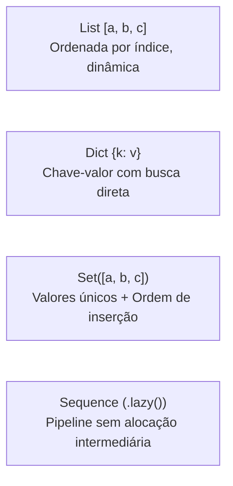

# Biblioteca Padrão (Stdlib)

A biblioteca padrão do Aipo foi projetada sob três princípios inegociáveis:
1. **Determinismo Absoluto**: A mesma operação produz os mesmos resultados bit a bit na VM nativa em Rust e no backend JavaScript.
2. **Segurança por Padrão (*Deny-by-Default*)**: Acesso a recursos do sistema hospedeiro (arquivos, variáveis de ambiente, relógio) exige concessão explícita de permissões (Capabilities).
3. **Ambiente Global Unificado**: Os módulos da biblioteca padrão são built-ins globais (`math`, `string`, `io`, `task`, `time`, `env`, `fs`, `random`, `json`, `encoding`, `binary`, `path`, `url`, `regex`, `expect`, `testing`, `log`). Não é necessário — e nem permitido — usar `import` para acessá-los; a palavra-chave `import` é reservada exclusivamente para arquivos locais do projeto e pacotes externos.

---

## Índice Visual de Módulos

| Crate / Módulo | Finalidade Primária | Requer Capability? |
| :--- | :--- | :---: |
| [`math`](#1-modulo-math) | Aritmética pura, trigonometria, constantes e limites seguros | ❌ Não |
| [`string`](#2-modulo-string) | Manipulação de texto com garantia de normalização Unicode NFC | ❌ Não |
| [`collections`](#3-colecoes-list-dict-set-sequence) | Listas dinâmicas, Dicionários, Conjuntos ordenados e Pipelines Lazy | ❌ Não |
| [`json`](#4-modulo-json) | Serialização e parse estrito com rejeição de chaves duplicadas | ❌ Não |
| [`random`](#5-modulo-random) | Gerador de números pseudo-aleatórios determinístico (SplitMix64) | ❌ Não |
| [`time` & `Duration`](#6-modulo-time-duration) | Relógio de alta precisão, datas civis puras e intervalos de tempo | 🔒 Sim (`clock.*`) |
| [`binary` & `Bytes`](#7-modulo-binary-bytes) | Leitura/escrita de buffers brutos Little/Big Endian e varints LEB128 | ❌ Não |
| [`path` & `url`](#8-modulos-path-url) | Manipulação lógica de caminhos de arquivos e decomposição de URLs | ❌ Não |
| [`testing` & `expect`](#9-modulo-testing-expect) | Framework integrado de asserções puras para testes de unidade | ❌ Não |
| [`task`](#10-modulo-task-concorrencia-assincrona) | Combinadores de tarefas assíncronas, grupos, corridas e timeouts | ❌ Não |
| [`fs` & `env`](#11-modulos-fs-env-recursos-do-host) | Leitura e gravação de arquivos e variáveis de ambiente isoladas | 🔒 Sim (`fs.*`, `env`) |

---

## 1. Módulo `math`

O módulo `math` provê operações numéricas de ponto flutuante e inteiras sem efeitos colaterais.

### Constantes Matemáticas
- `math.pi`: \(3.141592653589793\)
- `math.e`: \(2.718281828459045\)
- `math.tau`: \(6.283185307179586\) (\(2 \times \pi\))

### Funções Principais

| Função | Assinatura | Comportamento |
| :--- | :--- | :--- |
| `math.sin(rad)` | `Float -> Float` | Seno em radianos |
| `math.cos(rad)` | `Float -> Float` | Cosseno em radianos |
| `math.tan(rad)` | `Float -> Float` | Tangente em radianos |
| `math.sqrt(x)` | `Float -> Float` | Raiz quadrada (falha se `x < 0`) |
| `math.clamp(val, min, max)` | `(num, num, num) -> num` | Limita o valor entre `min` e `max` (falha se `min > max`) |
| `math.floor(x)` | `Float -> Int` | Maior inteiro menor ou igual a `x` |
| `math.ceil(x)` | `Float -> Int` | Menor inteiro maior ou igual a `x` |
| `math.round(x)` | `Float -> Int` | Arredondamento para o inteiro mais próximo |
| `math.rad(deg)` | `Float -> Float` | Converte graus para radianos |
| `math.deg(rad)` | `Float -> Float` | Converte radianos para graus |

### Exemplo Prático: Física de Pêndulo Simples

```aipo
struct Pendulo {
    comprimento
    gravidade
    angulo
    velocidade_angular
}

impl Pendulo {
    init(comprimento, gravidade, angulo, velocidade_angular) {
        self.comprimento = comprimento
        self.gravidade = gravidade
        self.angulo = angulo
        self.velocidade_angular = velocidade_angular
    }

    fn atualizar(self, delta_tempo) {
        # Aceleração angular: (-g / L) * sin(theta)
        let aceleracao = (-self.gravidade / self.comprimento) * math.sin(self.angulo)
        
        let nova_vel = self.velocidade_angular + aceleracao * delta_tempo
        let novo_angulo = self.angulo + nova_vel * delta_tempo
        
        # Mantém o ângulo contido no intervalo seguro [-pi, pi]
        let angulo_normalizado = math.clamp(novo_angulo, -math.pi, math.pi)
        
        return Pendulo{
            comprimento: self.comprimento,
            gravidade: self.gravidade,
            angulo: angulo_normalizado,
            velocidade_angular: nova_vel,
        }
    }
}

let p = Pendulo{
    comprimento: 2.5,
    gravidade: 9.81,
    angulo: math.rad(45.0),
    velocidade_angular: 0.0,
}

let p_proximo = p.atualizar(0.016)
io.println(f"Novo angulo: {p_proximo.angulo}")
```

::: tip Dica Cognitiva
O Aipo proíbe números `NaN` e infinitos no modelo de valores. Qualquer divisão por zero ou raiz de número negativo resulta imediatamente em uma falha recuperável com `fail`, nunca corrompendo variáveis com valores silenciosamente inválidos.
:::

---

## 2. Módulo `string`

Em Aipo, **toda string é validada em UTF-8 e automaticamente normalizada na Forma Canônica NFC** (*Normalization Form C*). Isso impede bugs invisíveis causados por caracteres com diacríticos compostos.

### Invocação Dupla: Função vs Método
Você pode usar a sintaxe que achar mais legível no seu código:
```aipo
let texto = "  Aipo Language  "

# Estilo função do módulo:
let a = string.trim(texto)

# Estilo método no receptor (equivalente e com zero custo extra):
let b = texto.trim().lower()
```

### Operações Essenciais

| Método | Assinatura | Descrição |
| :--- | :--- | :--- |
| `.len()` | `() -> Int` | Quantidade de caracteres (pontos de código Unicode) |
| `.byte_len()` | `() -> Int` | Quantidade de bytes brutos em memória |
| `.trim()` | `() -> String` | Remove espaços em branco nas duas extremidades |
| `.split(sep)` | `String -> List` | Divide a string em uma lista de pedaços |
| `.join(lista)` | `List -> String` | Une elementos de uma lista usando o separador |
| `.contains(sub)` | `String -> Bool` | Verifica se a substring está presente |
| `.starts_with(pre)` | `String -> Bool` | Testa prefixo inicial |
| `.ends_with(suf)` | `String -> Bool` | Testa sufixo final |
| `.replace(velho, novo)` | `(String, String) -> String` | Substitui ocorrências da substring |
| `.upper()` / `.lower()` | `() -> String` | Caixa alta ou baixa com respeito a Unicode |

### Exemplo Prático: Limpeza e Sanitização de Dados

```aipo
fn sanitizar_email(email_bruto) {
    let limpo = email_bruto.trim().lower()
    
    if not limpo.contains("@") {
        return fail("email invalido: sem arroba")
    }
    
    let partes = limpo.split("@")
    if partes.len() != 2 {
        return fail("email invalido: formato incorreto")
    }
    
    let usuario = partes[0]
    let dominio = partes[1]
    
    if usuario.len() == 0 or not dominio.contains(".") {
        return fail("email invalido: usuario ou dominio vazio")
    }
    
    return usuario + "@" + dominio
}

let entrada = "  Dev.Aipo@Poppy-Lang.ORG  "
let email_final = sanitizar_email(entrada)
io.println(f"Email sanitizado: {email_final}")
# Imprime: "Email sanitizado: dev.aipo@poppy-lang.org"
```

---

## 3. Coleções: `List`, `Dict`, `Set`, `Sequence`

O Aipo disponibiliza quatro estruturas de dados centrais, projetadas para cobrir desde manipulação rápida até pipelines de dados com alta eficiência:



### 1. `List`
Coleção dinâmica indexada por inteiros (`0`-based):
```aipo
let numeros = [10, 20, 30]
numeros.add(40)

io.println(numeros[0])  # 10
io.println(numeros[-1]) # 40 (índices negativos contam a partir do final)
```

### 2. `Dict`
Tabela associativa de chave e valor criada com a sintaxe `{}`:
```aipo
let config = {
    "porta": 8080,
    "host": "localhost",
    "debug": true,
}

io.println(config["porta"]) # 8080
config["porta"] = 9000
io.println(config["porta"]) # 9000
```

### 3. `Set` (Conjuntos com Ordem de Inserção)
Diferente de conjuntos convencionais em outras linguagens, o `Set` do Aipo **preserva rigorosamente a ordem original em que os elementos foram inseridos**:
```aipo
let tags = Set()
tags.add("rust")
tags.add("aipo")
tags.add("rust") # Duplicata é ignorada silenciosamente

io.println(tags.len()) # 2
io.println(tags.has("aipo")) # true
io.println(tags.to_list()) # ["rust", "aipo"] - ordem garantida!
```

### 4. `Sequence` (Pipelines Lazy / Preguiçosos)
Ao encadear transformações em listas convencionais, cada chamada a `.map()` ou `.filter()` cria uma lista temporária na memória. O tipo `Sequence`, obtido através de `.lazy()`, avalia cada elemento **sob demanda**, consumindo memória constante:

```aipo
let dados = [1, 2, 3, 4, 5, 6, 7, 8, 9, 10]

# O pipeline abaixo avalia sob demanda e não cria coleções intermediárias:
let seq = dados.lazy()
let pares = seq.filter(x => x % 2 == 0)
let multiplicados = pares.map(x => x * 10)
let primeiros = multiplicados.take(3)
let resultado = primeiros.collect()

io.println(resultado) # [20, 40, 60]
```

Métodos disponíveis em `Sequence`:
- **Estágios Intermediários (retornam nova `Sequence`)**: `.map(fn)`, `.filter(fn)`, `.flat_map(fn)`, `.take(n)`, `.skip(n)`, `.distinct()`, `.zip(other)`, `.chain(other)`, `.chunk(size)`, `.window(size)`, `.enumerate()`.
- **Estágios Terminais (consomem e retornam o valor final)**: `.collect()`, `.find(fn)`, `.any(fn)`, `.all(fn)`, `.count()`, `.reduce(initial, fn)`.

---

## 4. Módulo `json`

O módulo `json` fornece serialização e desserialização determinísticas com garantias estritas de integridade.

### Assinaturas Principais
- `json.parse(texto)`: Converte texto JSON em valores nativos do Aipo. **Rejeita chaves duplicadas** em objetos JSON disparando uma falha imediata, prevenindo vulnerabilidades de inconsistência em APIs.
- `json.stringify(valor, pretty = false)`: Converte valores do Aipo em texto JSON padronizado. Detecta ciclos no grafo de objetos e falha com segurança em vez de estourar a pilha.

### Exemplo Prático: Leitura, Validação e Serialização

```aipo
let carga_recebida = "{\"servico\": \"auth\", \"tentativas\": 3, \"ativo\": true}"

# Parse seguro dentro de um bloco attempt
var payload = {}
attempt {
    payload = json.parse(carga_recebida)
} failed err {
    payload = {"erro": "JSON malformado", "detalhe": err.message}
}

let servico = payload["servico"]
io.println(f"Servico solicitado: {servico}")

# Adicionando metadados e gerando nova saída formatada (pretty = true)
payload["atualizado_em"] = 1727330000
let resposta_json = json.stringify(payload, true)
io.println(resposta_json)
```

---

## 5. Módulo `random`

O módulo `random` é implementado sobre o algoritmo **SplitMix64**, um gerador de números pseudo-aleatórios (PRNG) de 64 bits de altíssima performance, com **reprodutibilidade matemática exata** entre a VM nativa em Rust e o runtime JavaScript.

### Gerador Global vs Gerador com Semente Independente
Você pode usar tanto o gerador global quanto criar instâncias isoladas com `random.create(seed)` para simulações e testes:

```aipo
# 1. Uso global rápido
let d6 = random.int(1, 6)
let probabilidade = random.float() # [0.0, 1.0)
let moeda = random.bool()

# 2. Uso com semente explícita para testes 100% reproduzíveis
let rng_jogo = random.create(42)

let inimigo_sorteado = rng_jogo.choice(["Goblin", "Orc", "Dragao"])
let atributos = rng_jogo.shuffle([10, 14, 18, 8, 12])

io.println(f"Inimigo: {inimigo_sorteado}")
io.print("Atributos: ")
io.println(atributos)
```

::: tip Por que isso importa?
Em testes automatizados e jogos multiplayer, ter um gerador que se comporta exatamente igual em qualquer máquina e em qualquer sistema operacional elimina testes instáveis (*flaky tests*) e bugs impossíveis de reproduzir.
:::

---

## 6. Módulo `time` & `Duration`

A medição de tempo no Aipo separa claramente dois conceitos:
1. **Tempo Físico do Sistema**: Medido pelo relógio da máquina (`time.now()`, `time.monotonic()`), considerado um recurso externo sensível protegido por **Capability** na Host ABI.
2. **Tempo Calendário Civil & Durações**: Operações puras de data civil (`time.date()`, `time.time_of_day()`, `time.parse_iso()`) e intervalos (`Duration`) que não dependem do sistema operacional.

### Relógio Host (Protegido por Capability)
```aipo
# Requer que o anfitrião conceda a capability 'clock.wall'
let agora_duracao = time.now()

# Requer capability 'clock.monotonic' (ideal para medição de performance)
let inicio = time.monotonic()
# ... executa trabalho pesado ...
let fim = time.monotonic()
let diferenca = fim - inicio
io.println(f"Tempo decorrido: {diferenca.total_seconds()}s")
```

### Datas Civis Puras & Intervalos de Tempo
```aipo
# Construção de data civil pura (Ano, Mês, Dia)
let lancamento = time.date(2026, 9, 26)
io.println(lancamento.to_iso()) # "2026-09-26"
io.println(f"Ano: {lancamento.year}, Mes: {lancamento.month}, Dia: {lancamento.day}")

# Criação e cálculo de Durações
let d1 = Duration(120.5) # 120.5 segundos
let d2 = Duration(30.0)
let total = d1 + d2

io.println(f"Total em segundos: {total.total_seconds()}")
io.println(f"Total em milissegundos: {total.total_milliseconds()}")
```

---

## 7. Módulo `binary` & `Bytes`

O tipo `Bytes` e o módulo `binary` oferecem manipulação de buffers contíguos de bytes em memória com controle de endianness (Little-Endian / Big-Endian) e compressão LEB128.

### Exemplo Prático: Serialização de Pacote de Rede Binário

Imagine construir um cabeçalho de protocolo com formato fixo:
- Byte 0: Código da mensagem (`u8`)
- Bytes 1-2: ID do jogador (`u16 Little-Endian`)
- Bytes 3-6: Coordenada X (`f32 Little-Endian`)
- Bytes 7-10: Coordenada Y (`f32 Little-Endian`)

```aipo
# Aloca um buffer inicial contíguo de 11 bytes
let buffer = Bytes(11)

# Escrita dos campos no pacote
binary.write_u8(buffer, 0, 1)          # MsgType = 1 (Posição)
binary.write_u16_le(buffer, 1, 1042)   # Player ID = 1042
binary.write_f32_le(buffer, 3, 128.5)  # X = 128.5
binary.write_f32_le(buffer, 7, -64.25) # Y = -64.25

io.println(f"Tamanho do buffer: {buffer.len()} bytes")

# Leitura correspondente no receptor
let tipo = binary.read_u8(buffer, 0)
let player_id = binary.read_u16_le(buffer, 1)
let pos_x = binary.read_f32_le(buffer, 3)
let pos_y = binary.read_f32_le(buffer, 7)

io.println(f"Pacote: tipo={tipo}, player={player_id}, x={pos_x}, y={pos_y}")
```

Além disso, strings podem ser convertidas diretamente para bytes e vice-versa:
```aipo
let texto = "Olá Aipo"
let bytes_utf8 = texto.encode()
let texto_recuperado = bytes_utf8.decode()
io.println(texto_recuperado) # "Olá Aipo"
```

---

## 8. Módulos `path` & `url`

Para evitar inconsistências entre Windows (`C:\caminho\arquivo`) e sistemas Unix (`/caminho/arquivo`), o módulo `path` **normaliza todos os separadores para barras simples (`/`)** e resolve caminhos relativos de forma lógica e segura.

### Exemplo Prático com `path` e `url`

```aipo
# 1. Normalização de caminhos multiplataforma
let caminho_bruto = "src/models/../controllers/auth.aipo"
let normalizado = path.normalize(caminho_bruto)
io.println(normalizado) # "src/controllers/auth.aipo"

let pai = path.dirname(normalizado)
let base = path.basename(normalizado)
let extensao = path.ext(normalizado)

io.println(f"Diretorio pai: {pai}")   # "src/controllers"
io.println(f"Nome do arquivo: {base}") # "auth.aipo"
io.println(f"Extensao: {extensao}")   # ".aipo"

# 2. Análise de URL (padrão WHATWG)
let endereco = "https://aipolang.vercel.app/manual/stdlib?lang=pt&tema=dark#topo"
let parsed = url.parse(endereco)

let proto = parsed["protocol"]
let host = parsed["host"]
let rota = parsed["pathname"]
let busca = parsed["search"]

io.println(f"Protocolo: {proto}") # "https:"
io.println(f"Host: {host}")       # "aipolang.vercel.app"
io.println(f"Pathname: {rota}")   # "/manual/stdlib"
io.println(f"Search: {busca}")   # "?lang=pt&tema=dark"
```

---

## 9. Módulo `testing` & `expect`

O Aipo vem acompanhado de um mecanismo nativo de asserções puras sem dependência de bibliotecas externas:

```aipo
fn dividir(dividendo, divisor) {
    if divisor == 0 {
        return fail("divisao por zero")
    }
    return dividendo / divisor
}

# Asserções de sucesso
expect.equal(dividir(10, 2), 5.0)
expect.true(dividir(10, 2) > 0.0)

# Verificação de falha esperada usando attempt/failed
var mensagem_erro = ""
attempt {
    dividir(10, 0)
} failed err {
    mensagem_erro = err.message
}

expect.equal(mensagem_erro, "divisao por zero")

io.println("Todos os testes passaram com sucesso!")
```

Asserções canônicas disponíveis:
- `expect.equal(atual, esperado)`
- `expect.not_equal(atual, esperado)`
- `expect.true(valor)`
- `expect.false(valor)`
- `expect.none(valor)`
- `expect.some(valor)`
- `expect.failure(valor)`
- `expect.contains(coleção, elemento)`
- `expect.approx(atual, esperado, tolerancia = 0.0001)`

---

## 10. Módulo `task` (Concorrência Assíncrona)

O módulo `task` orquestra a concorrência cooperativa da linguagem, operando sobre um **scheduler determinístico com relógio virtual**.

### Combinadores Assíncronos

| Combinador | Assinatura | Comportamento |
| :--- | :--- | :--- |
| `task.spawn(fn, [args])` | `(Callable, List) -> Task` | Cria uma tarefa e a enfileira no scheduler cooperativo |
| `task.sleep(dur)` | `Duration -> None` | Suspende a execução da tarefa atual por uma quantidade de ticks |
| `task.all(tasks)` | `List<Task> -> List` | Aguarda todas as tarefas completarem e retorna a lista de resultados |
| `task.race(tasks)` | `List<Task> -> Value` | Retorna o resultado da primeira tarefa a concluir |
| `task.timeout(task, dur)` | `(Task, Duration) -> Value` | Executa a tarefa com limite de tempo; falha com "timeout" se expirar |
| `task.cancel(task)` | `Task -> None` | Cancela cooperativamente uma tarefa pendente |
| `task.group()` | `() -> TaskGroup` | Cria um grupo de tarefas estruturado |

### Exemplo Prático: Busca Paralela e Disputa

```aipo
async fn buscar_dados(origem) {
    task.sleep(1)
    return f"dados-de-{origem}"
}

let t1 = buscar_dados("servidor-1")
let t2 = buscar_dados("servidor-2")

# Combinador all: aguarda ambas as tarefas e retorna a lista completa
let todos = task.all([t1, t2])
io.println(todos) # [dados-de-servidor-1, dados-de-servidor-2]

# Disputa (race): quem responder primeiro vence
let t3 = buscar_dados("norte")
let t4 = buscar_dados("sul")
let primeiro = task.race([t3, t4])
io.println(primeiro)
```

---

## 11. Módulos `fs` & `env` (Recursos do Host)

Diferente de runtimes onde qualquer script importado tem permissão irrestrita para ler seu disco ou enviar suas variáveis de ambiente para a internet, **o Aipo bloqueia acessos ao hospedeiro por padrão**.

```aipo
# Se o host não tiver concedido a capability "env.read":
# A execução falha com: AIPO_RT_CAPABILITY_DENIED (capability: "env.read")
var usuario = "convidado"
attempt {
    usuario = env.get("USER")
} failed err {
    usuario = "convidado" # Fallback seguro e transparente
}

io.println(f"Executando como: {usuario}")
```

::: warning Contrato de Segurança
Quando uma capability é negada, a função **não finge que o recurso não existe** e **não retorna valores vazios silenciosos**. Ela gera uma falha estruturada com o código canônico `AIPO_RT_CAPABILITY_DENIED`, permitindo auditoria clara e tratamento resiliente via `attempt ... failed`.
:::
