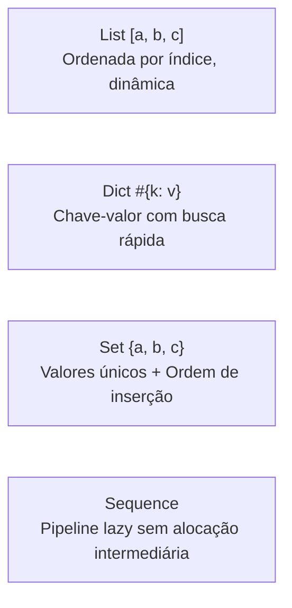

# Biblioteca Padrão (Stdlib)

A biblioteca padrão do Aipo foi projetada sob três princípios inegociáveis:
1. **Determinismo Absoluto**: A mesma operação produz os mesmos resultados bit a bit na VM nativa em Rust e no backend JavaScript.
2. **Segurança por Padrão (*Deny-by-Default*)**: Acesso a recursos do sistema hospedeiro (arquivos, variáveis de ambiente, relógio) exige concessão explícita de permissões.
3. **Ergonomia com Dupla Invocação**: Funções de módulos canônicos podem ser chamadas tanto como funções de módulo (`string.len(txt)`) quanto como métodos no receptor (`txt.len()`).

---

## Índice Visual de Módulos

| Crate / Módulo | Finalidade Primária | Requer Capability? |
| :--- | :--- | :---: |
| [`math`](#1-modulo-math) | Aritmética pura, trigonometria, constantes e limites seguros | ❌ Não |
| [`string`](#2-modulo-string) | Manipulação de texto com garantia de normalização Unicode NFC | ❌ Não |
| [`collections`](#3-colecoes-list-dict-set-sequence) | Listas dinâmicas, Dicionários, Conjuntos ordenados e Pipelines Lazy | ❌ Não |
| [`json`](#4-modulo-json) | Serialização e parse estrito com rejeição de chaves duplicadas | ❌ Não |
| [`random`](#5-modulo-random) | Gerador de números pseudo-aleatórios determinístico (SplitMix64) | ❌ Não |
| [`time` & `Duration`](#6-modulo-time-duration) | Relógio de alta precisão, datas civis puras e intervalos de tempo | 🔒 Sim (`clock.*`) |
| [`binary` & `Bytes`](#7-modulo-binary-bytes) | Leitura/escrita de buffers brutos Little/Big Endian e varints LEB128 | ❌ Não |
| [`path` & `url`](#8-modulos-path-url) | Manipulação lógica de caminhos de arquivos e decomposição de URLs | ❌ Não |
| [`testing`](#9-modulo-testing-expect) | Framework integrado de asserções puras para testes de unidade | ❌ Não |
| [`task`](#10-modulo-task-concorrencia-assincrona) | Combinadores de tarefas assíncronas, grupos, corridas e timeouts | ❌ Não |
| [`fs` & `env`](#11-modulos-fs-env-recursos-do-host) | Leitura e gravação de arquivos e variáveis de ambiente isoladas | 🔒 Sim (`fs.*`, `env`) |

---

## 1. Módulo `math`

O módulo `math` provê operações numéricas de ponto flutuante e inteiras sem efeitos colaterais.

### Constantes Matemáticas
- `math.pi`: \(3.141592653589793\)
- `math.e`: \(2.718281828459045\)
- `math.tau`: \(6.283185307179586\) (\(2 \times \pi\))

### Funções Principais

| Função | Assinatura | Comportamento |
| :--- | :--- | :--- |
| `math.sin(rad)` | `Float -> Float` | Seno em radianos |
| `math.cos(rad)` | `Float -> Float` | Cosseno em radianos |
| `math.tan(rad)` | `Float -> Float` | Tangente em radianos |
| `math.sqrt(x)` | `Float -> Float` | Raiz quadrada (falha se `x < 0`) |
| `math.clamp(val, min, max)` | `(num, num, num) -> num` | Limita o valor entre `min` e `max` (falha se `min > max`) |
| `math.floor(x)` | `Float -> Int` | Maior inteiro menor ou igual a `x` |
| `math.ceil(x)` | `Float -> Int` | Menor inteiro maior ou igual a `x` |
| `math.round(x)` | `Float -> Int` | Arredondamento para o inteiro mais próximo |
| `math.rad(deg)` | `Float -> Float` | Converte graus para radianos |
| `math.deg(rad)` | `Float -> Float` | Converte radianos para graus |

### Exemplo Prático: Física de Pêndulo Simples

```aipo
import math

struct Pendulo {
    comprimento: Float,
    gravidade: Float,
    angulo: Float,
    velocidade_angular: Float
}

impl Pendulo {
    fn atualizar(self, delta_tempo: Float) -> Pendulo {
        // Aceleração angular: (-g / L) * sin(theta)
        let aceleracao = (-self.gravidade / self.comprimento) * math.sin(self.angulo)
        
        let nova_vel = self.velocidade_angular + aceleracao * delta_tempo
        let novo_angulo = self.angulo + nova_vel * delta_tempo
        
        // Mantém o ângulo contido no intervalo seguro de visualização
        let angulo_normalizado = math.clamp(novo_angulo, -math.pi, math.pi)
        
        return Pendulo {
            comprimento: self.comprimento,
            gravidade: self.gravidade,
            angulo: angulo_normalizado,
            velocidade_angular: nova_vel
        }
    }
}

let p = Pendulo {
    comprimento: 2.5,
    gravidade: 9.81,
    angulo: math.rad(45.0),
    velocidade_angular: 0.0
}

let p_proximo = p.atualizar(0.016)
print("Novo ângulo: " + String(p_proximo.angulo))
```

::: tip Dica Cognitiva
O Aipo proíbe números `NaN` e infinitos no modelo de valores. Qualquer divisão por zero ou raiz de número negativo resulta imediatamente em uma falha recuperável com `fail`, nunca corrompendo variáveis com valores silenciosamente inválidos.
:::

---

## 2. Módulo `string`

Em Aipo, **toda string é validada em UTF-8 e automaticamente normalizada na Forma Canônica NFC** (*Normalization Form C*). Isso impede bugs invisíveis causados por caracteres com diacríticos compostos.

### Invocação Dupla: Função vs Método
Você pode usar a sintaxe que achar mais legível no seu código:
```aipo
import string

let texto = "  Aipo Language  "

// Estilo função do módulo:
let a = string.trim(texto)

// Estilo método no objeto (equivalente e com zero custo extra):
let b = texto.trim().lower()
```

### Operações Essenciais

| Método | Assinatura | Descrição |
| :--- | :--- | :--- |
| `.len()` | `() -> Int` | Quantidade de caracteres (pontos de código Unicode) |
| `.byte_len()` | `() -> Int` | Quantidade de bytes brutos em memória |
| `.trim()` | `() -> String` | Remove espaços em branco nas duas extremidades |
| `.split(sep)` | `String -> List` | Divide a string em uma lista de pedaços |
| `.join(lista)` | `List -> String` | Une elementos de uma lista usando o separador |
| `.contains(sub)` | `String -> Bool` | Verifica se a substring está presente |
| `.starts_with(pre)` | `String -> Bool` | Testa prefixo inicial |
| `.ends_with(suf)` | `String -> Bool` | Testa sufixo final |
| `.replace(velho, novo)` | `(String, String) -> String` | Substitui ocorrências da substring |
| `.upper()` / `.lower()` | `() -> String` | Caixa alta ou baixa com respeito a Unicode |

### Exemplo Prático: Limpeza e Sanitização de Dados

```aipo
import string

fn sanitizar_email(email_bruto: String) -> String {
    let limpo = email_bruto.trim().lower()
    
    if not limpo.contains("@") then
        fail "email inválido: sem arroba"
    end
    
    let partes = limpo.split("@")
    if partes.len() != 2 then
        fail "email inválido: formato incorreto"
    end
    
    let usuario = partes[0]
    let dominio = partes[1]
    
    if usuario.len() == 0 or not dominio.contains(".") then
        fail "email inválido: usuário ou domínio vazio"
    end
    
    return usuario + "@" + dominio
}

let entrada = "  Dev.Aipo@Poppy-Lang.ORG  "
let email_final = sanitizar_email(entrada)
print("Email sanitizado: " + email_final)
// Imprime: "Email sanitizado: dev.aipo@poppy-lang.org"
```

---

## 3. Coleções: `List`, `Dict`, `Set`, `Sequence`

O Aipo disponibiliza quatro estruturas de dados centrais, projetadas para cobrir desde manipulação rápida até pipelines de dados eficientes:



### 1. `List`
Coleção dinâmica indexada por inteiros (`0`-based):
```aipo
let numeros = [10, 20, 30]
numeros.push(40)
print(numeros[0])   // 10
print(numeros[-1])  // 40 (índices negativos contam do final)
```

### 2. `Dict`
Tabela associativa de chave e valor criada com a sintaxe `#{}`:
```aipo
let config = #{
    "porta": 8080,
    "host": "localhost",
    "debug": true
}

print(config["porta"]) // 8080
config["porta"] = 9000
```

### 3. `Set` (Conjuntos com Ordem de Inserção)
Diferente de conjuntos convencionais em outras linguagens, o `Set` do Aipo **preserva rigorosamente a ordem original em que os elementos foram inseridos**:
```aipo
let tags = Set()
tags.add("rust")
tags.add("aipo")
tags.add("rust") // Duplicata é ignorada silenciosamente

print(tags.len()) // 2
print(tags.to_list()) // ["rust", "aipo"] - ordem garantida!
```

### 4. `Sequence` (Pipelines Preguiçosos / Lazy)
Ao trabalhar com grandes volumes de dados, operações como `.map()` e `.filter()` encadeadas em listas criam coleções temporárias no heap. O tipo `Sequence` avalia cada elemento **sob demanda**, consumindo memória constante:

```aipo
let dados = [1, 2, 3, 4, 5, 6, 7, 8, 9, 10]

// O pipeline abaixo NÃO aloca listas intermediárias:
let resultado = Sequence(dados)
    .filter(fn(x) => x % 2 == 0)
    .map(fn(x) => x * 10)
    .take(3)
    .to_list()

print(resultado) // [20, 40, 60]
```

---

## 4. Módulo `json`

O módulo `json` fornece serialização e desserialização determinísticas com garantias estritas de segurança.

### Assinaturas Principais
- `json.parse(texto: String) -> Value`: Converte texto JSON em valores do Aipo. **Rejeita chaves duplicadas** em objetos JSON disparando uma falha imediata, prevenindo vulnerabilidades de inconsistência em APIs.
- `json.stringify(valor: Value, pretty: Bool = false) -> String`: Converte valores do Aipo em texto JSON padronizado. Detecta ciclos no grafo de objetos e falha graciosamente.

### Exemplo Prático: Leitura, Validação e Serialização

```aipo
import json

let carga_recebida = "{\"servico\": \"auth\", \"tentativas\": 3, \"ativo\": true}"

// Parse seguro dentro de um bloco attempt
let payload = attempt
    json.parse(carga_recebida)
recover err
    #{ "erro": "JSON malformado", "detalhe": err }
end

print("Serviço solicitado: " + payload["servico"])

// Adicionando metadados e gerando nova saída formatada
payload["atualizado_em"] = 1727330000
let resposta_json = json.stringify(payload, true)
print(resposta_json)
```

---

## 5. Módulo `random`

O módulo `random` é implementado sobre o algoritmo **SplitMix64**, um gerador de números pseudo-aleatórios (PRNG) de 64 bits de altíssima performance, com **reprodutibilidade matemática exata** entre diferentes plataformas.

### Gerador com Semente vs Gerador Global
Você pode usar tanto o gerador global quanto criar instâncias independentes de `Rng` para simulações e testes:

```aipo
import random

// 1. Uso global rápido
let d6 = random.int(1, 6)
let probabilidade = random.float() // [0.0, 1.0)
let moeda = random.bool()

// 2. Uso com semente explícita para testes 100% reproduzíveis
let rng_jogo = random.create(42)

let inimigo_sorteado = rng_jogo.choice(["Goblin", "Orc", "Dragao"])
let atributos = rng_jogo.shuffle([10, 14, 18, 8, 12])

print("Inimigo: " + inimigo_sorteado)
print("Atributos embaralhados: " + String(atributos))
```

::: tip Por que isso importa?
Em testes automatizados e jogos multiplayer, ter um gerador que se comporta exatamente igual em qualquer máquina e em qualquer sistema operacional elimina bugs difíceis de reproduzir (*heisenbugs*).
:::

---

## 6. Módulo `time` & `Duration`

A medição de tempo no Aipo separa claramente dois conceitos:
1. **Tempo Físico do Sistema**: Medido pelo relógio da máquina (`time.now()`, `time.monotonic()`), considerado um recurso externo sensível protegido por **Capability** na Host ABI.
2. **Tempo Calendário Civil & Durações**: Operações puras de data civil (`Date`, `DateTime`) e intervalos (`Duration`) que não dependem do sistema operacional.

### Relógio Host (Protegido por Capability)
```aipo
import time

// Requer que a aplicação anfitriã conceda a capability 'clock.wall'
let agora_segundos = time.now()

// Requer capability 'clock.monotonic' (ideal para medir performance)
let inicio = time.monotonic()
// ... executa trabalho pesado ...
let fim = time.monotonic()
let diferenca = fim - inicio
print("Tempo decorrido: " + String(diferenca) + "s")
```

### Datas Civis & Intervalos de Tempo
```aipo
import time

// Construção de data civil pura (Ano, Mês, Dia)
let data_lancamento = time.date(2026, 9, 26)

print("Ano bissexto? " + String(data_lancamento.is_leap()))
print("Dias no mês: " + String(data_lancamento.days_in_month()))
print("Formato ISO: " + data_lancamento.to_iso()) // "2026-09-26"

// Criação e cálculo de Durações
let intervalo = Duration(120.5) // 120.5 segundos
print("Em minutos: " + String(intervalo.minutes()))
```

---

## 7. Módulo `binary` & `Bytes`

O tipo `Bytes` e o módulo `binary` oferecem manipulação de streams de bytes contíguos em memória com controle de endianness (Little-Endian / Big-Endian) e compressão LEB128.

### Exemplo Prático: Serialização de Pacote de Rede Binário

Imagine construir um cabeçalho de protocolo com formato fixo:
- Byte 0: Código da mensagem (`u8`)
- Bytes 1-2: ID do jogador (`u16 Little-Endian`)
- Bytes 3-6: Coordenada X (`f32 Little-Endian`)
- Bytes 7-10: Coordenada Y (`f32 Little-Endian`)

```aipo
import binary

// Aloca um buffer inicial contíguo
let buffer = Bytes(11)

// Escrita dos campos no pacote
binary.write_u8(buffer, 0, 0x01)         // MsgType = 1 (Posição)
binary.write_u16_le(buffer, 1, 1042)      // Player ID = 1042
binary.write_f32_le(buffer, 3, 128.5)     // X = 128.5
binary.write_f32_le(buffer, 7, -64.25)    // Y = -64.25

print("Tamanho do pacote: " + String(buffer.len()) + " bytes")

// Leitura correspondente no receptor
let tipo = binary.read_u8(buffer, 0)
let player_id = binary.read_u16_le(buffer, 1)
let pos_x = binary.read_f32_le(buffer, 3)
let pos_y = binary.read_f32_le(buffer, 7)

print("Pacote lido: Jogador #" + String(player_id) + " em (" + String(pos_x) + ", " + String(pos_y) + ")")
```

---

## 8. Módulos `path` & `url`

Para evitar inconsistências entre Windows (`C:\caminho\arquivo`) e sistemas Unix (`/caminho/arquivo`), o módulo `path` **normaliza todos os separadores para barras simples (`/`)** e resolve caminhos relativos de forma lógica e segura.

### Exemplo Prático com `path` e `url`

```aipo
import path
import url

// 1. Normalização de caminhos multiplataforma
let caminho_bruto = "src\\models\\..\\controllers\\auth.aipo"
let normalizado = path.normalize(caminho_bruto)
print(normalizado) // "src/controllers/auth.aipo"

print("Diretório pai: " + path.dirname(normalizado)) // "src/controllers"
print("Nome do arquivo: " + path.basename(normalizado)) // "auth.aipo"
print("Extensão: " + path.extension(normalizado)) // "aipo"

// 2. Análise e montagem de URLs
let endereco = "https://aipolang.vercel.app/manual/stdlib?lang=pt&tema=dark#topo"
let parsed = url.parse(endereco)

print("Protocolo: " + parsed["protocol"]) // "https"
print("Host: " + parsed["host"])           // "aipolang.vercel.app"
print("Caminho: " + parsed["path"])       // "/manual/stdlib"
print("Query: " + parsed["query"])         // "lang=pt&tema=dark"
```

---

## 9. Módulo `testing` (`expect`)

O Aipo vem acompanhado de um mecanismo nativo de testes de unidade sem necessidade de bibliotecas externas:

```aipo
import testing: expect

fn dividir(dividendo: Int, divisor: Int) -> Int {
    if divisor == 0 then
        fail "divisao por zero"
    end
    return dividendo / divisor
}

// Teste de caso de sucesso
expect(dividir(10, 2)).to_equal(5)
expect(dividir(10, 3)).to_equal(3)

// Teste de caso de falha esperada
expect(fn() => dividir(10, 0)).to_fail_with("divisao por zero")

print("Todos os testes passaram com sucesso!")
```

---

## 10. Módulo `task` (Concorrência Assíncrona)

O módulo `task` orquestra a concorrência cooperativa da linguagem, operando sobre um **scheduler determinístico com relógio virtual**.

### Combinadores Assíncronos

| Combinador | Assinatura | Comportamento |
| :--- | :--- | :--- |
| `task.spawn(fn)` | `async fn -> Task` | Cria uma tarefa e a enfileira no scheduler cooperativo |
| `task.sleep(dur)` | `Duration -> Task` | Suspende a execução da tarefa atual por um período |
| `task.all(tasks)` | `List<Task> -> Task` | Aguarda todas as tarefas completarem com sucesso |
| `task.race(tasks)` | `List<Task> -> Task` | Retorna o resultado da primeira tarefa a concluir |
| `task.timeout(task, dur)` | `(Task, Duration) -> Task` | Interrompe a tarefa com falha se o prazo expirar |
| `task.cancel(task)` | `Task -> None` | Cancela cooperativamente uma tarefa pendente |

### Exemplo Prático: Busca Paralela com Timeout

```aipo
import task

async fn buscar_dados_servidor(servidor: String, delay_segundos: Float) -> String {
    task.sleep(Duration(delay_segundos))
    return "Resposta de " + servidor
}

async fn obter_resposta_mais_rapida() -> String {
    let t1 = task.spawn(fn() => buscar_dados_servidor("Norte-America", 0.15))
    let t2 = task.spawn(fn() => buscar_dados_servidor("America-Sul", 0.05))
    let t3 = task.spawn(fn() => buscar_dados_servidor("Europa", 0.20))
    
    // Disputa (race): quem responder primeiro vence
    let primeira = task.race([t1, t2, t3])
    
    // Aguarda com timeout máximo de 0.5 segundos
    let resultado = await do
        task.timeout(primeira, Duration(0.5))
    end
    
    return resultado
}
```

---

## 11. Módulos `fs` & `env` (Recursos do Host)

Diferente de Python ou Node.js, onde qualquer script importado tem permissão irrestrita para ler seu disco ou enviar suas variáveis de ambiente para a internet, **o Aipo bloqueia acessos ao hospedeiro por padrão**.

```aipo
import fs
import env

// Se o host não tiver concedido permissão "env.read":
// A execução é interrompida com: AIPO_RT_CAPABILITY_DENIED (capability: "env.read")
let usuario = attempt
    env.get("USER")
recover err
    "convidado" // Fallback seguro e transparente
end

print("Executando como: " + usuario)
```

::: warning Contrato de Segurança
Quando uma capability é negada, a função **não finge que o recurso não existe** e **não retorna valores vazios silenciosos**. Ela gera uma falha estruturada com o código canônico `AIPO_RT_CAPABILITY_DENIED`, permitindo auditoria clara e tratamento resiliente.
:::
