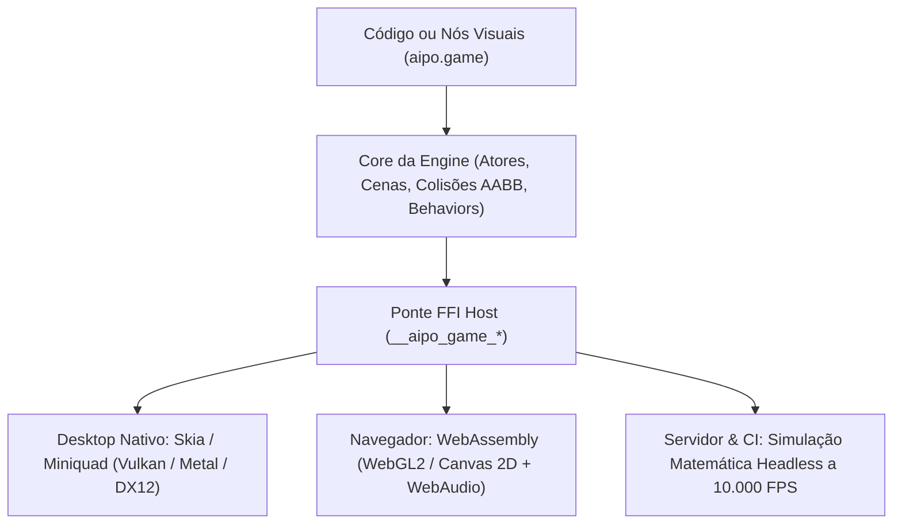
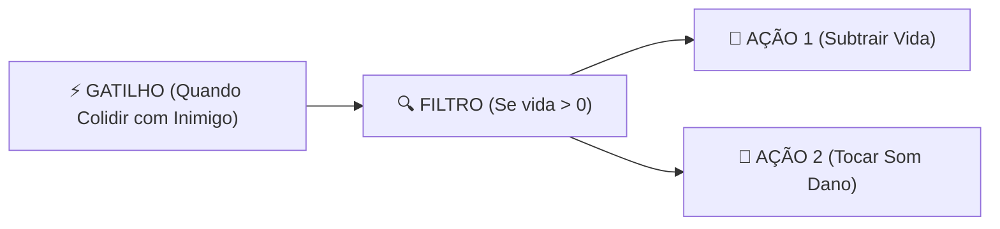

# aipo.game — Micro Game Engine 2D

`aipo.game` é a engine 2D oficial da linguagem Aipo para criação ágil e expressiva de jogos, inspirada nos melhores princípios de produtividade e facilidade do **Construct 3**, **ct.js** e **GameMaker Studio**, mas com a robustez e o desempenho da arquitetura nativa da Aipo.

---

## 1. Visão Geral & Filosofia

O desenvolvimento de jogos 2D não deve ser sobrecarregado por cerimônias de boilerplate ou motores excessivamente complexos. O `aipo.game` foi projetado com quatro pilares essenciais:

1. **Atores e Cenas Claros:** Cada entidade (`Actor`) possui seu próprio ciclo de vida (`on_create`, `on_update`, `on_collision`, `on_destroy`), encapsulando sua lógica e física.
2. **Behaviors Plugáveis em 1 Linha:** Funcionalidades completas como movimentação de plataforma, física de projétil ou barreiras sólidas são anexadas com uma única chamada declarativa.
3. **Simulação Determinística:** A aritmética e o estado da Aipo garantem simulações 100% reproduzíveis, viabilizando **Rollback Netcode** para multiplayer e saves de replay microscópicos.
4. **Programação Visual Anti-Espaguete:** O sistema de nós visuais segue o modelo estruturado **"Gatilho $\to$ Filtro $\to$ Ação"**, gerando código `.aipo` transparente e legível.



---

## 2. Instalação

Adicione ao seu `aipo.toml`:

```toml
[dependencies]
"aipo.game" = { path = "packages/aipo-game" }
```

---

## 3. Exemplo Prático: Jogo Espacial em 50 Linhas

```aipo
import aipo.game as g

// 1. Definição do Jogador
let Nave = g.actor("Nave", {
    sprite: "nave.png",
    behaviors: [
        g.behaviors.TopDown(speed: 250.0),
        g.behaviors.KeepInScreen()
    ],

    on_create: actor => {
        actor.vida = 100
        actor.cooldown = 0.0
    },

    on_update: (actor, dt) => {
        actor.cooldown -= dt
        
        // Atirar ao pressionar Barra de Espaço
        if g.input.key_down("Space") and actor.cooldown <= 0.0 {
            g.spawn(Laser, x: actor.x, y: actor.y - 18)
            g.audio.play("laser.wav")
            actor.cooldown = 0.15
        }
    },

    on_collision: (actor, other) => {
        if other.is_a(Asteroide) {
            actor.vida -= 20
            other.destroy()
            g.audio.play("explosao.wav")
        }
    }
})

// 2. Definição do Projétil
let Laser = g.actor("Laser", {
    sprite: "laser.png",
    behaviors: [
        g.behaviors.Bullet(speed: 600.0, angle: -90.0),
        g.behaviors.DestroyOutsideScreen()
    ]
})

// 3. Definição do Inimigo
let Asteroide = g.actor("Asteroide", {
    sprite: "asteroide.png",
    behaviors: [
        g.behaviors.Bullet(speed: 140.0, angle: 90.0),
        g.behaviors.DestroyOutsideScreen()
    ]
})

// 4. Montagem da Cena do Jogo
let FaseEspacial = g.scene("Fase1", {
    width: 800,
    height: 600,
    background: "#0d0e15",

    on_load: scene => {
        g.spawn(Nave, x: 400, y: 520)

        // Gerador de asteroides a cada 0.8s
        scene.timer(interval: 0.8, repeat: true, _ => {
            let posX = g.random.range(40, 760)
            g.spawn(Asteroide, x: posX, y: -20)
        })
    }
})

// 5. Ponto de Entrada
fn main() {
    g.start({
        title: "Space Defender — Aipo Game",
        width: 800,
        height: 600,
        initial_scene: FaseEspacial
    })
}
```

---

## 4. Catálogo de Comportamentos (*Behaviors*)

| Comportamento | Parâmetros Principais | Descrição |
|---|---|---|
| `g.behaviors.TopDown()` | `speed: 200.0`, `diagonal: true` | Movimentação em 8 direções com suporte automático a WASD, setas e gamepads. |
| `g.behaviors.Platformer()` | `speed: 200.0`, `jump_force: 400.0`, `gravity: 980.0` | Física clássica de plataforma com salto, gravidade e colisão de solo. |
| `g.behaviors.Bullet()` | `speed: 400.0`, `angle: 0.0` | Desloca a entidade em linha reta na direção e velocidade configuradas. |
| `g.behaviors.Solid()` | *(nenhum)* | Marca o ator como obstáculo intransponível para atores com movimentação. |
| `g.behaviors.WrapScreen()` | `margin: 16.0` | Faz a entidade reaparecer do lado oposto ao cruzar os limites da tela. |
| `g.behaviors.KeepInScreen()` | `margin: 0.0` | Impede a entidade de sair dos limites visíveis da janela. |
| `g.behaviors.DestroyOutsideScreen()` | `margin: 50.0` | Libera o ator da memória automaticamente ao sair do campo de visão. |

---

## 5. Sistema de Entrada e Áudio

### Teclado e Mouse
```aipo
// Checagens contínuas ou de clique único
if g.input.key_down("Space") { ... }
if g.input.key_pressed("Enter") { ... }

// Eixos analógicos normalizados (-1.0 a +1.0)
let ax = g.input.axis_x() // A/D ou Setas Esquerda/Direita
let ay = g.input.axis_y() // W/S ou Setas Cima/Baixo

// Coordenadas do mouse
let mx = g.input.mouse_x()
let my = g.input.mouse_y()
let clicou = g.input.mouse_down("left")
```

### Efeitos Sonoros e Trilha Sonora
```aipo
g.audio.play("tiro.wav")
g.audio.play_sound("tiro.wav", volume: 0.8, pitch: 1.2)
g.audio.play_music("trilha_fase1.ogg", volume: 0.5, loop: true)
```

---

## 6. Sistema de Nós Visuais Anti-Espaguete

O módulo `aipo.game.nodes` implementa a arquitetura de programação visual para ferramentas visuais (como o futuro **Aipo Game Studio**).

Em vez de nós desordenados e teias de fios cruzados, a programação visual é estruturada em trilhas de **Gatilho $\to$ Filtro $\to$ Ação**:



### Bilinguismo Visual/Texto
Qualquer regra montada visualmente transcreve diretamente para código canônico da Aipo:

```aipo
import aipo.game.nodes as n

let regra_colisao = n.rule(
    "DanoNoInimigo",
    trigger: n.trigger("on_collision", { "with": "Inimigo" }),
    filters: [ n.filter("actor.vy", ">", "0") ],
    actions: [
        n.action("destroy", { "target": "other" }),
        n.action("play_sound", { "file": "impacto.wav" })
    ]
)

// O compilador de nós gera código limpo para estudo ou edição manual:
let codigo_gerado = n.transpile_to_aipo_code(regra_colisao)
```
