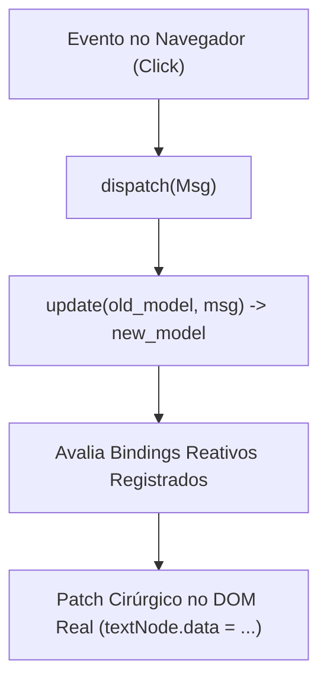

# aipo.html — Framework Web Declarativo

`aipo.html` é o pacote oficial da linguagem Aipo para construção de aplicações web modernas, Single Page Applications (SPAs) e interfaces de usuário no navegador.

Ele combina:
1. **Sintaxe de Tags Declarativas Limpas:** sem `children: [...]` e sem fechamento manual de tags.
2. **Reatividade MVU de Granularidade Fina (*Fine-Grained Model-View-Update*):** atualizações cirúrgicas no DOM com zero diffing de árvore inteira.
3. **CSS-in-Aipo Tipado:** criação de estilos com hashing de classes e injeção automática no `<head>`.
4. **Ponte de Execução JavaScript (`aipo-dom.js`):** compatível com o emissor `aipo-js` e compilação WebAssembly.

---

## 1. Primeiros Passos

No arquivo `aipo.toml`:

```toml
[dependencies]
"aipo.html" = { path = "packages/aipo-html" }
```

Importe o pacote e monte a aplicação em um elemento da página (ex: `<div id="app"></div>`):

```aipo
import aipo.html as h

struct Model {
    count: Int
}

enum Msg {
    Increment,
    Decrement,
    Reset
}

fn update(m: Model, msg: Msg) -> Model {
    match msg {
        Msg::Increment => Model{ count: m.count + 1 },
        Msg::Decrement => Model{ count: m.count - 1 },
        Msg::Reset => Model{ count: 0 }
    }
}

fn view(m: Model, dispatch: Fn) {
    h.div(class: "p-8 max-w-sm mx-auto bg-white rounded-xl shadow-lg border") {
        h.h1(f"Contador: {m.count}", class: "text-2xl font-bold text-gray-800")
        
        h.div(class: "flex gap-2 mt-4") {
            h.button("+1", class: "bg-indigo-600 text-white px-4 py-2 rounded font-medium", on_click: _ => dispatch(Msg::Increment))
            h.button("-1", class: "bg-gray-200 text-gray-800 px-4 py-2 rounded font-medium", on_click: _ => dispatch(Msg::Decrement))
            h.button("Zerar", class: "bg-red-500 text-white px-4 py-2 rounded font-medium", on_click: _ => dispatch(Msg::Reset))
        }
    }
}

h.mount("#app", init = Model{ count: 0 }, update, view)
```

---

## 2. A Sintaxe Declarativa das Tags

O `aipo.html` usa o recurso de *trailing blocks* da Aipo. As tags comportam-se de forma intuitiva:

### Tags Folha e Texto Direto
Quando um elemento contém apenas texto, o texto é passado como o primeiro parâmetro:

```aipo
h.h1("Título Principal")
h.p("Texto corrido do parágrafo.", class: "lead text-gray-600")
h.span("Em destaque", class: "badge font-semibold")
```

### Tags Contêiner com Filhos
Atributos ficam nos parênteses e os nós filhos dentro de um bloco `{ ... }`:

```aipo
h.div(class: "card shadow-sm") {
    h.h3("Cabeçalho do Card")
    h.p("Conteúdo interno do card.")
    h.button("Ação")
}
```

### Tags Vazias (Void Elements)
Tags sem filhos (como `input`, `img`, `hr`):

```aipo
h.img(src: "foto.png", alt: "Avatar", class: "rounded-full h-12 w-12")
h.input(type: "text", placeholder: "Digite aqui...", class: "border p-2 rounded")
h.hr(class: "my-4")
```

---

## 3. Reatividade: MVU de Granularidade Fina

Ao contrário de frameworks convencionais que recalculam a árvore inteira e gastam ciclos de CPU comparando nós virtuais idênticos (Virtual DOM diffing tradicional), o `aipo.html` implementa **MVU com Granularidade Fina**:



1. **Mount Único:** A função `view(m, dispatch)` constrói o DOM na primeira renderização e registra *bindings* nos nós folha e nos atributos dinâmicos.
2. **Atualização Cirúrgica:** Quando uma mensagem altera o estado imutável, o runtime avalia apenas os valores modificados e atualiza **diretamente o nó de texto ou atributo afetado** no navegador.

---

## 4. Estilização: Utility Classes e CSS-in-Aipo Tipado

### Utility Classes (Tailwind / Bootstrap)
Passe as classes diretamente na propriedade `class`:

```aipo
h.div(class: "flex items-center justify-between p-4 bg-slate-900 text-white rounded-lg") {
    h.span("Dashboard Ativo")
}
```

### CSS-in-Aipo Tipado (`h.css`)
Crie estilos componíveis e isolados (*scoped*):

```aipo
let card_style = h.css {
    display: "flex",
    direction: "column",
    padding: 20,
    background: "#ffffff",
    border_radius: 12,
    border: "1px solid #e2e8f0",
    hover: {
        border_color: "#6366f1",
        shadow: "0 8px 16px rgba(99, 102, 241, 0.1)"
    }
}

# O style injeta a classe hash única no documento e anexa ao nó
h.div(style: card_style) {
    h.p("Card com estilo isolado e seguro!")
}
```

---

## 5. Componentização Limpa

Componentes reutilizáveis em Aipo são simples funções que recebem propriedades e um *trailing block* para os filhos:

```aipo
fn modal(title: String, is_open: Bool, on_close: Fn, content: Fn) {
    if !is_open { return }

    h.div(class: "fixed inset-0 bg-black/50 flex items-center justify-center p-4") {
        h.div(class: "bg-white rounded-xl p-6 max-w-md w-full shadow-2xl") {
            h.div(class: "flex justify-between items-center border-b pb-3 mb-4") {
                h.h3(title, class: "text-lg font-bold")
                h.button("✕", class: "text-gray-400 hover:text-black", on_click: _ => on_close())
            }
            content()
        }
    }
}
```

Usando o componente:

```aipo
modal("Aviso Importante", is_open: m.show_dialog, on_close: _ => dispatch(Msg::CloseDialog)) {
    h.p("Suas alterações foram salvas com sucesso!")
    h.div(class: "mt-4 flex justify-end") {
        h.button("Ok", class: "btn-primary", on_click: _ => dispatch(Msg::CloseDialog))
    }
}
```
