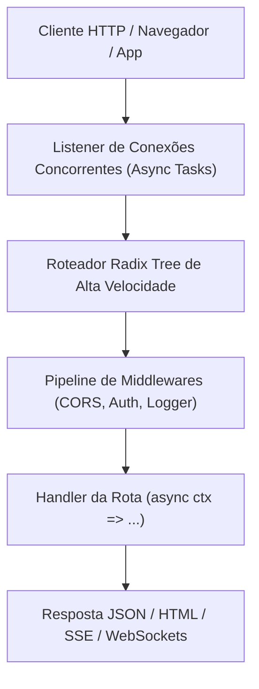

# aipo.http — Framework Web Backend & APIs

`aipo.http` é o framework oficial da linguagem Aipo para construção de servidores HTTP, microsserviços e APIs com suporte nativo a WebSockets, projetado para alavancar a concorrência assíncrona da linguagem e a performance extrema do compilador Wasm JIT.

Inspirado na velocidade e elegância do **Hono** e do **FastAPI**, o `aipo.http` elimina o boilerplate tradicional e adota uma arquitetura declarativa e segura por padrão.

---

## 1. Visão Geral & Filosofia

Ao contrário de frameworks legados que dependem de transpiladores, decorators ou middlewares mutáveis complexos, o `aipo.http` tira proveito dos recursos de primeira classe da Aipo:

1. **Roteamento Baseado em Radix Tree:** Despacho ultrarrápido de rotas parametrizadas (`/usuarios/:id`).
2. **Contexto Limpo (`ctx`):** Acesso simples a parâmetros, headers, queries e body JSON com métodos encadeáveis e imutáveis.
3. **Validação de Schemas e Contratos:** Integração direta com schemas da linguagem para validação automática de payloads com erro HTTP 422 padronizado.
4. **WebSockets Nativos:** Conexões bidirecionais em tempo real sem bibliotecas externas.
5. **Fullstack com `aipo.html`:** O mesmo código Aipo roda no servidor (renderização SSR) e no cliente (reatividade com MVU de Granularidade Fina).



---

## 2. Exemplo Rápido: API REST com Schemas

```aipo
import aipo.http as web

let app = web.create()

// Middleware de Logger
app.use(async (ctx, next) => {
    let inicio = time.now()
    await next()
    let duracao = time.elapsed_ms(inicio)
    print(f"[{ctx.method}] {ctx.path} — {ctx.status} ({duracao}ms)")
})

// Rota Simples
app.get("/", ctx => {
    return ctx.json({ "mensagem": "Servidor Aipo HTTP ativo!" })
})

// Rota com Parâmetros de URL
app.get("/usuarios/:id", async ctx => {
    let user_id = ctx.param("id")
    let usuario = await buscar_usuario_no_banco(user_id)
    
    if usuario == null {
        return ctx.status(404).json({ "erro": "Usuário não encontrado" })
    }
    
    return ctx.json(usuario)
})

// Rota POST com Body JSON
app.post("/usuarios", async ctx => {
    let body = await ctx.req.json()
    
    // Validação de dados
    if !body.contains("nome") or !body.contains("email") {
        return ctx.status(400).json({ "erro": "Campos 'nome' e 'email' são obrigatórios" })
    }
    
    let novo_usuario = await criar_usuario(body.nome, body.email)
    return ctx.status(201).json(novo_usuario)
})

// Iniciar servidor na porta 3000
app.listen(port: 3000, host: "0.0.0.0", _ => {
    print("🚀 Servidor rodando em http://localhost:3000")
})
```

---

## 3. WebSockets em Tempo Real

O suporte a WebSockets é embutido diretamente no núcleo do `aipo.http`, permitindo construir chats, salas de jogos multiplayer e feeds de dados em poucas linhas:

```aipo
app.ws("/ws/sala/:sala_id", {
    on_connect: (socket, ctx) => {
        let sala = ctx.param("sala_id")
        socket.join(sala)
        socket.broadcast_to(sala, "Um novo participante entrou na sala!")
    },

    on_message: (socket, mensagem) => {
        // Enviar mensagem para todos na sala
        socket.broadcast_to(socket.current_room, mensagem)
    },

    on_disconnect: (socket, motivo) => {
        print(f"Desconectado: {motivo}")
    }
})
```

---

## 4. Integração Fullstack (SSR com `aipo.html`)

O `aipo.http` renderiza nativamente componentes construídos com o pacote [`aipo.html`](/packages/aipo-html) no lado do servidor, entregando HTML estático instantâneo com hidratação no cliente:

```aipo
import aipo.http as web
import aipo.html as h

app.get("/pagina", ctx => {
    return ctx.html(
        h.div(class: "container mx-auto p-4") {
            h.h1("Renderizado no Servidor com Aipo!", class: "text-2xl font-bold")
            h.p("Zero dependência de Node.js, Webpack ou Babel.")
        }
    )
})
```
