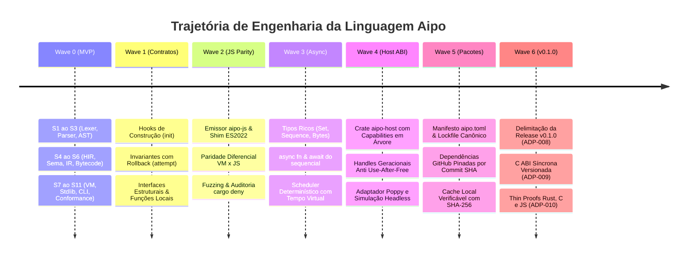

# Trajetória de Desenvolvimento

Esta seção documenta a jornada completa de engenharia, arquitetura e evolução da linguagem **Aipo**, desde a concepção inicial dos primeiros tokens até a consolidação da versão v0.1.0.

Cada onda (*wave*) e fatia vertical (*slice*) foi construída sob a metodologia **Lean Progressive Context (LPC)** e governada pelo **Prumo CLI**, com critérios rigorosos de aceitação, testes exaustivos e zero suposições não comprovadas.

---

## Linha do Tempo das Ondas de Implementação

---

## Sumário das Ondas de Implementação

Concluído
<h4>Wave 0 — MVP da Linguagem</h4>

Implementação dos 11 slices verticais fundamentais: Lexer UTF-8, Parser resiliente, HIR, SEMA, Core IR, Bytecode, VM de pilha/registradores, Stdlib mínima, Formatter, CLI unificada e suíte inicial de conformance.

<a href="/trajectory/wave-0-mvp">Ler documentação da Wave 0 →</a>

Concluído
<h4>Wave 1 — Contratos & Conformance</h4>

Fechamento do MVP de linguagem com hooks <code>init()</code>, invariantes de integridade <code>invariant()</code> em fronteiras estáveis de mutação com rollback automático via journal transacional e conformidade de interfaces.

<a href="/trajectory/wave-1-contracts">Ler documentação da Wave 1 →</a>

Concluído
<h4>Wave 2 — Paridade JS & Qualidade</h4>

Criação do emissor <code>aipo-js</code> para JavaScript moderno (ES2022) com runtime shim modular, suíte de conformance diferencial VM↔JS, testes de propriedade, fuzzing contínuo e política estrita de dependências com <code>cargo deny</code>.

<a href="/trajectory/wave-2-js-parity">Ler documentação da Wave 2 →</a>

Concluído
<h4>Wave 3 — Tipos Ricos & Async</h4>

Introdução de <code>Set</code> com ordem de inserção, <code>Sequence</code> lazy, empacotamento de <code>Bytes</code>, sintaxe nativa <code>async fn</code> e <code>await do</code>, combinadores assíncronos e scheduler cooperativo com tempo virtual.

<a href="/trajectory/wave-3-async">Ler documentação da Wave 3 →</a>

Concluído
<h4>Wave 4 — Host ABI & Poppy Engine</h4>

Design da Host ABI segura (<code>aipo-host</code>) com permissões deny-by-default, handles geracionais resistentes a use-after-free, barreira contra escape de escopo e integração com o motor headless de simulação Poppy.

<a href="/trajectory/wave-4-host-poppy">Ler documentação da Wave 4 →</a>

Concluído
<h4>Wave 5 — Pacotes Herméticos</h4>

Sistema de gerenciamento de dependências e distribuição de pacotes hermético: coordenadas <code>namespace.package</code>, dependências GitHub pinadas por commit SHA com digest verificado, cache local atômico e replay 100% offline.

<a href="/trajectory/wave-5-packages">Ler documentação da Wave 5 →</a>

Em Curso
<h4>Wave 6 — Release v0.1.0</h4>

Formalização da fronteira canônica do produto (ADP-008): foco exclusivo na linguagem e seu ferramental autônomo, test runner minimalista, C ABI síncrona versionada (ADP-009) e provas finas de interoperabilidade em Rust, C e JavaScript (ADP-010).

<a href="/trajectory/wave-6-release-v010">Ler documentação da Wave 6 →</a>

