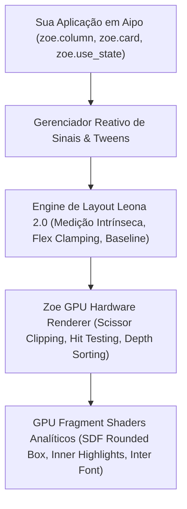

# Zoe UI Framework (`aipo.zoe`)

> **O Framework Declarativo de Alta Performance para Interfaces Gráficas em Aipo.**  
> Combinando o modelo mental reativo moderno à velocidade nativa de motores analíticos em GPU (SDF), tipografia subpixel e a engine de layout **Leona**.

---

## 🌟 O que é o Zoe UI?

O **Zoe UI** é a biblioteca e framework canônico da linguagem Aipo para construção de aplicações gráficas profissionais, editores de ferramentas (IDEs, engines de jogos, consoles) e interfaces de usuário táteis e reativas.

Diferente de frameworks tradicionais que encapsulam bibliotecas nativas pesadas (C++, Electron, Qt), o Zoe UI é implementado **100% em código Aipo puro**:
- Toda a árvore de nós (`ElementNode`), o cálculo de caixas delimitadoras e o despacho de eventos reativos ocorrem no runtime gerenciado da linguagem.
- O backend de baixo nível (`aipo-game-host`) acelera a apresentação através de **fragment shaders analíticos de GPU (SDF)**, garantindo 60+ FPS constante, bordas arredondadas matematicamente perfeitas, inner highlights e tipografia subpixel nítida.



---

## 🎯 Pilares Arquiteturais

| Pilar | Descrição |
| :--- | :--- |
| **Pilar 1: Shaders Analíticos de UI (GPU)** | Renderização de primitivas usando *Signed Distance Fields* (SDF). Antialiasing contínuo com `smoothstep`, luz física no chanfro superior (*top inner highlight*) e elevação gaussiana de 2 camadas. |
| **Pilar 2: Motor Tipográfico Subpixel** | Tipografia vetorial calibrada alimentada por `fontdue` e fonte Inter TTF embutida. Métricas reais de glifos (`ascent`, `descent`, `line_height`) em tempo de layout. |
| **Pilar 3: Leona 2.0 Layout Engine** | Sistema de layout em 3 passadas: Medição Intrínseca (*content-driven*), Distribuição Flex Estrita (*overflow-clamping*) e Alinhamento pela Linha de Base (*baseline alignment*). |
| **Pilar 4: Protocolo de Extensibilidade** | Contrato unificado para autoria de componentes. Facilidade para criar e compor widgets complexos como editores de código, grafos de nós com curvas de Bézier e painéis acopláveis. |

---

## 🚀 Começando em 60 Segundos

Adicione a dependência ao seu `aipo.toml`:

```toml
[dependencies]
"aipo.zoe" = { path = "packages/aipo-zoe" }
```

Crie seu arquivo `main.aipo`:

```aipo
import aipo.zoe as zoe

fn view() {
    let count = zoe.use_state(0)

    return zoe.center({ "background": zoe.color.base, "gap": 16.0 }, [
        zoe.label(f"Contador: {count.get()}", {
            "font_size": 24.0,
            "color": zoe.color.text,
            "font_weight": "bold"
        }),
        zoe.row({ "gap": 12.0 }, [
            zoe.button("+1 Incrementar", _ => zoe.set_state(count, count.get() + 1), {
                "variant": "primary"
            }),
            zoe.button("Zerar", _ => zoe.set_state(count, 0), {
                "variant": "secondary"
            })
        ])
    ])
}

fn setup() {
    zoe.mount(view)
}

fn update(dt) {
    zoe.step(dt)
}

fn draw() {
    zoe.draw_ui()
}
```

Execute a aplicação:

```bash
aipo run main.aipo
```

---

## 🧭 Navegação da Documentação

- **[Guia de Primeiros Passos](/zoe/guide/getting-started)** — Ciclo de vida da aplicação, ponto de entrada e boas práticas.
- **[Layout com Leona 2.0](/zoe/guide/layout-leona)** — Compreendendo flexbox, constraints min/max, hugging de conteúdo e baseline.
- **[Reatividade & Sinais](/zoe/guide/reactivity)** — Como utilizar `use_state`, `use_memo`, `use_effect` e animações com `use_tween`.
- **[Criando Componentes Customizados](/zoe/guide/custom-components)** — O protocolo canônico para compor novos widgets.
- **[Catálogo de Componentes](/zoe/components/buttons)** — Documentação de botões, inputs, layout, navegação e widgets avançados.
- **[Playground Interativo](/zoe/playground)** — Teste código Zoe e veja a pré-visualização interativa.
