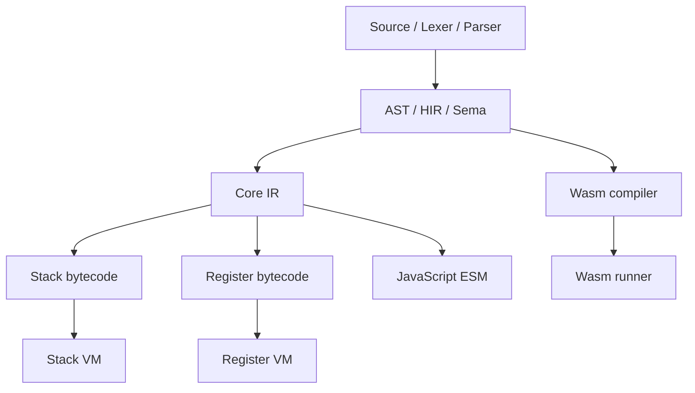

# Arquitetura de implementação

O Aipo é implementado em Rust, em um workspace composto por crates com responsabilidades separadas. Sua arquitetura permite compartilhar etapas do compilador sem compartilhar indevidamente estados de runtime.

## Mapa de processamento

**Importante:** a revisão de runtime de outubro descreve o compilador Wasm recebendo HIR diretamente. Não desenhe um pipeline universal IR → Wasm sem verificar o código.

## Responsabilidades de cada camada

| Módulo | Entrada | Saída/ownership |
| --- | --- | --- |
| `aipo-source` | Texto e paths | Spans e source maps |
| `aipo-lexer` | Source | Tokens e diagnósticos léxicos |
| `aipo-syntax` e `aipo-ast` | Tokens | Árvore sintática e AST |
| `aipo-hir`, `aipo-sema` | AST | Modelo semântico, resolução, contratos |
| `aipo-ir` | HIR | IR comum e transformações |
| `aipo-bytecode` | IR | Emissão, formato e validação de bytecode |
| `aipo-vm` | Bytecode | Estado de execução e faults |
| `aipo-js` | IR | Código ESM e shim |
| `aipo-wasm` | HIR | Módulo Wasm e execução opcional |
| `aipo-host` / `aipo-c-abi` | Host autorizado | Esquemas, capacidades e ponte nativa |

## Regras de boundaries

- Fases de frontend não dependem de backends ou de componentes de GUI.
- Uma otimização deve preservar a semântica já definida e ser testada pelos destinos afetados.
- Os tipos de erro de parse, análise e execução precisam permanecer distinguíveis.
- A ABI pública precisa de versionamento e testes com consumidores, não somente testes Rust.
- Referências semânticas de linguagem não são substituídas por descrições de implementação.

**Aprofunde:** [Mapa original de crates](https://github.com/poppy-team/aipo-lang/blob/main/docs/crates/crate-contracts.md), [guia de runtime](https://github.com/poppy-team/aipo-lang/blob/main/docs/development/runtime-hardening-guide.md) e [Decisões](/engineering/decisions/).
